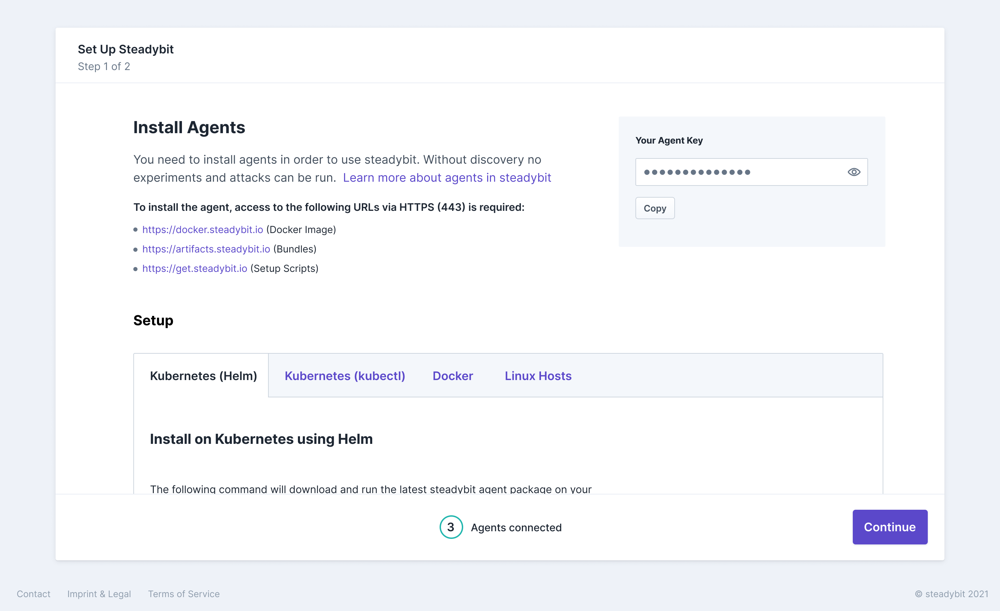
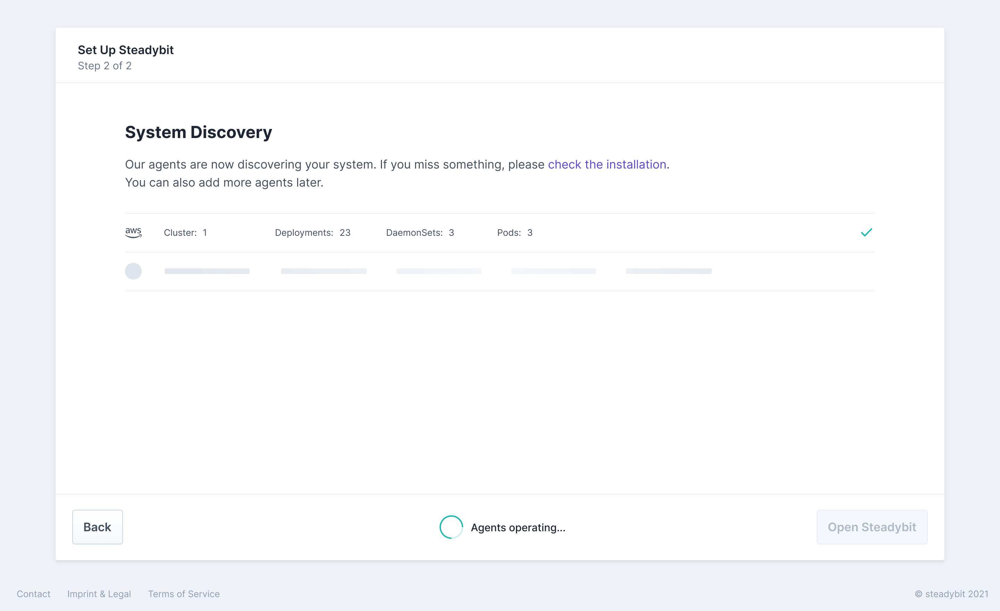
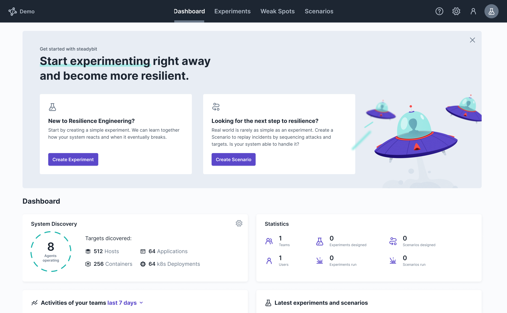

This guide helps you with the initial setup of our steadybit platform and leads you step by step through the first setup.

>If you are not using our SaaS and would like to know how to deploy our platform in your environment, please read first [install On-Prem (self-hosted)](20-install-onprem).
>

Setting up steadybit is simple, just follow these steps:

- [Step 0 - Check Prerequisites](#step-0---check-prerequisites)
- [Step 1 - Install Agents](#step-1---install-agents)
- [Step 2 - Let steadybit discover your system](#step-2---let-steadybit-discover-your-system)
- [Step 3 - Run your first experiment](#step-3---run-your-first-experiment)

In case something is not working out for you, [let us help you](https://www.steadybit.com/contact)!

## Step 0 - Check Prerequisites
Steadybit is right now invitation only, [let's discuss details in a demo](https://www.steadybit.com/request-demo).
After receiving the invitation mail you can login to the [steadybit platform](https://platform.steadybit.io/) with your e-mail address and a temporary password.
This temporary password needs to be changed immediately at first login.
After that, you will be guided through the steadybit on-boarding process

To complete the on-boarding and install an agent, make sure that access to the following URLs via HTTPS (443) is possible:

* https://docker.steadybit.io and https://index.docker.io (Docker Image)
* https://artifacts.steadybit.io (Agent Bundles)
* https://get.steadybit.io (Setup Scripts)
* https://steadybit.github.io/helm-charts (when using Kubernetes and helm)

## Step 1 - Install Agents
Our agents continuously gather and deliver target data to the platform, helping you to create targeted experiments based on always up-to-date data.
Therefore, it is necessary that you deploy the agents at the locations where you want to perform analyses and experiments.

> No agents means no discovery data and thus no experiments are possible.

We offer our agents for different platforms and have made the installation as easy as possible for you.
You can find the different installation scripts directly in our platform after logging in.
When using Kubernetes, we recommend using Helm.

Simply copy your agent key, replace it with the placeholder in the installation script and execute it next to your system.

Once an agent is rolled out, they connect to the platform and appear in bottom of the page. This may take a few minutes. Afterwards you are able to continue with the on-boarding by clicking continue.

## Step 2 - Let steadybit discover your system
Now, the steadybit Agent is busy discovering your system and gives you an overview what has been found.
After completing initial discovery, you can open up steadybit and start with your first experiment

## Step 3 - Run your first experiment
That's it!
You are welcomed by our Dashboard giving you access to all relevant information and you are ready to take off by creating a first experiment.

## Next steps

Check out one of these getting started to start your first experiment:
- [Run an experiment with a local Kubernetes cluster and a demo application](30-run-experiment-local)
- [Run an experiment with an AWS EKS and a demo application](40-run-experiment-eks)

Looking for more advanced steps?
- [How to install more agents](../install-configure/30-install-agents)
- [Learn how to configure your monitoring](../install-configure/70-configure-monitoring).
- [Invite more users and group them to teams](../install-configure/60-teams-and-users)
- [Structure your system by setting up Areas](../install-configure/50-set-up-areas)
