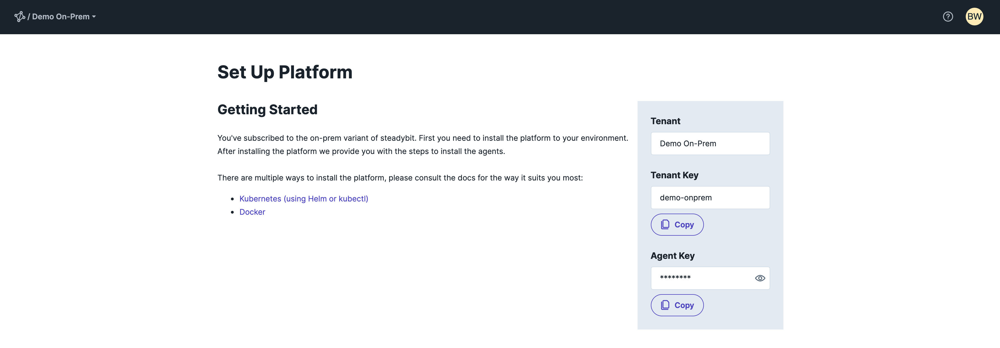

This guide helps you with the initial setup of our steadybit platform On-Prem and leads you step by step through the first setup.
It is explicitly of use for environments where it is not yet possible to take advantage of our SaaS platform and the need to self-host our platform.

>If you are interested in using and setting up our platform as a SaaS, let us know and read on with how to get started to [set up the SaaS Platform](10-set-up-saas).
>


If you want to use our self-hosted service, you have already received an invitation in advance and can register with your credentials under [https://platform.steadybit.io/](https://platform.steadybit.io/)


You are only a view steps away from your first experiment with steadybit:

- [Step 1 - Get your key](#step1-getyourkey)
- [Step 2 - Install Platform](#step2-installplatform)

If you need help, please [contact](https://www.steadybit.com/contact) us.

## Step 1 - Get your keys
With your access on [https://platform.steadybit.io/](https://platform.steadybit.io/) you will get to the following page.



This page contains the **Agent Key** which you need to use to install the steadybit agents.
However, a running platform is necessary first, which we will now set up together.

## Step 2 - Install Platform
Our platform is installed as Docker container. The platform container image is available in the steadybit Docker Registry.

Please choose one of the following deployment options:
- [Step 2.1 - Kubernetes](#step2.1-kubernetes)
- [Step 2.2 - Docker](#step2.1-docker)

## Step 2.1 - Kubernetes

It is our goal to make the installation as easy as possible for you, so we provide you with a Helm chart that takes a lot of the work out of it and only requires a few parameters from you.
If you are not familiar with Helm and would like to learn more about it, visit [helm.sh/docs/intro/quickstart/](https://helm.sh/docs/intro/quickstart/)

Please replace the placeholder `replace-with-agent-key`with your agent key determined from [Step 1 - Get your key](#step-1---getyourkey) and start the helm chart installation with:

```bash
helm repo add steadybit https://steadybit.github.io/helm-charts
helm repo update
kubectl create namespace steadybit-platform
helm install steadybit-platform \
  --namespace steadybit-platform \
  --set agent.key=<replace-with-agent-key> \
  steadybit/steadybit-platform
```
To make it as easy as possible for you to get started, we have a default for everything. In this case we also include the necessary Postgres database and set up everything for you automatically.
Nevertheless, you have the freedom to make adjustments and are welcome to take a look at our settings. You can find all the details in our public [GitHub repository](https://github.com/steadybit/helm-charts/tree/master/charts/steadybit-platform).

In case you prefer to deploy our steadybit platform using Kubernetes directly, you can find everything you need [here](../install-configure/40-install-platform/20-k8s/#deploytheplatformusingkubectl).

## Step 2.2 - Docker

At least a Docker installation and a PostgresSQL database is required to run the platform.
Please replace the placeholder `agent-key` with your value determined from [Step 1 - Get your key](#step-1---getyourkey).
A Postgres database is required, please replace the placeholders `jdbc-url`, `jdbc-user` and `jdbc-password` in our one liner script. We create a default user with admin access, see log output.

```bash
curl -sfL https://get.steadybit.io/platform.sh | sh -s -- -a <agent-key> -d <jdbc-url> -e <jdbc-user> -f <jdbc-password>
```

> For use in **production**, we strongly recommend that you connect an internal LDAP or OIDC provider as [described here](../install-configure/40-install-platform/10-docker#externalldap).

## What's next?
Done, the platform is running and now you can connect the first agents to it.

We'll show you how to do that in our [Set up Platform & Agents](10-set-up-saas).
