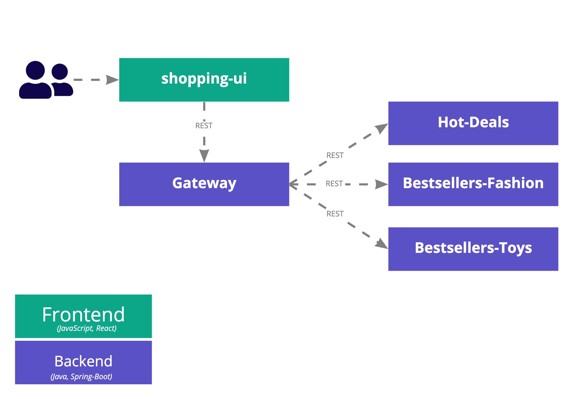
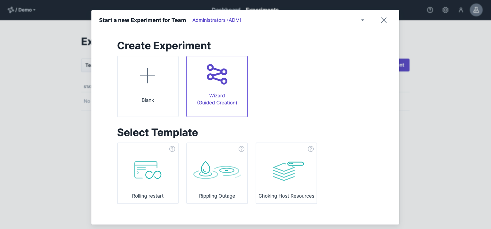
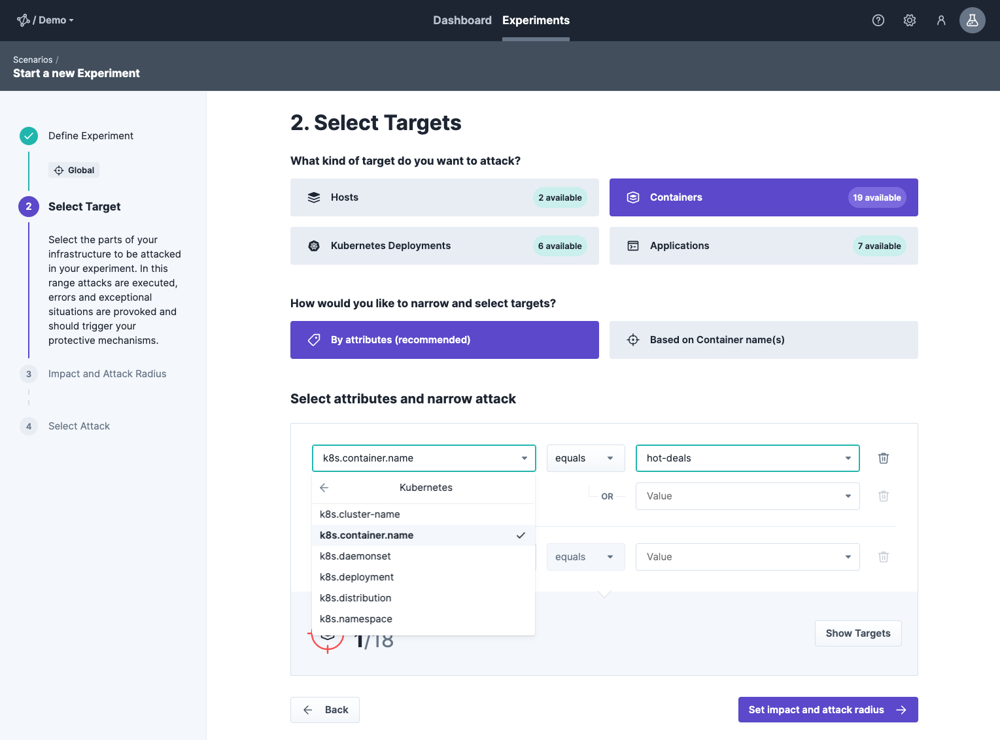
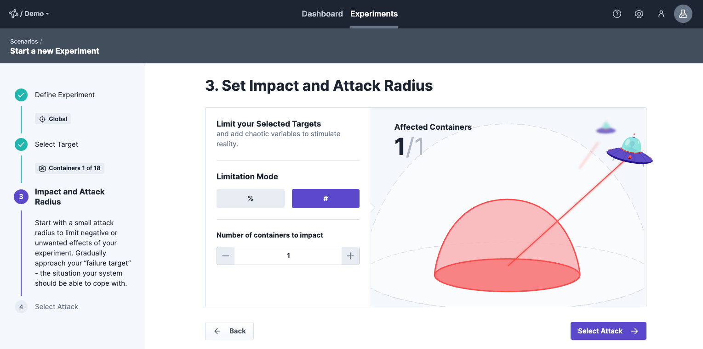
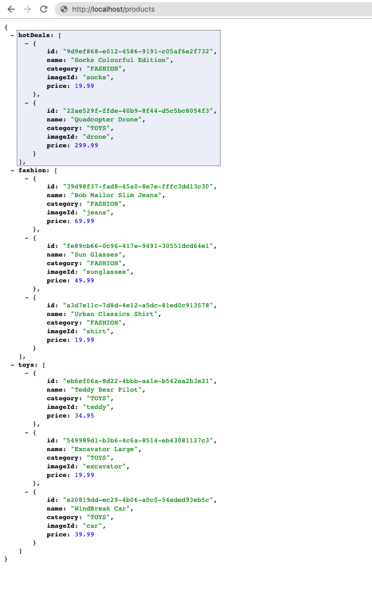

This getting started will show you how to install and use steadybit locally with Kubernetes on minikube.
We will run an ecommerce application in Kubernetes and find out how it handles network latency.
By using steadybit, we will slow down individual Kubernetes pods at the network level.

[Kubernetes](https://kubernetes.io/), also known as k8s, is an open source system for automating the deployment, scaling, and management of containerized applications.
We are using [minikube](https://minikube.sigs.k8s.io/docs/) to set up a local Kubernetes cluster on macOS, Linux or Windows.

Basically, the getting started is split into 4 steps.
If you have already done the first steps, get in directly via the short link.

- [Step 1 - Start your minikube cluster](#step1-startyourminikubecluster)
- [Step 2 - Install steadybit agent](#step2-installsteadybitagent)
- [Step 3 - Deploying shopping demo](#step3-deployingthesteadybitshopping-demo)
- [Step 4 - Run your first experiment](#step4-runyourfirstexperiment)

## Prerequisites

- a running [minikube](https://minikube.sigs.k8s.io/docs/start/) installation
- a running [steadybit](https://www.steadybit.com/try-for-free) platform

## Step 1 - Start your minikube cluster

From a terminal, run:

```bash
minikube start
```

If you already have installed `kubectl` you can access your cluster with:

```bash
kubectl get po -A
```

If you don't have `kubectl` installed yet, check this out: [How to install kubectl](https://kubernetes.io/docs/tasks/tools/install-kubectl/)

## Step 2 - Install steadybit agent

We take an agent-based approach to help you identify goals and run experiments.
The installation of our steadybit agents is very simple.
In the case of Kubernetes, you can install our agents in Kubernetes as a [DaemonSet](https://kubernetes.io/docs/concepts/workloads/controllers/daemonset/).

You can either install our agent directly using a [Helm](https://helm.sh/) chart or use the YAML file to install it using `kubectl`.

### Option 2.1 - Helm

If you haven't installed Helm yet, go [here](https://helm.sh/docs/intro/quickstart/) to get started.
Once Helm is installed and configured, the next steps are to add the repo and install the agent.

Add the repo for the steadybit Helm chart:

```bash
helm repo add steadybit https://steadybit.github.io/helm-charts
helm repo update
```

In our steadybit platform you will find under section `.../settings/agents/setup` your agent key.


Please copy the agent key and replace it below.
In addition, you also need to set the cluster name you are installing the agents into:

```bash
helm install steadybit-agent \
  --namespace steadybit-agent \
  --create-namespace \
  --set agent.key=<replace-with-agent-key> \
  --set cluster.name=<replace-with-cluster-name> \
  steadybit/steadybit-agent
```

That's all, ready to start your first experiment!

### Option 2.2 - DaemonSet YAML

In our steadybit platform you will find under section `.../settings/agents/setup` all details to install agents in your system.
Please select the Kubernetes tab and copy the YAML file prepared there.


Create a DaemonSet based on the YAML file:

```bash
kubectl apply -f YOUR-FILE-NAME.yaml
```

That's all, ready to start your first experiment!

## Step 3 - Deploying the steadybit shopping-demo

In order to give you a quick and easy start, we have developed a small demo application.
Our shopping demo is a small product catalog provided by 4 distributed backend services and a simple UI.



If you want to learn more about our demo, please take a look at our GitHub
repository: [https://github.com/steadybit/shopping-demo](https://github.com/steadybit/shopping-demo)

First you need to download our shopping demo app, run following `git clone` command:

```bash
git clone https://github.com/steadybit/shopping-demo.git
```

Now we use kubectl to deploy the demo by running the following command:

```bash
kubectl apply -f k8s-manifests.yml
```

Verify that all Shopping Demo pods are running:

```bash
kubectl get pods --namespace steadybit-demo
```

You will see the following result, all pods are ready if you can see the status `Running`:

```bash
NAME                                  READY   STATUS    RESTARTS   AGE
fashion-bestseller-79b9698f88-557vt   1/1     Running   0          11s
gateway-7fc74f7f9b-tshzg              1/1     Running   0          11s
hot-deals-75cb898ff7-wrnxc            1/1     Running   0          10s
postgres-68f9db56cc-wxxth             1/1     Running   0          10s
toys-bestseller-6df5bd864f-kzrt9      1/1     Running   0          11s
```

The command `minikube tunnel` creates a route to services deployed with type LoadBalancer and sets their Ingress to their ClusterIP.

```bash
minikube tunnel
```

With the following command you can now determine the external IP and port to access the `gateway` service:

```bash
kubectl get svc -n steadybit-demo
```

Example response:

```bash
NAME                 TYPE           CLUSTER-IP       EXTERNAL-IP   PORT(S)          AGE
fashion-bestseller   NodePort       -------------    <none>        ----:-----/---   ---
gateway              LoadBalancer   10.98.173.27     127.0.0.1     80:30131/TCP     3h15m
hot-deals            NodePort       -------------    <none>        ----:-----/---   ---
product-db           NodePort       -------------    <none>        ----:-----/---   ---
toys-bestseller      NodePort       -------------    <none>        ----:-----/---   ---
```

Visit `http://{EXTERNAL-IP}:{PORT}/products` in your browser to retrieve the aggregated list of all products or just use `curl`:

```bash
curl http://{EXTERNAL-IP}:{PORT}/products
```

The result is an aggregated list of all products of the services `toys`, `hot-deals` and `fashion`:

```bash
{
  "fashionResponse": {
    "responseType": "REMOTE_SERVICE",
    "products": [
      {
        "id": "e9f0bec4-989c-4b9f-8bf9-334622e915ad",
        "name": "Bob Mailor Slim Jeans",
        "category": "FASHION"
      },
      {
        "id": "b110185b-d808-4104-b605-08a90b1248ce",
        "name": "Lewi's Jeanshose 511 Slim Fit",
        "category": "FASHION"
      },
      {
        "id": "222d7084-3cc7-43c3-890f-4598aa44eb2f",
        "name": "Urban Classics Shirt Shaped Long Tee",
        "category": "FASHION"
      }
    ]
  },
  "toysResponse": {
    "responseType": "REMOTE_SERVICE",
    "products": [
      ...
    ]
  },
  "hotDealsResponse": {
    "responseType": "REMOTE_SERVICE",
    "products": [
      ...
    ]
  },
  "duration": 112,
  "statusFashion": "REMOTE_SERVICE",
  "statusToys": "REMOTE_SERVICE",
  "statusHotDeals": "REMOTE_SERVICE"
}
```

## Step 4 - Run your first experiment

We will now use steadybit to find out how our shopping demo behaves when one of the backend service can not be reached.
Therefore, we simulate the unavailability of one container (`hot-deals`) by isolating it on network level.
This approach is less invasive than stopping it.

To do that, we start by creating a new experiment via our Wizard, which guides us through every step:



### Step 4.1 Define Experiment

First step is to give our experiment a meaningful name and define the environment where to be executed.
To keep things simple, we choose the `Global` environment to get access to everything steadybit has discovered and not being limited in scope/permissions yet.


### Step 4.2 Select Targets

In the next step we can define our target.
Since our target of our experiment is a container running in Kubernetes, we select Container as target kind.
Furthermore, we want our experiment to be reusable even after container restarts, so we describe our target container with attributes and not by a unique name.



### Step 4.3 Set Impact and Attack Radius

Going to the next step, we can define how large our impact is.
When having a scaled system you may want to start with a small attack radius first - affecting only one container and not all replicas.

Since in the current deployment none of the services are scaled, we keep the default of only one affected container.



### Step 4.4 Select Attack

Last but not least: We choose the attack.
We want to simulate unavailability of the `hot-deals` container by isolating it from others.
Therefore, we choose the attack "blackhole" on network level.


### Step 4.4 Save Experiment

That's it, we can finalize the wizard by saving the experiment.
You can now add additional attacks, checks and actions to the experiment or simply run our first experiment.
Of course, we choose the fun part and run it immediately!


### Step 4.4 Run Experiment

Before running the experiment make sure to have the `/products`-endpoint open in your browser.
While running the experiment simply refresh it multiple times to check for effects.



When hitting the "run experiment"-button you see the steadybit execution window.


You should notice that the `/products`-endpoint will not work while `hot-deals` is unavailable.
This is not desirable as there are other products which could have been browsed by the customers of the online shop.
You can improve this behavior by adding appropriate fallbacks or scaling the services.

## Conclusion

You have now successfully run an experiment with steadybit in a Kubernetes environment.
You have discovered the impact of an unavailable service in a non-scaled system.

What are the next steps?

You can extend the experiment by adding the HTTP action.
This way, you see the availability of the `/product`-endpoint directly in steadybit and don't need to check it manually.

After that, how about scaling the `hot-deals` service and then running your new experiment again to check increased resilience?

```bash
kubectl scale deploy hot-deals --replicas=3 --namespace steadybit-demo
```

Verify by running:

```bash
kubectl get deployments -A

NAMESPACE        NAME                 READY   UP-TO-DATE   AVAILABLE   AGE
kube-system      coredns              1/1     1            1           128d
steadybit-demo   fashion-bestseller   1/1     1            3           1h49m
steadybit-demo   gateway              1/1     1            1           1h49m
steadybit-demo   hot-deals            3/3     3            3           1h49m
steadybit-demo   postgres             1/1     1            1           1h49m
steadybit-demo   toys-bestseller      1/1     1            1           1h49m
```

One big advantage is that you can re-run your experiment stored in steadybit at any time.
