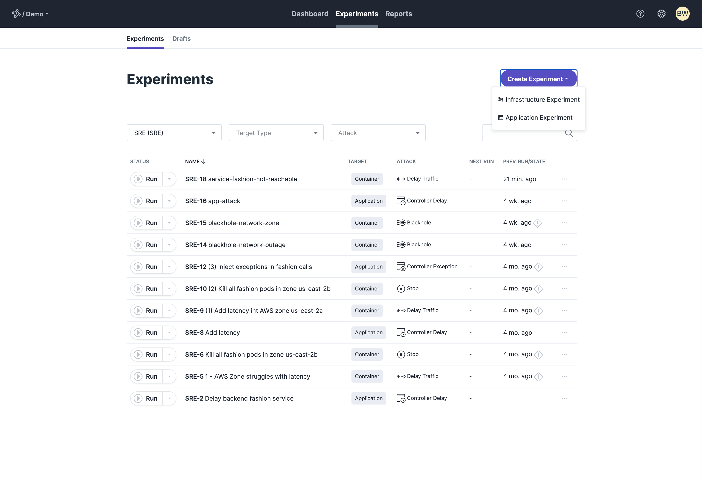
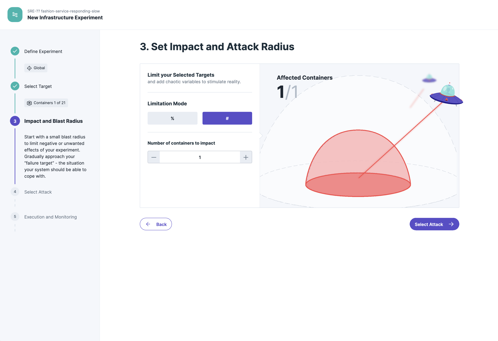

This getting started will show you how to install and use steadybit with Kubernetes managed by AWS Elastic Kubernetes Service (AWS EKS). We will run an
ecommerce application in Kubernetes and find out how it handles network latency. By using steadybit, we will slow down individual Kubernetes pods at the network
level.

[Kubernetes](https://kubernetes.io/), also known as k8s, is an open source system for automating the deployment, scaling, and management of containerized
applications. We are using [AWS EKS](https://docs.aws.amazon.com/eks/latest/userguide/what-is-eks.html) to set up a Kubernetes cluster.

Basically, the getting started is split into 4 steps. If you have already done the first steps, get in directly via the short link.

- [Step 1 - Create your EKS cluster](#step1-startyourminikubecluster)
- [Step 2 - Install steadybit agent](#step2-installsteadybitagent)
- [Step 3 - Deploying shopping demo](#step3-deployingthesteadybitshopping-demo)
- [Step 4 - Run your first experiment](#step4-runyourfirstexperiment)

## Prerequisites

- [AWS account](https://aws.amazon.com/de/account/)
- [AWS Command Line Interface](https://docs.aws.amazon.com/cli/latest/userguide/cli-chap-install.html)
- [AWS eksctl](https://docs.aws.amazon.com/eks/latest/userguide/getting-started-eksctl.html)
- [Kuberentes kubectl](https://kubernetes.io/docs/tasks/tools/install-kubectl/)
- a running [steadybit](https://www.steadybit.com/try-for-free) platform (Saas or on-prem)

## Step 1 - Create your AWS Elastic Kubernetes Service (AWS EKS) cluster and nodes

Verfiy your AWS CLI configuration by running:

```bash
aws --version
```

Your output should be similiar to:

```bash
aws-cli/2.0.44 Python/3.8.5 Darwin/19.6.0 source/x86_64
```

Create your Amazon EKS cluster and containing 2 nodes by running the following command. More details are available
at [AWS documentation](https://docs.aws.amazon.com/eks/latest/userguide/getting-started-eksctl.html)

From a terminal, run:

```bash
eksctl create cluster \
--name steadybit-demo-cluster \
--region us-west-2
```

If you already have installed `kubectl` you can access your cluster with:

```bash
kubectl get nodes
```

Your output should be look like:

```bash
NAME                                           STATUS   ROLES    AGE    VERSION
ip-192-168-53-195.us-west-2.compute.internal   Ready    <none>   113s   v1.17.12-eks-7684af
ip-192-168-68-23.us-west-2.compute.internal    Ready    <none>   118s   v1.17.12-eks-7684af
```

If you don't have `kubectl` installed yet, check this out: [How to install kubectl](https://kubernetes.io/docs/tasks/tools/install-kubectl/)

## Step 2 - Install steadybit agent

We take an agent-based approach to help you identify goals and run experiments. The installation of our steadybit agents is very simple. In the case of
Kubernetes, you can install our agents in Kubernetes as a [DaemonSet](https://kubernetes.io/docs/concepts/workloads/controllers/daemonset/).

You can either install our agent directly using a [Helm](https://helm.sh/) chart or use the YAML file to install it using `kubectl`.

### Step 2.1 - Helm

If you haven't installed Helm yet, go [here](https://helm.sh/docs/intro/quickstart/) to get started. Once Helm is installed and configured, the next steps are
to add the repo and install the agent.

Add the repo for the steadybit Helm chart:

```bash
helm repo add steadybit https://steadybit.github.io/helm-charts
helm repo update
````

Create a namespace for the steadybit Kubernetes agent:

```bash
kubectl create namespace steadybit-agent
```

In our steadybit platform you will find under section `.../settings/agents/setup` your agent key.


Please copy the agent key and paste it:

```bash
helm install steadybit-agent steadybit/steadybit-agent \
              --namespace steadybit-agent \
              --set agent.key=STEADYBIT_AGENT_KEY
```

That's all, ready to start your first experiment!

### Step 2.2 - DaemonSet YAML

In our steadybit platform you will find under section `.../settings/agents/setup` all details to install agents in your system. Please select the Kubernetes tab
and copy the YAML file prepared there.


Create a DaemonSet based on the YAML file:

```bash
kubectl apply -f YOUR-FILE-NAME.yaml
```

That's all, ready to start your first experiment!

## Step 3 - Deploying the steadybit shopping-demo

In order to give you a quick and easy start, we have developed a small demo application. Our shopping demo is a small product catalog provided by 4 distributed
backend services and a simple UI.


First you need to download our shopping demo app, run following `git clone` command:

```bash
git clone https://github.com/steadybit/shopping-demo.git
```

Now we use kubectl to deploy the demo by running the following command:

```bash
kubectl apply -f demo-deployment/
```

Verify that all Shopping Demo pods are running:

```bash
kubectl get pods --namespace steadybit-demo
```

You will see the following result, all pods are ready if you can see the status `Running`:

```bash
NAME                                  READY   STATUS    RESTARTS   AGE
fashion-bestseller-79b9698f88-557vt   1/1     Running   0          11s
gateway-7fc74f7f9b-tshzg              1/1     Running   0          11s
hot-deals-75cb898ff7-wrnxc            1/1     Running   0          10s
postgres-68f9db56cc-wxxth             1/1     Running   0          10s
toys-bestseller-6df5bd864f-kzrt9      1/1     Running   0          11s
```

With the following command you can now determine the external IP and port to access the `gateway` service:

```bash
kubectl get svc -n steadybit-demo
```

Example response:

```bash
NAME                 TYPE           CLUSTER-IP       EXTERNAL-IP   PORT(S)          AGE
fashion-bestseller   NodePort       -------------    <none>        ----:-----/---   ---
gateway              LoadBalancer   10.98.173.27     127.0.0.1     80:30131/TCP     3h15m
hot-deals            NodePort       -------------    <none>        ----:-----/---   ---
product-db           NodePort       -------------    <none>        ----:-----/---   ---
toys-bestseller      NodePort       -------------    <none>        ----:-----/---   ---
```

Visit `http://{EXTERNAL-IP}:{PORT}/products` in your browser to retrieve the aggregated list of all products or just use `curl`:

```bash
curl http://{EXTERNAL-IP}:{PORT}/products
```

The result is an aggregated list of all products of the services `toys`, `hot-deals` and `fashion`:

```bash
{
  "fashionResponse": {
    "responseType": "REMOTE_SERVICE",
    "products": [
      {
        "id": "e9f0bec4-989c-4b9f-8bf9-334622e915ad",
        "name": "Bob Mailor Slim Jeans",
        "category": "FASHION"
      },
      {
        "id": "b110185b-d808-4104-b605-08a90b1248ce",
        "name": "Lewi's Jeanshose 511 Slim Fit",
        "category": "FASHION"
      },
      {
        "id": "222d7084-3cc7-43c3-890f-4598aa44eb2f",
        "name": "Urban Classics Shirt Shaped Long Tee",
        "category": "FASHION"
      }
    ]
  },
  "toysResponse": {
    "responseType": "REMOTE_SERVICE",
    "products": [
      ...
    ]
  },
  "hotDealsResponse": {
    "responseType": "REMOTE_SERVICE",
    "products": [
      ...
    ]
  },
  "duration": 112,
  "statusFashion": "REMOTE_SERVICE",
  "statusToys": "REMOTE_SERVICE",
  "statusHotDeals": "REMOTE_SERVICE"
}
```

## Step 4 - Run your first experiment

We will now use steadybit to find out how our shopping demo behaves when there is increased latency in the network for a backend service. This latency should
only happen for a specific type of container. One of the reasons for this is that we don't want to negatively impact our colleagues unnecessarily if we want to
do this kind of testing later on in a real Kubernetes cluster.

Please create a new experiment for the infrastructure section:



Like everything in life, our experiment needs a fitting name:


Our target for our experiment is a container running in Kubernetes. Therefore, we select Container for the type of targets. We want our experiment to be
repeatable as often as we like, so we describe our target container with attributes and not by a unique name:


In the current deployment, none of the services are scaled, which doesn't really make sense and only supports this demo. For this reason we also get only 1
affected container for the attack radius. In real life you would see more than 1 affected container and can then control how many of them should be affected by
this experiment:



Our experiment is to inject latency into the network in order to find out how this affects our application and more importantly what our customers' experience
is in this case.


For now, let's skip the Execution and Monitoring section. Normally, here you would create an appropriate load test that is executed during the experiment and
connect your monitoring solution.

You can read more about this in our [docs](content/use/execution-monitoring).


Now everything is ready and we can start the experiment. In the next 30 seconds there will be an increased latency in the Fashion-bestseller service.

You can track this by checking the response of the `shopping-demo` endpoint `/products`.


You should notice that in the `fashionResponse` section only the `fallback` is displayed and you do not see any products. One good thing is the fact that the
latency we injected does not also have a negative impact on the gateway service. However, the current behavior can still be improved, for example by scaling the
services.

## Conclusion

You have now successfully run an experiment with steadybit in a Kubernetes environment. You could discover how big the impact of a little latency is in a
non-scaled system.

What are the next steps?

How about scaling the fashion-bestseller service and then running your new experiment again to increase availability and resilience?

```bash
kubectl scale deploy fashion-bestseller --replicas=3 --namespace steadybit-demo
```

Verify by running:

```bash
kubectl get deployments -A

NAMESPACE        NAME                 READY   UP-TO-DATE   AVAILABLE   AGE
kube-system      coredns              1/1     1            1           128d
steadybit-demo   fashion-bestseller   3/3     3            3           1h49m
steadybit-demo   gateway              1/1     1            1           1h49m
steadybit-demo   hot-deals            1/1     1            1           1h49m
steadybit-demo   postgres             1/1     1            1           1h49m
steadybit-demo   toys-bestseller      1/1     1            1           1h49m
```

One big advantage is that you can re-run your experiment stored in steadybit at any time.


