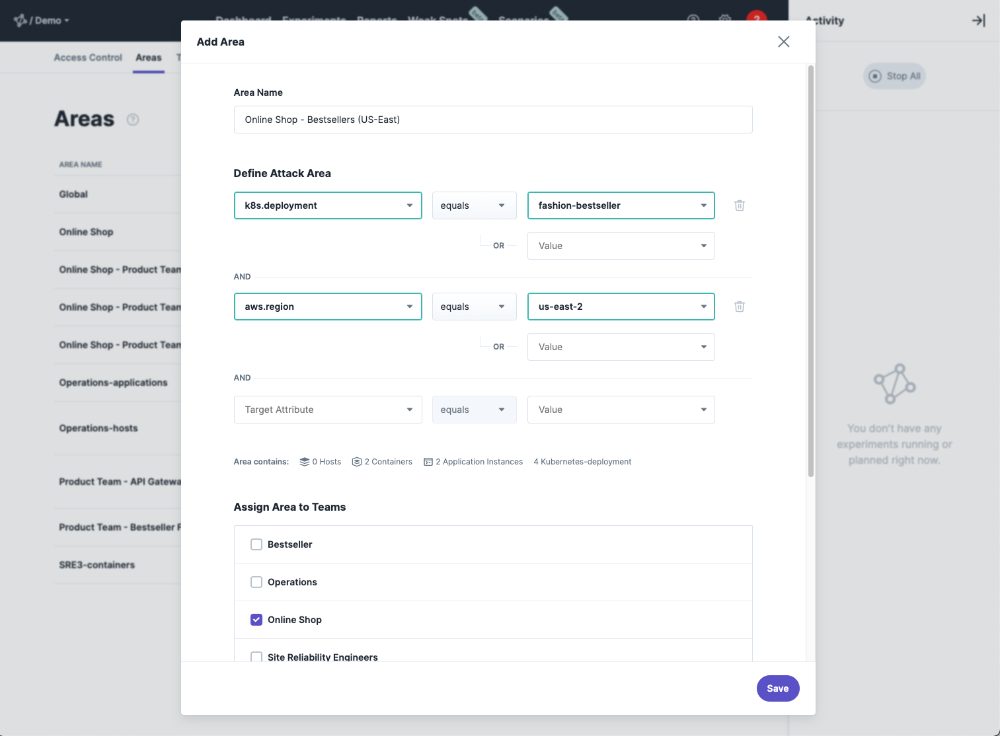
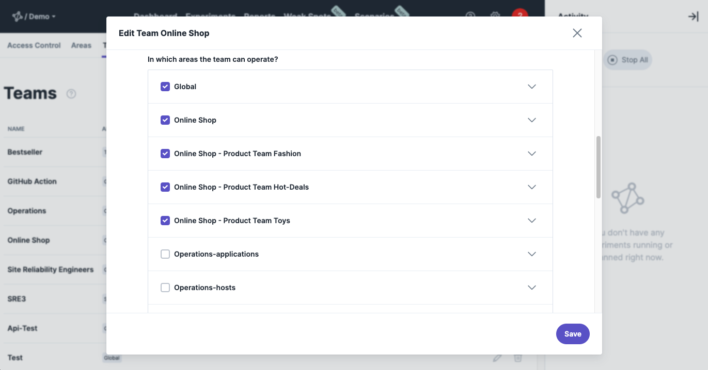

No one knows your system better than you, so it is obvious that you should be the one who structures the discovered targets.
It's up to you whether you use areas to separate parts of your system from each other (like "bounded contexts" in domain driven design) or to separate your environments (like development, QA and Production).

## Default Area: Global
Per default, your system contains one area called `Global`.
This is the place where every target that steadybit has discovered will be in.
It is similar as an root / admin-user in Linux / Windows. So, using Global for the start is fine (when trying out steadybit), but on the long run dangerous and you should create your own.

## Define your own Area
To create or change an area go to `/settings/access control/areas` and choose to either add an area or edit an existing one. An area consists of a name as well as a definition of which targets to include. For that our [discovery data](../learn/30-discovery) is used to define which targets should be included.

## Assign Areas to Teams

In order to leverage Areas you have to assign them to a team. This can be done from Area-perspective (`/settings/access control/areas` ) as well as from Team-Perspective (`/settings/access control/teams`).
This limits access to the users of a team to certain systems and environments.

## Use Areas
Once the areas are defined and assigned to teams, you can make use of them when e.g. [designing an experiment](../use/10-experiments/10-design#area).

