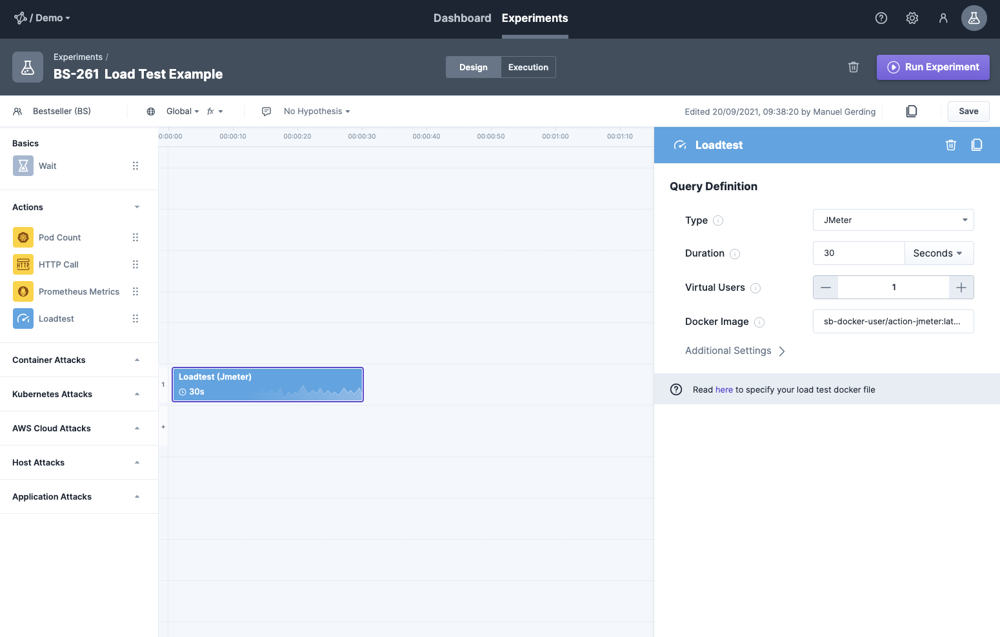

[JMeter](https://jmeter.apache.org/) is open source software, designed to load test functional behavior and measure performance.
You can integrate the execution of JMeter load tests directly into your experiments.

## Integrate Custom Load Tests

We base our integration of custom load test on the concept of Docker-images.
Therefore, you need a Docker Hub user or a private Docker registry as prerequisite.
After that, just follow the steps below to integrate your custom load test:

1. Place your JMeter load test file in a separate folder. We assume for this steps that it is named *custom.jmx*. Alternatively, download an example [custom.jmx](attachments/jmeter/custom.jmx) load test and adjust it as needed.
2. Put a [Dockerfile](attachments/jmeter/Dockerfile) into the same directory which simply copies the custom load test into the Docker image. It looks like:

```
# Inherit existing image
FROM steadybit/action-jmeter:latest

# Provide custom test
COPY custom.jmx /script.js
```

3. Build the docker image and tag it with your own Docker Hub user by running ` docker build . --tag <your-docker-hub-huser>/action-jmeter:latest`.
3. Login to dockerhub via `docker login`
4. Push the Docker image to Docker Hub Registry via `docker push <your-docker-hub-huser>/action-jmeter:latest`
5. In the experiment using the JMeter load test you have to specify `<your-docker-hub-huser>/action-jmeter:latest` as *Docker Image* parameter.



In case the image is not public and requires authentication to be pulled you can configure the Pull-Secrets in the platform via Application Settings -> Agents -> Pull Secrets.

**Tip:** Instead of the dockerhub registry you can also use a custom one - you then need to use a prefixed image tag and the correct login

### Parameters

Within the JMeter load test you have access to the following parameters as environment variables.
You can use them in the script via e.g. `${__ENV.DURATION}` as shown in the attached [custom.jmx](attachments/jmeter/custom.jmx).

| Parameter   | Environment Variable   |      Description      | Default |
|----------|-------------|-------------|-------------|-------------|
| Duration | DURATION | How long should the load test run? | inherited from experiment duration |
| Virtual Users | VUS | How many virtual users should be started? | 1 |

### Report
After execution, the JMeter report will be transferred to the platform.
By default, the location `/jmeter/result.jtl` will be used as file location.
However, you can change this location to another one using the *Additional Settings* in the experiments settings.
