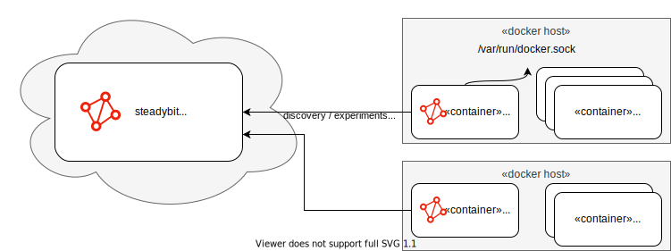

The steadybit platform never connects to the agent, all connections are initiated by the agent, regardless of the deployment model.

The steadybit agents periodically sends discovery data to the platform using http, only the delta to the last successful submission is transferred.
If there is an experiment to be executed for the agent, the agent connects via a websocket to the platform and receives the attacks to be executed.
In case this connection is interrupted the agents immediately stops and rollbacks any active attack.

The agents are self updating.
By default the agent queries our repository every 6h for updates and will install the updates immediately.

