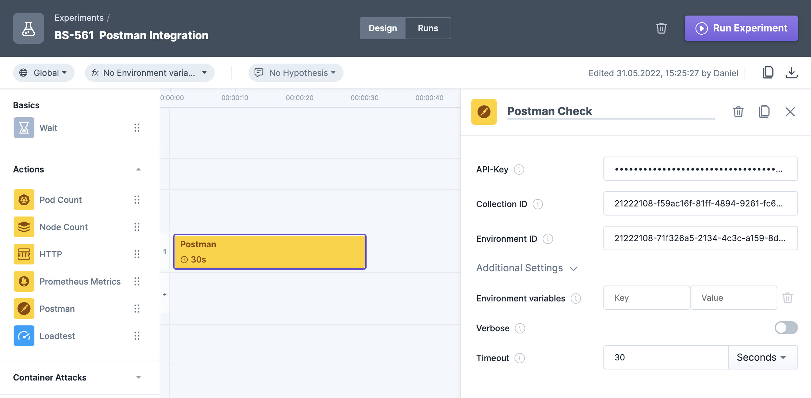

The Postman Integration can be used to run a Postman collection. You can find the Postman integration in the "Actions" folder in the experiment editor.

Currently, we are supporting collections, which are hosted and accessible via [Postman's Cloud API service](https://api.getpostman.com/).

We are using [newman](https://github.com/postmanlabs/newman) to run your collection behind the scenes.

## Parameters
| Name                  | Required | Description                                                                                                                                                           |
|:----------------------|:---------|:----------------------------------------------------------------------------------------------------------------------------------------------------------------------|
| API-Key               | Yes      | The API-Key to access your collection, can be created [here](https://learning.postman.com/docs/developer/intro-api/#generating-a-postman-api-key)                     |
| Collection Id         | Yes      | The collectionId to run. Find out your collectionId by fetching all collection from the postman api with `https://api.getpostman.com/collections?apikey=$apiKey`      |
| Environment Id        | No       | The environmentId to use. Find out your environmentId by fetching all environments from the postman api with `https://api.getpostman.com/environments?apikey=$apiKey` |
| Environment Variables | No       | Additional environment variables, will be passed to newman with `--env-var key=value`                                                                                 |
| Iterations            | No       | Number of iterations to run the collection, will be passed to newman with `-n`                                                                                        |
| Verbose               | No       | Should we enable verbose logging? Will be passed to newman with `--verbose`                                                                                           |
| Timeout               | Yes      | The timeout of your collection, wil be passed to newman with `--timeout`                                                                                              |

## Example

## Outputs
We are using the reporters `cli` and `json`.

You can download the `json`-report in the experiment run log after the experiment has finished.

The `cli`-output can be accessed by clicking on the `Action Logs`-tab in the experiment run view and supports a live view during experiment execution.

The step will be marked as failed, if implemented [tests](https://learning.postman.com/docs/writing-scripts/script-references/test-examples/) in the postman collection are failing.
