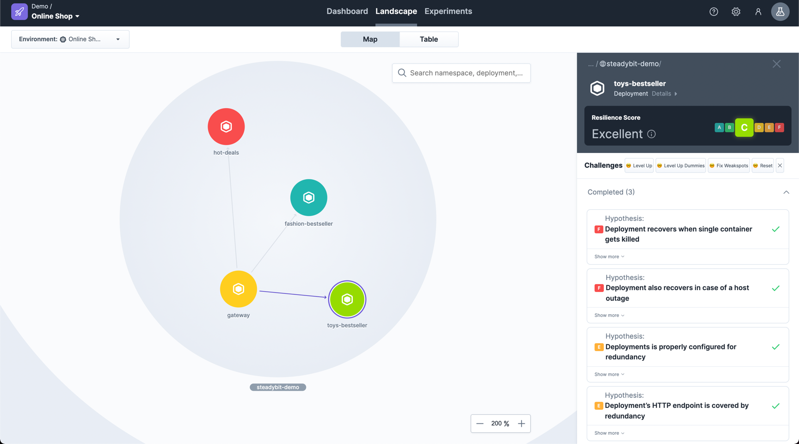

One key aspect when doing Chaos Engineering is to have visibility into the system.
Knowing the system's architecture, understand dependencies and identify effects of your experiments is crucial.

> Landscape is currently limited to Kubernetes Cluster and Kubernetes Deployments.
> Dependencies are discovered when you use your system and only support TCP-based connections to other Kubernetes Deployments.
> Future Extension is part of our roadmap.

## Explore the Landscape

When viewing the landscape you see by default the `Global`-environment (if allowed by your team).
This way, you see your entire Kubernetes cluster.
In case you have multiple clusters, you can choose the right one by the additional dropdown below.

However, it is usually very crowded in the `Global`-environment.
So, we strongly recommend you to divide your system by creating [environments](/install-configure/50-set-up-environments).

## Drill Down
After choosing your [environment](/install-configure/50-set-up-environments) in the top left dropdown you have higher focus on the right system parts.
You can further zoom into your system using e.g. your mouse scroll wheel and select a namespace (e.g. `steadybit-demo`).
This way, you get a list of all Kubernetes deployments in that namespace as well as the discovered connections of your deployments.

## Suggested Experiments
Click a deployment of your choice in order to get suggested experiments as part of the Resilience Score.
These are suggestions we recommend you to start with in order to get a resilient system.

In case you want to learn more about the suggested experiments, continue reading at [Resilience Score](30-resilience-score)-documentation page.

However, you can always create a [manual experiment by your own](/use/10-experiments) in case you exactly know what you want to check.

> ## Call for Feedback
> Landscape and Resilience Score are two relatively new features which we would like to get your opinion on.
> Feel free to [reach out to us](https://www.steadybit.com/contact) and share your experience.

