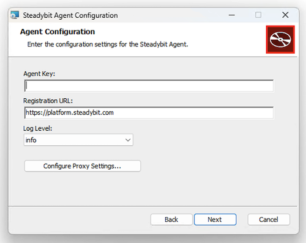

# Install on Windows Hosts

Steadybit Agent is packaged as a Windows _.msi_ installer. Unlike the Linux installation, the [extension-host-windows](https://hub.steadybit.com/target/com.steadybit.extension_host_windows.host) is not bundled and has to be installed separately.

## Agent installation

To install the agent on your Windows system, download the latest [installer](https://windows-registry.steadybit.com/steadybit-agent/windows-agent-latest.zip) archive and extract the installer into a folder of your choice.
You may also download the [SHA-256 checksum](https://windows-registry.steadybit.com/steadybit-agent/windows-agent-latest.sha256) and verify it matches the hash of the downloaded archive.

Looking for a specific version? Find it in the [Windows Registry](https://windows-registry.steadybit.com).

### Regular installation (GUI)

Double-click the downloaded _.msi_ installer and follow the installation instructions. During the installation process you must specify the _Agent Key_ and _Registration URL_, and are also able to configure
proxy settings in a dedicated dialog.



### Headless installation (No GUI)

Run the following command from the __administrator__ powershell:

```pwsh
msiexec /i SteadybitAgentInstaller.msi \`
  STEADYBIT_AGENT_KEY="<agent-key>" \`
  STEADYBIT_AGENT_REGISTER_URL="<registration-url>" \`
/qn
```

### Configure HTTP Proxy Server

The Steadybit Agent uses HTTP and WebSockets to communicate with the platform. To simplify the agent deployment, consider allowing direct communication to our platform.

If you require a single entry into and out of your network, you can configure the agent to use a proxy server. Enter your proxy server settings during installation in the GUI
or add the following command line flags to the terminal installation command:

```pwsh
STEADYBIT_AGENT_PROXY_HOST="<host>"
STEADYBIT_AGENT_PROXY_PORT="<port>"
STEADYBIT_AGENT_PROXY_PROTOCOL="<http|https>"
STEADYBIT_AGENT_PROXY_USER="<username>"
STEADYBIT_AGENT_PROXY_PASSWORD="<password>"
```

You may also add these entries as environment variables and restart the _SteadybitAgent_ service.

## Start/Stop

During the agent installation, an application service is automatically initialized for you. If you want to manually control whether the agent is running or not, use the following commands:

```pwsh
Start-Service SteadybitAgent
```

```pwsh
Restart-Service SteadybitAgent
```

```pwsh
Stop-Service SteadybitAgent
```

## Logs 

### File System

Navigate to `C:\ProgramData\Steadybit GmbH\Steadybit Agent\steadybit-agent.log`

### Event Viewer

If you need to diagnose issues or review the activity of the agent and its extensions, their logs are recorded in the **Windows Application Event Log**. Here's how to access them:

1.  **Open Event Viewer:**
    *   Press `WINKEY + R` to open the Run dialog.
    *   Type `eventvwr.msc` and press Enter.
    *   Alternatively, search for "Event Viewer" in the Windows Start Menu.
2.  **Navigate to Application Logs:**
    *   In the Event Viewer window, on the left-hand pane, expand **Windows Logs**.
    *   Select **Application**.
3.  **Find Relevant Entries:**
    *   The central pane will now display a list of events. Look for entries where the **Source** column might indicate the agent or its extensions (e.g., "Steadybit Agent," or a specific extension name).
    *   You can sort by "Date and Time" to find recent events or use the "Filter Current Log..." option in the right-hand pane to narrow down your search (e.g., by Event level like "Error" or "Warning", or by specific Event sources)."

## Certificates

By default, the Steadybit Agent (version 2.2.2 and later) will pick up the Certificates trusted by the system.

If you don't want this, remove the line `-Djavax.net.ssl.trustStoreType=Windows-ROOT` from the file `C:\Program Files\Steadybit GmbH\Steadybit Agent\Core\agent.l4j.ini`.
Then it will use the JREs (located in `C:\Program Files\Steadybit GmbH\Steadybit Agent\Core\jre`) keystore, which can be managed using the keytool.

## Uninstalling the Steadybit Agent

Here are two methods to remove the Steadybit Agent from your Windows computer:

### Method 1: Using Windows Settings 

This method uses the modern Windows Settings panel, which is common in Windows 10 and 11.

1.  **Open Windows Settings:**
    *   Click the **Start** button (the Windows icon, usually in the bottom-left corner).
    *   Click the **Settings** cogwheel icon ⚙️.
2.  **Navigate to Apps:**
    *   In the Settings window, click on **Apps**.
3.  **Find Installed Apps:**
    *   In the Apps section, click on **Installed apps** (or it might be called **Apps & features** on some older Windows 10 versions).
4.  **Locate Steadybit Agent:**
    *   You'll see a list of all applications installed on your computer. Scroll through this list or use the search bar at the top of the list to find "**Steadybit Agent**".
5.  **Initiate Uninstall:**
    *   Once you find "Steadybit Agent":
    *   Click the three vertical dots (`...`) next to "Steadybit Agent" and select **Uninstall**.
6.  **Follow Uninstaller Prompts:**
    *   A confirmation pop-up might appear asking if you're sure. Click **Uninstall** again if prompted.
    *   The Steadybit Agent's own uninstaller will then launch. Follow any instructions it provides to complete the removal.

### Method 2: Using Control Panel

This method uses the traditional Control Panel interface, which has been around for many Windows versions.

1.  **Open the Run Dialog:**
    *   Press the **`WINKEY`** (the key with the Windows logo) + **`R`** key on your keyboard at the same time. This will open the "Run" dialog box.
    *   Alternatively, you can search for "Run" in the Start menu.
2.  **Open Programs and Features:**
    *   In the Run dialog box, type **`appwiz.cpl`** and press **Enter** or click **OK**.
    *   This will directly open the "Programs and Features" window (sometimes titled "Uninstall or change a program").
3.  **Locate Steadybit Agent:**
    *   You'll see a list of installed programs. Scroll through this list to find "**Steadybit Agent**". You can also click on the "Name" column to sort the list alphabetically, which might make it easier to find.
4.  **Initiate Uninstall:**
    *   Select "**Steadybit Agent**" from the list by clicking on it once.
    *   An **Uninstall** button (or sometimes "Uninstall/Change") will appear at the top of the list or when you right-click the entry. Click this button.
5.  **Follow Uninstaller Prompts:**
    *   A confirmation pop-up might appear. Confirm that you want to uninstall.
    *   The Steadybit Agent's own uninstaller will then launch. Follow any instructions it provides to complete the removal.

---
