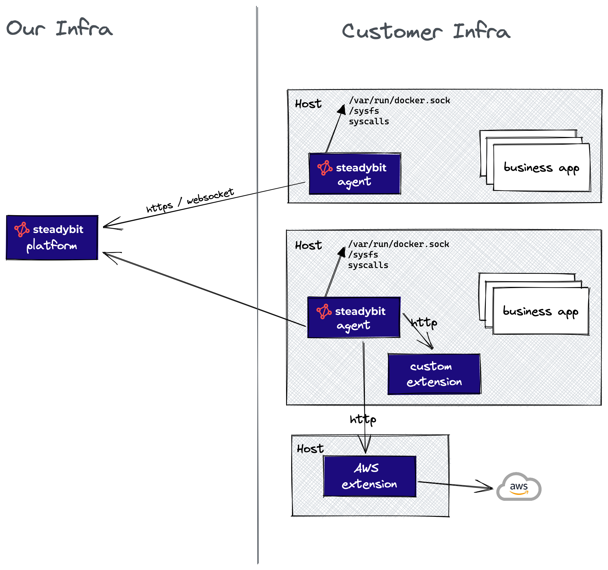

# Architecture

This documentation covers the architecture of the **legacy** agent.
Only use it in case you still run the legacy Agent.

Otherwise, please refer to [this section](/install-and-configure/install-outpost-agent) instead to see the Agent architecture.


The core of the steadybit architecture is the agent-based approach consisting of

* a central platform, being the center of control for you
* multiple agents, deployed in your system to discover running hosts, containers and applications.

The following diagram shows this in an example of two hosts having each a running steadybit agent.

The steadybit agents periodically sends discovery data to the platform using http, only the delta to the last successful submission is transferred. If there is an experiment to be executed for the agent, the agent connects via a websocket to the platform and receives the attacks to be executed. In case this connection is interrupted the agents immediately stops and rollbacks any active attack.

Important to note is that the steadybit platform never connects to the agent, _all connections are initiated by the agent_, regardless of the deployment model.
