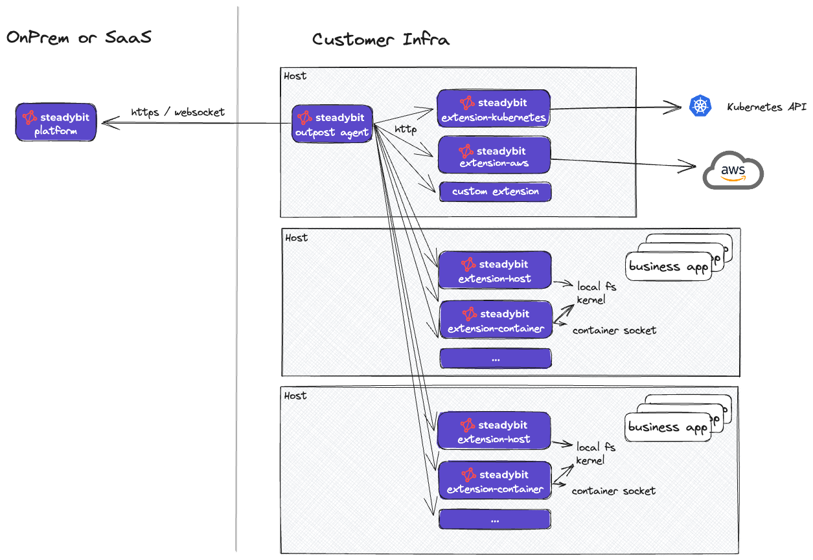

# Outpost Agent Architecture

The core of the Steadybit architecture is the agent-based approach consisting of

* a central platform, being the center of control for you
* one or more outpost agents deployed somewhere in your system, being a mediator between the platform and multiple extensions
* extensions, deployed wherever you need them, able to discover running hosts, containers, and many more, and able to execute various actions.

The following diagram shows this in an example of three hosts, one with the outpost agent installed and communicating with the installed extensions.

<figure><figcaption>
steadybit outpost architecture
</figcaption></figure>

The Steadybit outpost agent periodically polls its registered extensions for discovery data using HTTP. For each call, only the delta of the discovery data is sent to the platform.\
If an experiment is to be executed for the outpost, the outpost connects via a websocket to the platform and receives the actions to be executed. The outpost will then control the action execution and calls the respective HTTP endpoints of the extension. If the connection between the platform and outpost or outpost and extension is interrupted, the outpost immediately stops and rollbacks any active action.


The Steadybit platform never connects to the outpost or any extensions: \
_all connections are initiated by the outpost_, regardless of the deployment model.


Check our [reliability hub](https://hub.steadybit.com/extensions) for an up-to-date list of extensions. Our extensions are Open Source and available on [github.com](https://github.com/steadybit). They are written in Go to ensure the best possible resource usage.
