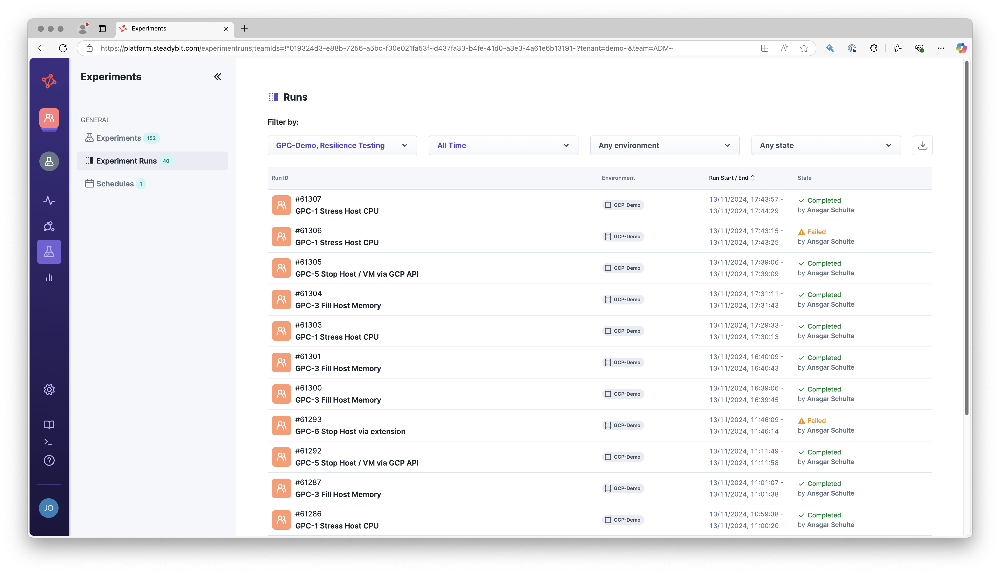

# Migrating From the Legacy Agent

### Before you start

* "All or nothing" - We recommend replacing all legacy agents with the new outpost agents and their extensions. You cannot consistently attack targets using a mixed form of legacy and outpost agents.
* Most of the functionality will work seamlessly, but there are a few [breaking changes](migration-breaking-changes.md). Please take a moment to review them.
* You will be able to [go back](migrating-from-the-legacy-agent.md#migrate-back-to-legacy-agents) to Legacy Agents at any point in time.
* Make sure you have the latest platform release installed.

### Migrate to Outpost Agents (Kubernetes)

#### Step 1: Uninstall legacy

First, we must uninstall all Legacy and AWS Agents (if you have installed them before). Extensions can now be installed with the combined [outpost/extension helm-chart](https://github.com/steadybit/helm-charts/tree/main/charts/steadybit-outpost). To do that, we recommend uninstalling all existing extensions as well.

* Using helm
  * Get an overview of what is currently installed in your cluster:\
    `helm list -A -f 'steadybit-*'`
  * Uninstall everything, examples:
    * `helm uninstall steadybit-agent --namespace steadybit-agent`
    * `helm uninstall steadybit-agent --namespace steadybit-agent-aws`
    * `helm uninstall steadybit-extension-kong --namespace steadybit-extension`\

* Manual using kubectl (not recommended)
  * Get a list of all namespaces in your cluster\
    `kubectl get ns`
  * Delete the namespace if existing.
    * `kubectl delete namespace steadybit-agent`
    * `kubectl delete namespace steadybit-agent-aws`&#x20;
    * `kubectl delete namespace steadybit-extension`
  * You may need to check out non-namespaced resources that need to be cleaned up. (That's why we recommend uninstalling via helm)
    * List: `kubectl get persistentvolumes | grep steadybit`\
      Delete: `kubectl delete persistentvolumes <id>`
    * List: `kubectl get clusterroles | grep steadybit`\
      Delete: `kubectl delete clusterroles <name>`
    * List: `kubectl get clusterrolebindings | grep steadybit`\
      Delete: `kubectl delete clusterrolebindings <name>`

#### Step 2: Install outpost

Next, we can install the outpost agent and all desired extensions. Please take a look at the [installation guide](install-on-kubernetes.md).

#### Step 3: Switch to new  agent

By default the new actions will not be active. You activate them on the Settings -> Extensions -> [Actions](https://platform.steadybit.com/settings/extensions;tab=actions) Page.

<figure><figcaption>
Toggle for activating the new actions
</figcaption></figure>

### Migrate back to Legacy Agents (Kubernetes)

* Uninstall all outpost agents and extensions
  * `helm uninstall steadybit-outpost --namespace steadybit-outpost`
* Install the legacy agent as you did in the past. In case you need help, visit the[ Install Legacy Agent](../install-agents/kubernetes/) docs.
* Visit Settings -> Extensions -> [Actions](https://platform.steadybit.com/settings/extensions;tab=actions) and switch back to the legacy agent. After switchung back the legacy agents' actions will be used again.

<figure><figcaption>
Toggle fo switching back to the legacy agent mode
</figcaption></figure>

* You should delete all actions and target types no longer reported by the outpost agents, those are marked with the label "Missing Agent"
