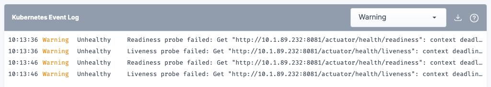

# Migration Breaking Changes

* The "Deployment Readiness"-Widget will no longer be added automatically. You must add a "Pod Count Metrics" step, set a duration, and select deployment targets you want to observe during experiment execution.

<figure><figcaption>
Deployment Readiness Widget
</figcaption></figure>

<figure><figcaption>
Pod count metrics step
</figcaption></figure>

* The "Kubernetes Event Log"-Widget will no longer be added automatically. You must add a "Kubernetes Event Log" step, set a duration, and select a cluster you want to observe during experiment execution.

<figure><figcaption>
Kubernetes Event Log
</figcaption></figure>

<figure><figcaption>
Kubernetes Event Log Step
</figcaption></figure>

* Kubernetes Node Count and Pod Count Checks need a target selection. We try to create a matching target selection based on your old step configuration. If this is not possible, you will get a validation error and need to tune the target selection manually.

<figure><figcaption>
New Pod Count Check with target selection
</figcaption></figure>

* Weak spots, Landscape connections and Policies are limited in functionality.
* The "Kubernetes Delete Pods" attack is not supported anymore and will eventually be replaced by a new attack.

<figure><figcaption>
"Delete Pods" - Attack
</figcaption></figure>

