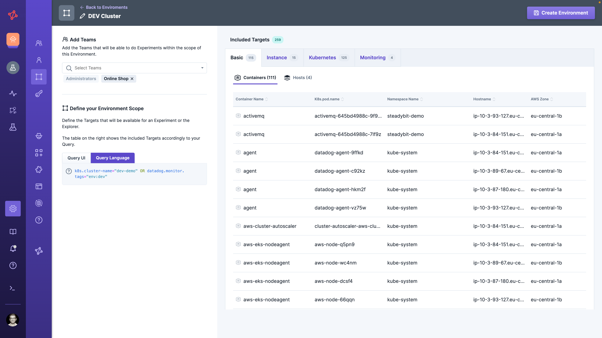

# Manage Environments

No one knows your system better than you, so it is obvious that you should be the one who structures the discovered targets.

It's up to you whether you use environments to separate parts of your system from each other (like "bounded contexts" in domain driven design), to separate your environments (like development, QA and Production) or simply both.

## Default Environment: Global

Per default, your system contains one environment called `Global`.
This is the place where **every** target that Steadybit has discovered will be in.
So, using Global for the start is fine (when trying out Steadybit), but on the long run dangerous and you should create your own.

## Define your own Environment

To create or change an environment go to `/settings/environments` and choose to either add an environment or edit an existing one.
An environment consists of a

- **Name**: A meaningful name helps to find the environment afterwards (e.g. "Onlineshop DEV" or "Contract Management PROD").
- **Team**: For using that environment to run an experiment you need to assign the team to it. This can be done from environment-perspective (`/settings/environments` ) as well as from Team-perspective (`/settings/teams`). It limits access to the users of a team to certain environments (so targets).
- **Environment Scope**: The environment scope defines targets belonging to an environment by using our [discovery data](../../use-steadybit/discovery/). This is the upper limit of targets that can be attacked when running an experiment in a certain environment.

### Define Environment Scope

With the query UI, you can build regular queries which are connected with an AND expression.
For most use cases this can be sufficient.
But sometimes, it's necessary to have even more control over the query.
For instance, if you want to check for any key-value pair existence or you want to match all, but not a specific attribute, e.g. cluster.name="prod".
Queries like that can easily be written with the Query language.
For detailed information, please [visit the query language documentation](../../use-steadybit/query-language.md).

Finally, don't forget to finally assign the environment to a team and give it a meaningful name.
That's it, you are ready to use that environment in an experiment!

### Use Environments

Once the environments are defined and assigned to teams, you can make use of them when e.g. [designing an experiment](../../use-steadybit/experiments/).
