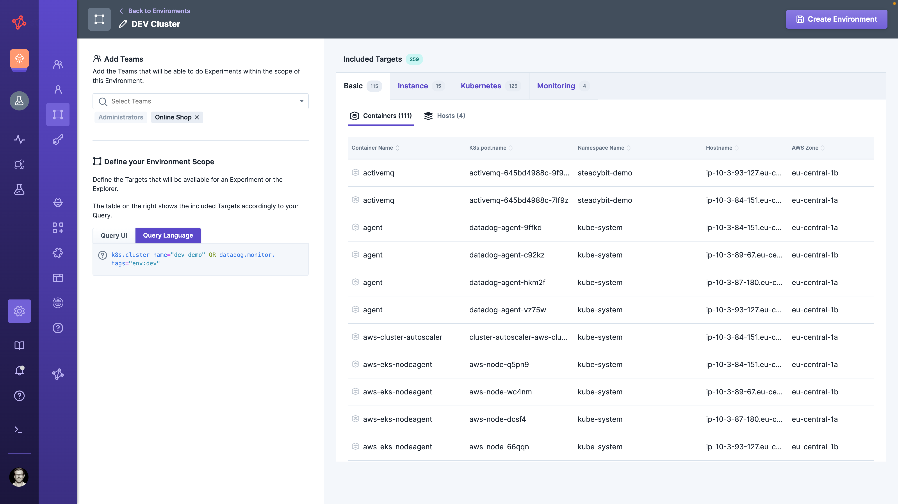

# Manage Environments

No one knows your system better than you, so you should be the one who structures the discovered targets.

It's up to you whether you use environments to separate parts of your system from each other (like "bounded contexts" in domain-driven design), to separate your stages (like development, QA and production), or both.

## Default Environment: Global

By default, your system contains one environment called `Global`. It contains **every** target that Steadybit has discovered. Using Global to get started is fine while you are trying Steadybit out, but it is dangerous in the long run, so you should create your own environments.

## Define your own Environment

To create or change an environment go to `/settings/environments` and choose to either add an environment or edit an existing one. An environment consists of a

* **Name**: A meaningful name helps you find the environment later (e.g. "Onlineshop DEV" or "Contract Management PROD").
* **Team**: To use an environment for running an experiment, you need to assign a team to it. You can do this from the environment side (`/settings/environments`) as well as from the team side (`/settings/teams`). This restricts a team's users to certain environments, and therefore to certain targets.
* **Environment Scope**: The environment scope defines targets belonging to an environment by using our [discovery data](../../concepts/discovery/). This is the upper limit of targets that can be attacked when running an experiment in a certain environment.

### Define Environment Scope

With the query UI, you can build regular queries which are connected with an AND expression. For most use cases that is sufficient. Sometimes, though, you need more control over the query — for instance, to check whether a key-value pair exists at all, or to match everything except one specific attribute, e.g. `cluster.name="prod"`. Queries like that can easily be written with the Query Language. For detailed information, please [visit the query language documentation](../../concepts/query-language/).

Finally, don't forget to assign the environment to a team and give it a meaningful name. That's it, you are ready to use that environment in an experiment!

### Use Environments

Once the environments are defined and assigned to teams, you can make use of them when e.g. [designing an experiment](../../use-steadybit/experiments/).

## Environment Variables

With an environment often come variables that are useful in an experiment associated with the provided environment (e.g., the name of the Kubernetes cluster, the HTTP base path of a load-balanced ingress, or the AWS account). You can manage environment variables to define those and use them consistently across all your experiments referencing the environment. Each variable can hold a fixed value or a [dynamic value](../../use-steadybit/experiments/variables.md#value-settings) that is resolved from your infrastructure when an experiment run starts. You can [learn more in the experiment's variable section](../../use-steadybit/experiments/variables.md).
