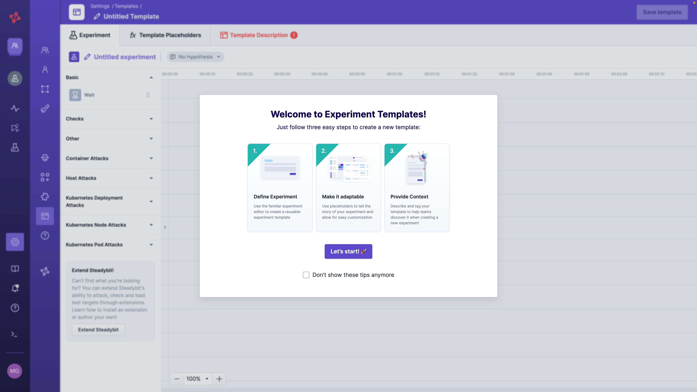
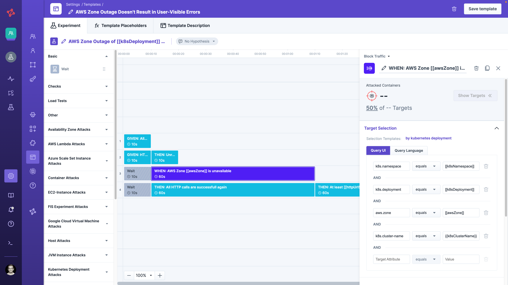
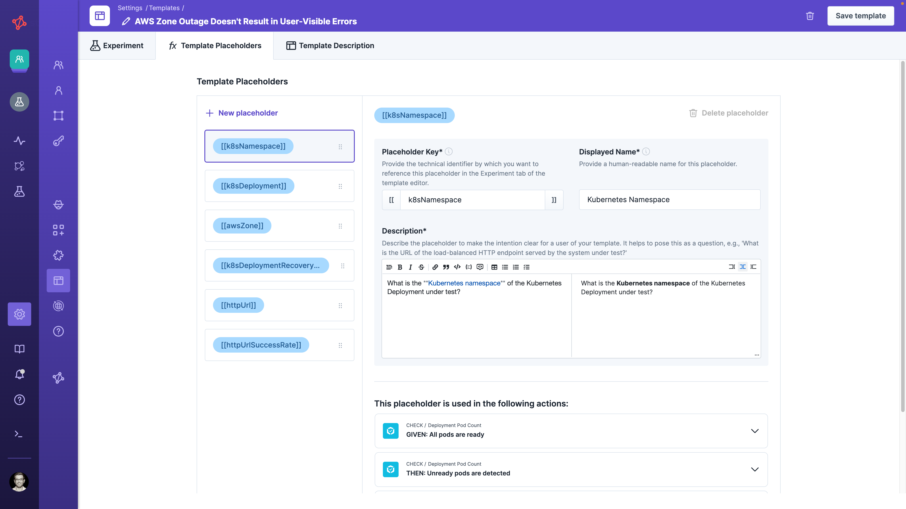
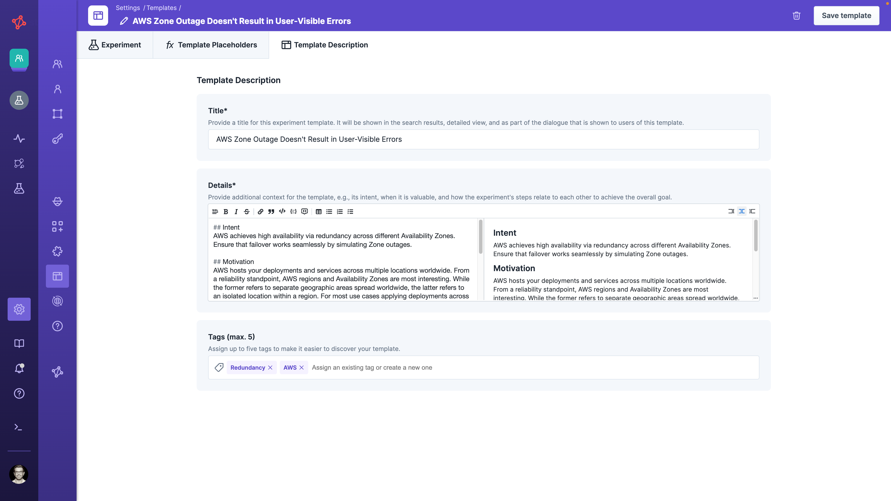
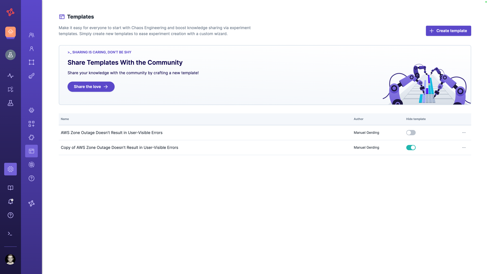
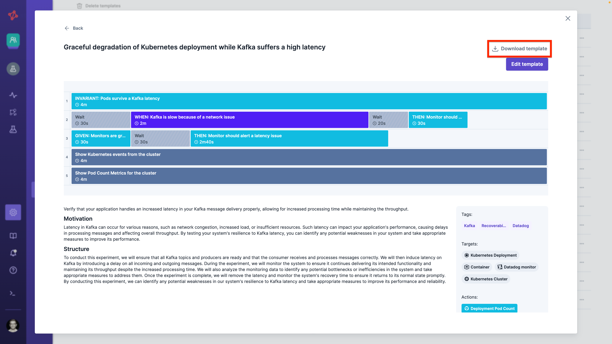
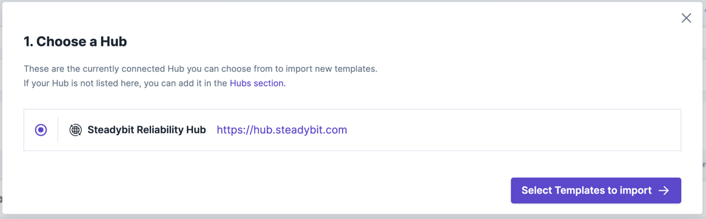
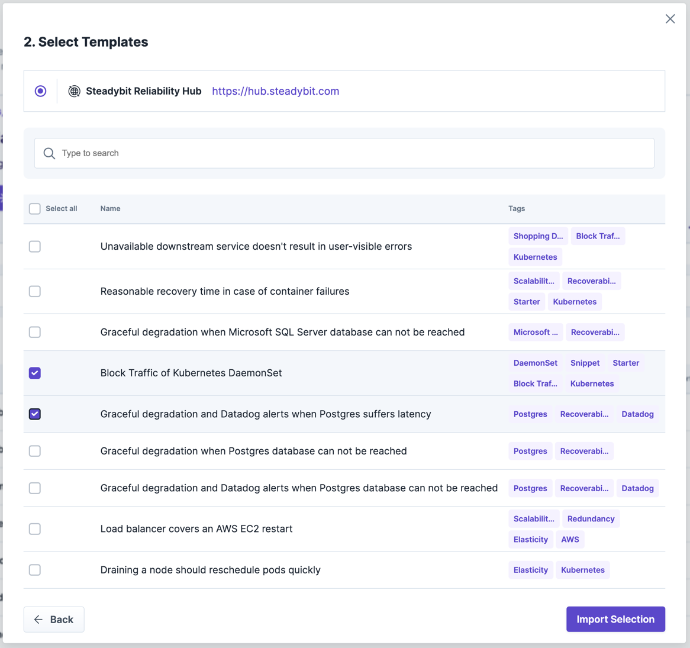
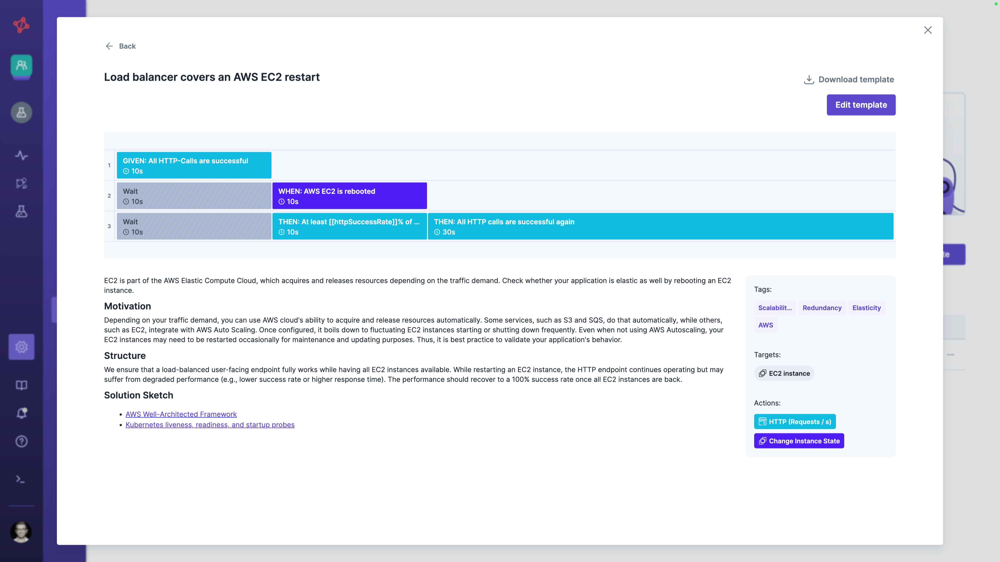

# Manage Experiment Templates
Experiment templates allow you to easily share knowledge with the teams and make it easy for everyone to do and learn Chaos Engineering.
You can create your own custom Experiment templates or import existing ones from a Reliability Hub.

## Permissions and Scope
Only admin users can manage experiment templates and thus create, import, edit, or delete experiment templates.
All experiment templates are scoped tenant-wide and automatically shared with all teams and users.
Users can even create experiments from experiment templates where they lack permissions for actions (e.g., the template contains a `Shutdown host` attack for which the team lacks permission).
However, before being able to run the experiment, they need to remove the action.

## Create Templates
Create and edit a template via the `Platform's settings` -> `Templates` section.
Choose the Blank approach to start from scratch.
Alternatively, you can upload a template from a file or create one from an existing experiment via `Save as Template`.

An experiment template consists of three parts: the *experiment* created when using a template, *template placeholders* to make the experiment adaptable, and *template description* to make the template discoverable for users.
To save a template, you must specify all required values of all three parts.

### Experiment

To define the experiment of the template, you benefit from a similar experiment editor as when creating an experiment.
When designing the experiment of the template, all targets are resolved to the `Global` environment.
However, when using a template to create an experiment, the user can select the desired environment, and all target and environment variables are evaluated against the selected environment.
This way, it is still easy to define a template and safe for teams to use one.
To make the experiment adaptable to different contexts, you can reference template placeholders (see below) and [environment variables](/use-steadybit/experiments/design.md#basic-elements) in the experiment's steps (e.g., target query, parameters, and step labels), hypothesis, and experiment name.

### Template Placeholder

A template placeholder defines occurrences where the exact value needs to be specified whenever one uses a template.
A template placeholder consists of a
- **Displayed Name** that is a human-readable name shown to the user of a template (e.g., `AWS Zone`, or `Kubernetes Deployment`
- **Placeholder Key** that defines all occurrences in the template that should be replaced later on (e.g., `[[aws_zone]]`, or `[[k8s_deployment]]`)
- **Placeholder Description** is shown when using the template and should help users understand the value.
  The description supports Markdown and can include, e.g., the intention of the placeholder and a question to ask for the value.

### Template Description

Describe your template to make it approachable for users.
The template description consists of the template's
- **Title**, which is shown in search results, detail view before creating an experiment from a template
- **Details** that allows you to provide noteworthy context and describe, e.g., the overall intention of the template or when it is useful.
  The field supports Markdown.
- **Tags** to structure your template by assigning it to new or existing tags.

## Edit Templates
You can edit a template and change all its content whenever needed.
Please note that changes don't affect experiments created from a template.

## Delete Templates
After you delete a template, users can't create an experiment from it anymore.
However, experiments previously created using that template are never deleted automatically.
Instead, you can also [hide a template](#hide-a-template) to temporarily prevent the use of a template.

## Hide Templates

By default, all saved templates are discoverable when creating a new experiment from a template.
However, you can hide a template to prevent users from using it.
To hide a template, change the toggle in `Settings`> `Template` of a specific template.
Experiments that have already been created from that template are not affected.

## Export Templates as Files
Once you've saved your template, you can export it as a file from the template details modal in `Settings` -> `Template`.

The saved file can be imported later on, either as a template or as an experiment (see [import templates](#import-templates-files)).
In addition, you can version your template as a file and update it automatically using Steadybit APIs.

## Import Templates Files
You can upload a template file into your Steadybit platform either as
a new template so that everyone can create an experiment from it (via `Settings` -> `Template` -> `Create Template`)
directly as an experiment by uploading it into the experiment creation flow (`Experiments` -> `New Experiment`) and running through the template wizard.
While the first option is only available to administrators, the second option is available to everyone.


When you export a template, the file contains a unique UUID of the template.
Whenever you import the template again, and the UUID already exists, the existing template is overwritten.


## Share Templates
Instead of sharing template's files directly, you can also use Steadybit's [hub connection](../../integrate-with-steadybit/hubs) to share a template via connected hubs.

### Import Templates from Hub
The hub connection makes it super easy to benefit from the best practices of the Chaos Engineering community (e.g., via Steadybit's [Reliability Hub](https://hub.steadybit.com/)).
Furthermore, if you're using Steadybit on-premise, you can easily keep multiple platforms in sync by using the hub connections via API.

To import a template from a hub, go to `Settings` -> `Templates` -> `Create Template` -> `From Hub`.
You first have to select a connected hub ([learn how to connect a new hub](../../integrate-with-steadybit/hubs#connect-new-hubs)).

Next, choose the templates you want to import.
If your template is already imported, you can re-import it to update it from the connected hub.

In addition, we provide an API to automate template syncing with connected hubs, and you can also [host your own private hub](../../integrate-with-steadybit/hubs#host-your-own-hub) to share templates within your organization.

### Export Templates to Reliability Hub
We're always looking forward to your contribution to Steadybit's public [Reliability Hub](https://hub.steadybit.com/)
Contributing is easy, just follow these steps:
1. Create a [fork of the repository reliability-hub-db](https://github.com/steadybit/reliability-hub-db/fork) into your GitHub account
2. Check out the forked repository to your local machine
3. If you haven't already, add yourself as a maintainer to `maintainers/<unique-identifier-of-your-org>/description.yml` (see, e.g., [maintainer Steadybit](https://github.com/steadybit/reliability-hub-db/blob/main/maintainers/com.steadybit/description.yml)).
4. Download your created template from the platform and save it to a new folder in `templates/<short-name-of-the-template>/template.json`.
Please ensure the template's description includes a short explanation, motivation, and structure overview.
Also, you have to parameterize all environment-specifics via template placeholders.

5. Add a `description.yml` to the folder `templates/<short-name-of-the-template>` which references your maintainer, the repository location and license information (see, e.g., [description.yml for template EC2 restart](https://github.com/steadybit/reliability-hub-db/blob/main/templates/aws-ec2.ec2-restart/description.yml)).
6. Add your template to the [index.json's](https://github.com/steadybit/reliability-hub-db/blob/main/index.json) `templates' array and update the Unix timestamp `lastChange` so that users can import it to their Steadybit platform.
7. Create a pull request from your forked repository to [reliability-hub-db](https://github.com/steadybit/reliability-hub-db) and wait for feedback from Steadybit!

We're looking forward to your valuable experiment template! 🎉