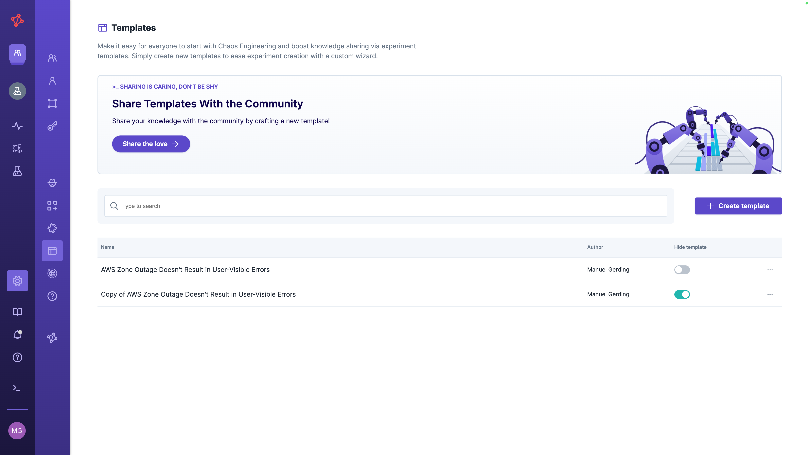

# Manage Experiment Templates
Experiment templates allow you to easily share knowledge with the teams and make it easy for everyone to do and learn Chaos Engineering.
You can create your own custom Experiment templates or import existing ones from a Reliability Hub.

## Permissions and Scope
Only admin users can manage experiment templates and thus create, import, edit, or delete experiment templates.
All experiment templates are scoped tenant-wide and automatically shared with all teams and users.
Users can even create an experiment from experiment templates where they are missing permissions for actions (e.g., the template contains a `Shutdown host` attack for which the team lacks permission).
However, before being able to run the experiment, they need to remove the action.

## Create a Template
Create and edit a template via the `Platform's settings` -> `Templates` section.
Choose the Blank approach to start from scratch.
Alternatively, you can upload a template from a file or create one from an existing experiment via `Save as Template`.

An experiment template consists of three parts: the *experiment* created when using a template, *template placeholders* to make the experiment adaptable, and *template description* to make the template discoverable for users.
To save a template, you must specify all required values of all three parts.

### Experiment

To define the experiment of the template, you benefit from a similar experiment editor as when creating an experiment.
When designing the experiment of the template, all targets are resolved to the `Global` environment.
However, when using a template to create an experiment, the user can select the desired environment, and all target and environment variables are evaluated against the selected environment.
This way, it is still easy to define a template and safe for teams to use one.
To make the experiment adaptable to different contexts, you can reference template placeholders (see below) and [environment variables](/use-steadybit/experiments/design.md#basic-elements) in the experiment's steps (e.g., target query, parameters, and step labels), hypothesis, and experiment name.

### Template Placeholder

A template placeholder defines occurrences where the exact value needs to be specified whenever one uses a template.
A template placeholder consists of a
- **Displayed Name** that is a human-readable name shown to the user of a template (e.g., `AWS Zone`, or `Kubernetes Deployment`
- **Placeholder Key** that defines all occurrences in the template that should be replaced later on (e.g., `[[aws_zone]]`, or `[[k8s_deployment]]`)
- **Placeholder Description** is shown when using the template and should help users understand the value.
The description supports Markdown and can include, e.g., the intention of the placeholder and a question to ask for the value.

### Template Description

Describe your template to make it approachable for users.
The template description consists of the template's
- **Title** which is shown in search results, detail view before creating an experiment from a template
- **Details** that allow you to provide noteworthy context and describe, e.g., the overall intention of the template or when it is useful.
The field supports Markdown.
- **Tags** to structure your template by assigning it to new or existing tags.

## Edit a Template
You can edit a template and change all its content whenever needed.
Please note that changes don't affect experiments created from a template.

## Delete a Template
After you delete a template, users can't create an experiment from it anymore.
However, previously created experiments from that template are not deleted.
Instead, you can also [hide a template](#hide-a-template) to temporarily prevent the use of a template.

## Hide a Template

By default, all saved templates are discoverable when creating a new experiment from a template.
However, you can decide to hide a template to prevent users from using it.
To hide a template, simply change the toggle in `Settings`> `Template` of a specific template.
Experiments that have already been created from that template are not affected.

## Import a Template
This feature is currently under development and will be available soon.

## Export a Template
This feature is currently under development and will be available soon.

## Share a Template
This feature is currently under development and will be available soon.