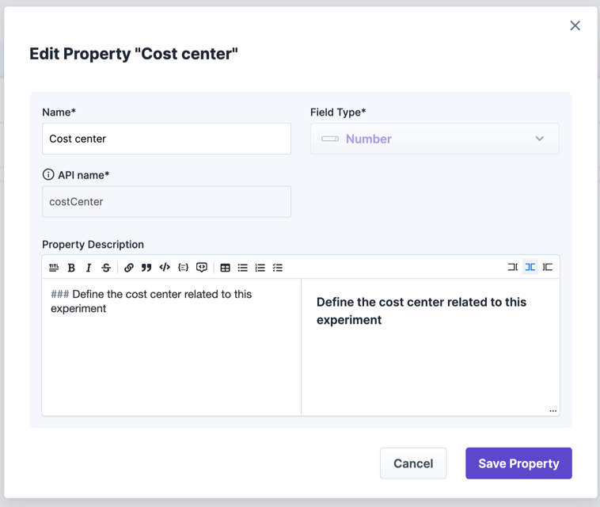

# Manage Experiment Properties

Properties are key-value pairs that can be used to add additional information to your experiments and runs. They can be used to store metadata about the experiment, such as the experiment's purpose, the team responsible for it, the outcome, or just a note of a specific run or any other relevant information.

Properties consist of three parts:

* Property definitions: The administrator can define which properties are available in the Steadybit platform. These definitions can be assigned to experiments and runs.
* Property assignments: Assignments define the relationship between a property definition and an experiment. They define where the property is visible and editable.
  * Administrators can assign properties to each experiment in your Steadybit tenant and even mark it as a required property.
  * Users can assign properties to a single experiment or a single run that they are allowed to edit. This allows users to add additional information to the experiment. More details can be found in the [experiment's section of property assignments](../../use-steadybit/experiments/properties/#assign-properties).
* Property values: The actual values of the properties. Values saved as part of an experiment design are copied to each experiment run. These values can be updated after the experiment has been run, if the assignment configuration allows so. Learn more in the [experiment's section of properties](../../use-steadybit/experiments/properties/).

## Examples

* Adding a note to a single experiment run
  * Your administrator defines a property definition called `note` with the datatype `rich text`.
  * You can add the property `note` to a single experiment run you are allowed to edit and fill out a Markdown value like "This experiment was _really_ great!".
* Adding a mandatory cost center field to each experiment
  * Your administrator defines a property definition called `costCenter` with the datatype `integer`.
  * Your administrator assigns the property definition `costCenter` to all experiment designs and marks it as required.
  * You need to fill out the cost center for each experiment you want to run.

## Manage Property Definitions

Property definitions are the basis for properties in Steadybit.

A property definition consists of the following fields:

* **Name**: The name of the property definition. This is the name that will be shown in the UI.
* **API name**: The key of the property that will be used in the API. This is a unique identifier for the property definition.
* **Field Type**: The data type of the property definition. This can be one of the following:
  * `String`: A text field containing any string value.
  * `List of Strings`: A list of text fields containing multiple string values.
  * `Rich Text`: A string field containing Markdown-formatted text.
  * `Boolean`: A checkbox that can be either true or false.
  * `Date`: A date field containing a date value.
  * `Number`: A number field containing an integer value.
  * `List of Numbers`: A list of number fields containing multiple integer values.
  * `Enumeration`: A dropdown field containing a predefined list of values. The values can be defined in the property definition.
  * `List of Enumerations`: A list of dropdown fields containing multiple predefined values. The values can be defined in the property definition.
  * `Link`: A field containing a URL. This can be used to link to external resources.
  * `List of Links`: A list of URL fields containing multiple links.
* **Property Description**: A description of the property definition. This is optional but recommended to provide additional context for the property.

Property definitions can be created and managed in the settings of the Steadybit platform. Administrators can create new property definitions, edit existing ones, and delete them. If an administrator deletes a property definition, all assignments and values of this property definition will be removed from all experiment designs and templates. Values in existing runs will not be deleted.

 

Properties can also be managed and assigned using the following API endpoint. Check out [Integrate with Steadybit / API](../../integrate-with-steadybit/api/api.md) how to access the API.

* [Manage property definitions](https://platform.steadybit.com/api/swagger/swagger-ui/index.html?configUrl=/api/spec/swagger-config#/Properties)

## Assign Properties

An administrator can assign property definitions to each experiment design. He can also mark a property as required, which means that the property must be filled in before the experiment can be run. This allows administrators to enforce certain properties for all experiments in the tenant. The assignment also defines whether the property is editable after the run has been started or if it should be read-only. This can be done in the settings section of the Steadybit platform.

### Property Assignment Configuration

A property assignment configuration consists of the following fields:

#### Property Definition API name

The referenced property definition assigned to the experiment design or run. For the UI, this is automatically given due to the context. For the API, you have to explicitly specify the property's API name.

#### Mandatory

Define a property's value to be required before being able to run the experiment.

#### Allow editing the value in the experiment run

Decide whether the property's value can be edited at run-level or only at design level. By default, this is design-only and thus, the property's value can only be edited at the experiment design level. If activated, the property can also be edited for each experiment run individually at the run details page.

 

### API

Properties can also be managed and assigned using the following API endpoint. Check out [Integrate with Steadybit / API](../../integrate-with-steadybit/api/api.md) how to access the API.

* [Manage property assignments](https://platform.steadybit.com/api/swagger/swagger-ui/index.html?configUrl=/api/spec/swagger-config#/Properties)

### Assign Properties Individually

Additionally, users can assign properties to a single experiment design or run, if they are a member of the team. More details can be found in the [experiment's section of property assignments](../../use-steadybit/experiments/properties/#assign-properties).

## Properties in Experiments

Properties can be used in experiment designs and runs:

* A **property definition** can be assigned to an experiment design or run (if not assigned globally)
* An **assigned property** can save values per experiment design or run

Learn more in the [experiment's section of properties](../../use-steadybit/experiments/properties/).
