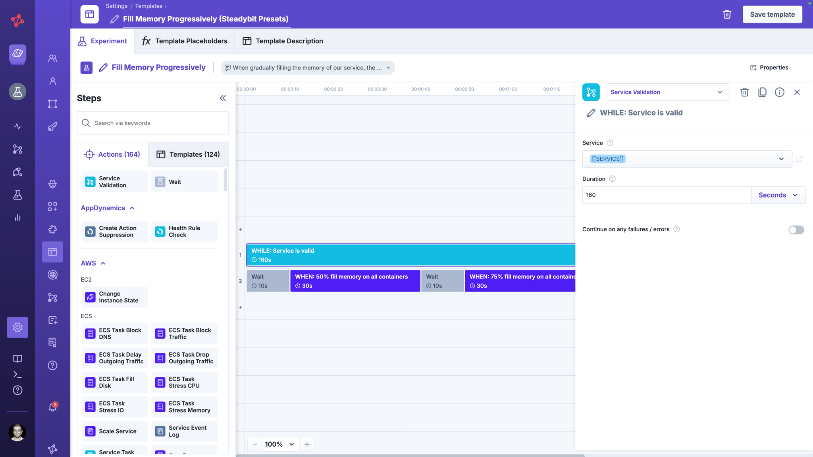
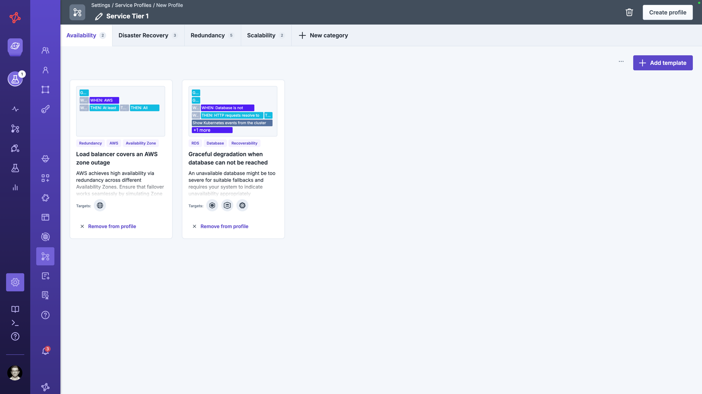

# Manage Service Profiles

A service profile defines the set of experiments provided to a [service](../../use-steadybit/services).
It specifies which reliability categories matter (e.g., Scalability, Redundancy, Dependencies) and which experiment templates are instantiated per service per category.
When a service is linked to a profile, Steadybit automatically generates concrete experiments from those templates using the service's target scope and validations.

## Service Profile Structure

A service profile consists of **categories** and **experiment templates** within those categories.

### Categories

Categories group related experiments and are shown as filter options on the service detail page (e.g., Redundancy, Scalability, Dependencies).
They help teams focus on one reliability dimension at a time.

### Experiment Templates

Each [experiment template](../../use-steadybit/experiments/templates/) in a profile defines the structure of an experiment to be generated for each service.
When a service uses a profile, Steadybit instantiates a profile's template on-the-fly by substituting the service into the template — producing ready-to-run experiments scoped to that specific service.
To reference to a service, you can create a template placeholder with the placeholder key `[[SERVICE]]`.
Use this placeholder in, e.g., a service validation drop down or a target query (`service.id="[[SERVICE]]"`).


Be aware, that removing a template from a service profile results in deleting provided experiments and experiment runs for all services refering to this service profile.
If you delete a template from one category and assign it to another one, without saving in between, no experiments are deleted.


### Linking a Service Profile to a Service

A service profile is selected when creating or editing a service via the **Customize** tab in the [service settings](../../use-steadybit/services/README.md#customize).
Every service must be linked to exactly one service profile.


Be aware, that changing a service's service profile results in deleting provided experiments and experiment runs that aren't part of the newly associated profile anymore.


## Service Profiles
You can use the existing built-in service profiles, coming from Steadybit for easy starting and best practices in reliability.
Alternatively, you can create your own service profile to match organizational standards.

### Built-in Starter Service Profile

Steadybit ships with a Starter built-in service profiles.
The **Steadybit Starter** profile makes it easy to begin with services.
It contains a broad set of experiment templates covering impactful reliability scenarios for various technologies, so teams can get meaningful results quickly without being overwhelmed.

We recommend creating your own custom service profile for rolling Steadybit out into your organization.

### Custom Service Profiles

Administrators can create custom service profiles to define organization-specific reliability standards.
This allows you to:

- Define categories that reflect your internal reliability model
- Select experiment templates that match the technology stack and failure modes relevant to your services
- Standardize the reliability evaluation across all teams and services

Custom profiles are managed in **Settings** → **Service Profiles**.

You can define one service profile as default, to use this for every new service. 


Only administrators can create and manage service profiles.
All profiles are available tenant-wide and can be assigned to any service.
