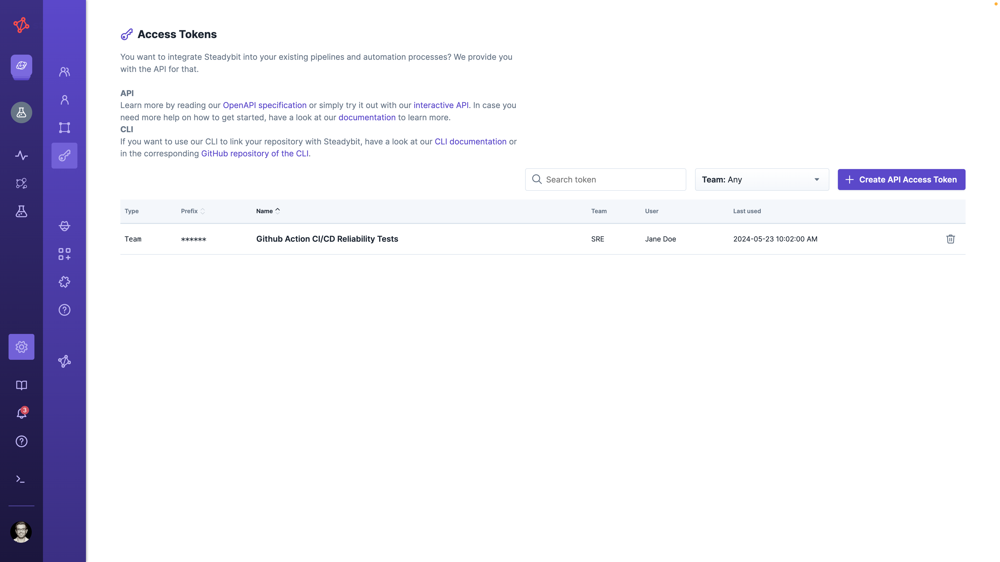
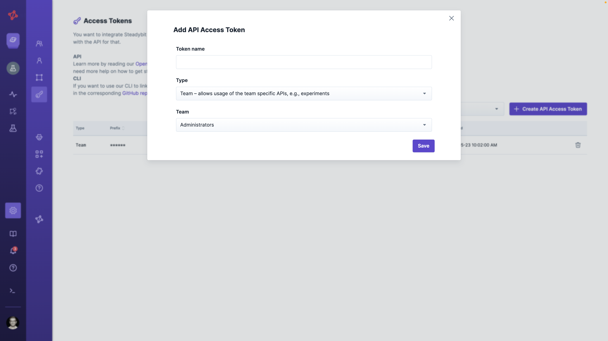

# API

The Steadybit Web API allows interfacing with the platform. We follow the principle that every feature available at the UI is also available via API.

To access the API, you need to have an Access token.

## Access Tokens

To use the API, you need to create an API access token and provide it via the `Authorization` header in your API requests.

API access tokens are managed by the administrator and team owners and can be found in the UI's Settings → API Access Tokens section.



We differentiate between team tokens and admin tokens.

**Team Tokens** are bound to a team and can be used to access all team experiments.

**Admin Tokens** have access to management APIs to manage, e.g., teams or environments. Admin tokens are only available to the administrator user.

### Create a new Access Token

You can create a new access token via the platform's user interface. Go to Settings → API Access Tokens.




You can't see it again once you create a new API access token. Make sure to save it in a safe place!


#### Create an Admin Token via internal API

On-premises customers can also create an admin token via internal APIs. 
These tokens can be used to provision environments, teams, templates, etc., automatically via the API.


These API tokens are associated with an implicit "machine" user, which cannot be removed/disabled.
That means: if you schedule experiments with these tokens and then revoke the token, the schedules are still active, and the experiments will be executed.
This differs from API tokens associated with a user: If the user is removed or loses their permissions, the scheduled experiments will fail due to insufficient permissions.


**Create Admin Token via CLI**

To generate a new admin token in your On-Prem Platform via CLI, first ssh into the platform server. Afterward, run the following command:

```bash
/scripts/createAdminToken.sh

Missing mandatory arguments
Usage: /scripts/createAdminToken.sh -n <name> -t <tenantKey>
  -n | --name <name>           Name of the token
  -t | --tenantKey <tenantKey> Tenant key
  -h | --help                  Show this help
  
  
/scripts/createAdminToken.sh -t demo -n AdminToken
Z8pChlF2*************
```

The token will be printed to the console.

**\[On-Prem] Create Admin Token via HTTP API**

To generate a new admin token in your On-Prem Platform via HTTP API, first ssh into the platform server. Afterwards, you can curl:

```bash
curl --header "Content-Type: application/json" \
  --request POST \
  --data '{"name":"'$NAME'","tenantKey":"'$TENANTKEY'"}' \
  http://localhost:9090/actuator/adminaccesstoken
```

> This endpoint is only accessible for On-Prem customers and only from localhost. It cannot be accessed from outside your server.


## OpenApi Specification

We provide a [OpenApi 3.0 Specification for the API](https://platform.steadybit.com/api/spec) as well as an [interactive documentation](https://platform.steadybit.com/api/swagger). In case you are using our on-prem variant you can access it at `http://<your-installation-url>/api/spec`.

### Requests and Responses

All API requests require a specified access token via the `Authorization` header in the format `Authorization: accessToken <token>`.

If applicable, request and response bodies are expressed using `json` or `yml`, depending on the used `Content-Type` and `Accept` headers. Success or failure of an API call is expressed via HTTP status.

#### Too Many Requests

API endpoints are rate limited and may return the HTTP status code `429 - Too Many Requests`.

In this case the `Retry-After` response header contains the number of seconds to wait before executing further requests, see [RFC 7231](https://www.rfc-editor.org/rfc/rfc7231.html#section-7.1.3). Furthermore, the response headers `RateLimit-Limit`, `RateLimit-Remaining` and `RateLimit-Reset`, as defined in the IETF draft [RateLimit Header Fields for HTTP](https://www.ietf.org/archive/id/draft-polli-ratelimit-headers-02.html), are returned containing more details.

```bash
curl \
 -v \
 -H "Authorization: accessToken <token>"\
 -H "Accept: application/json"\
 https://platform.steadybit.com/api/<endpoint>
[...]
< HTTP/1.1 429 Too Many Requests
< ratelimit-limit: 100;w=60
< ratelimit-remaining: 0
< ratelimit-reset: 46
< retry-after: 46
[...]
```

### Example: Create Experiment

This is how you can create an experiment (`json` is supported as well):

```bash
curl \
  -i \
  -H 'Content-Type: application/x-yaml' \
  -H 'Authorization: accessToken <token>' \
  https://platform.steadybit.com/api/experiments \
  --data '
---
name: Experiment API Test
team: ADM
environment: Global
lanes:
  - steps:
      - !<action>
        actionType: check:http
        parameters:
          method: "GET"
          url: "https://example.com"
          headers: []
          successRate: 100
          maxConcurrent: 5
          requestsPerSecond: 1
          duration: "10s"
          followRedirects: false
          readTimeout: "5s"
          connectTimeout: "5s"
          statusCode: "200-299"
'
```

The `Location` header of the response indicates the url of the newly created experiment:

```
location: https://platform.steadybit.com/api/experiments/ADM-
```

### Example: Run Experiment

You can then run the experiment:

```bash
curl \
  -i \
  -X POST \
  -H 'Authorization: accessToken <token>' \
  https://platform.steadybit.com/api/experiments/ADM-1/execute
```

### Create a golang client with oapi-codegen

In case you want to [generate the structs](https://github.com/oapi-codegen/oapi-codegen), you should add this parameter to your configuration file:

```yaml
compatibility:
  circular-reference-limit: 11
```

Here is an example configuration to generate a Go client with net/http:

```yaml
package: api
generate:
  std-http-server: true
  models: true
output: gen.go
compatibility:
  circular-reference-limit: 11
```

And then in your golang file:

```go
//go:generate go run github.com/oapi-codegen/oapi-codegen/v2/cmd/oapi-codegen --config=config.yaml https://platform.steadybit.com/api/spec
```
