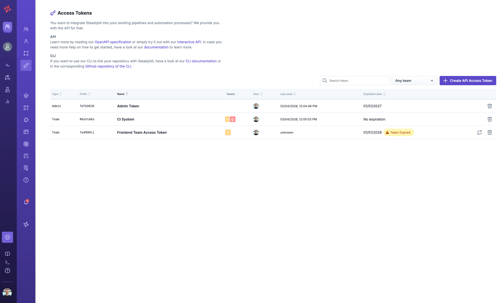
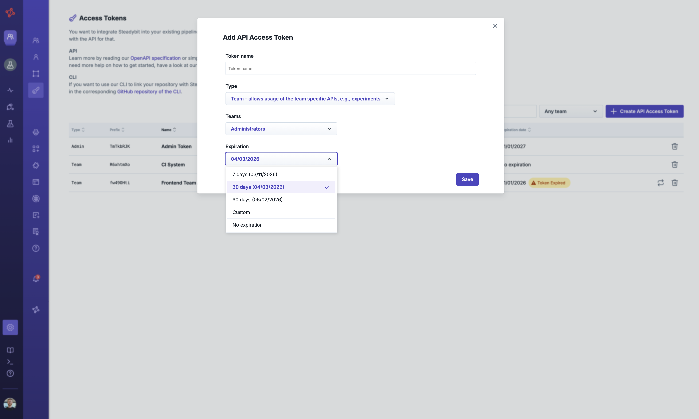

# API

The Steadybit API gives you programmatic access to the platform. Every feature available in the UI is also available via the API.

All API requests require an access token for authentication.

## Access Tokens

To authenticate API requests, create an access token and pass it via the `Authorization` header in your request.

Access tokens can be managed in the UI under Settings → API Access Tokens.



### Token Types

Steadybit supports three token types:

**Team Tokens** are associated with one or more teams and can be used to access experiments and team-related operations within those teams. Admins and team owners can create team tokens.

**Wildcard Tokens** grant access to all teams the token creator belongs to. Team memberships are resolved dynamically at authentication time, so the token automatically reflects any future team changes. Admins and team owners can create wildcard tokens.

**Admin Tokens** grant access to platform management APIs (e.g., teams, environments, users). They are not associated with any team and can only be created by administrators.

### Token Expiration

Access tokens can have an optional expiration date. Once expired, a token can no longer be used for authentication. Tokens without an expiration date never expire.

Expired tokens can be **recreated** with a new expiration date. Recreating a token generates a new secret while preserving the original name, type, and team associations. The old token is invalidated.

### Token Permissions

Who can manage tokens depends on the token type:

| Action   | Admin Token | Team Token and Wildcard Token                 |
|----------|-------------|-----------------------------------------------|
| Create   | Admin only  | Admin or team owner (of all associatod teams) |
| Delete   | Admin only  | Admin or token creator                        |
| Recreate | Admin only  | Admin or token creator                        |

### Creating a Token via the UI

You can create a new access token in the UI under Settings → API Access Tokens.




The token value is shown only once at creation time. Make sure to save it in a safe place.


### Creating a Token via the API

Access tokens can also be managed programmatically via the `/api/access-tokens/v2` endpoints.

```bash
curl -X 'POST' \
  'https://platform.dev.steadybit.com/api/access-tokens/v2' \
  -H 'accept: application/json' \
  -H 'Content-Type: application/json' \
  -H 'Authorization: accessToken <admin-token>' \
  -d '{
  "name": "CI/CD access token",
  "type": "TEAM",
  "teams": [
    "ADM",
    "DEV"
  ],
  "expiresAt": "2027-01-01T00:00:00Z"
}'
```

Details on the Access Token API endpoint can be found in specification linked in the [OpenApi Specification](#openapi-specification) section.

### Creating an Admin Token via Internal API (On-Prem)

On-premises customers can create admin tokens via an internal API. This is useful for automated provisioning of environments, teams, and templates.


Tokens created via the internal API are associated with an implicit "machine" user that cannot be removed or disabled.

Experiments scheduled with such a token will continue to execute even after the token is deleted. This differs from tokens associated with a regular user, if that user is removed or loses permissions, their scheduled experiments will fail.


**Via CLI**

SSH into the platform server and run:

```bash
/scripts/createAdminToken.sh -t <tenantKey> -n <name>
```

Example:

```bash
/scripts/createAdminToken.sh -t onprem -n AdminToken
Z8pChlF2*************
```

**Via HTTP API**

SSH into the platform server and call:

```bash
curl \
  -H 'Content-Type: application/json' \
  -X POST \
  -d '{"name":"'$NAME'","tenantKey":"'$TENANTKEY'"}' \
  http://localhost:9090/actuator/adminaccesstoken
```


This endpoint is only accessible from localhost and is not reachable from outside the server.


## OpenApi Specification

We provide a [OpenApi 3.0 Specification for the API](https://platform.steadybit.com/api/spec) as well as an [interactive documentation](https://platform.steadybit.com/api/swagger). In case you are using our on-prem variant you can access it at `http://<your-installation-url>/api/spec`.

### Requests and Responses

All API requests require a specified access token via the `Authorization` header in the format `Authorization: accessToken <token>`.

If applicable, request and response bodies are expressed using `json` or `yml`, depending on the used `Content-Type` and `Accept` headers. Success or failure of an API call is expressed via HTTP status.

#### Too Many Requests

API endpoints are rate limited and may return the HTTP status code `429 - Too Many Requests`.

In this case the `Retry-After` response header contains the number of seconds to wait before executing further requests, see [RFC 7231](https://www.rfc-editor.org/rfc/rfc7231.html#section-7.1.3). Furthermore, the response headers `RateLimit-Limit`, `RateLimit-Remaining` and `RateLimit-Reset`, as defined in the IETF draft [RateLimit Header Fields for HTTP](https://www.ietf.org/archive/id/draft-polli-ratelimit-headers-02.html), are returned containing more details.

```bash
curl \
 -v \
 -H "Authorization: accessToken <token>"\
 -H "Accept: application/json"\
 https://platform.steadybit.com/api/<endpoint>
[...]
< HTTP/1.1 429 Too Many Requests
< ratelimit-limit: 100;w=60
< ratelimit-remaining: 0
< ratelimit-reset: 46
< retry-after: 46
[...]
```

### Example: Create Experiment

This is how you can create an experiment (`json` is supported as well):

```bash
curl \
  -i \
  -H 'Content-Type: application/x-yaml' \
  -H 'Authorization: accessToken <token>' \
  https://platform.steadybit.com/api/experiments \
  --data '
---
name: Experiment API Test
team: ADM
environment: Global
lanes:
  - steps:
      - !<action>
        actionType: check:http
        parameters:
          method: "GET"
          url: "https://example.com"
          headers: []
          successRate: 100
          maxConcurrent: 5
          requestsPerSecond: 1
          duration: "10s"
          followRedirects: false
          readTimeout: "5s"
          connectTimeout: "5s"
          statusCode: "200-299"
'
```

The `Location` header of the response indicates the url of the newly created experiment:

```
location: https://platform.steadybit.com/api/experiments/ADM-
```

### Example: Run Experiment

You can then run the experiment:

```bash
curl \
  -i \
  -X POST \
  -H 'Authorization: accessToken <token>' \
  https://platform.steadybit.com/api/experiments/ADM-1/execute
```

### Create a golang client with oapi-codegen

In case you want to [generate the structs](https://github.com/oapi-codegen/oapi-codegen), you should add this parameter to your configuration file:

```yaml
compatibility:
  circular-reference-limit: 11
```

Here is an example configuration to generate a Go client with net/http:

```yaml
package: api
generate:
  std-http-server: true
  models: true
output: gen.go
compatibility:
  circular-reference-limit: 11
```

And then in your golang file:

```go
//go:generate go run github.com/oapi-codegen/oapi-codegen/v2/cmd/oapi-codegen --config=config.yaml https://platform.steadybit.com/api/spec
```
