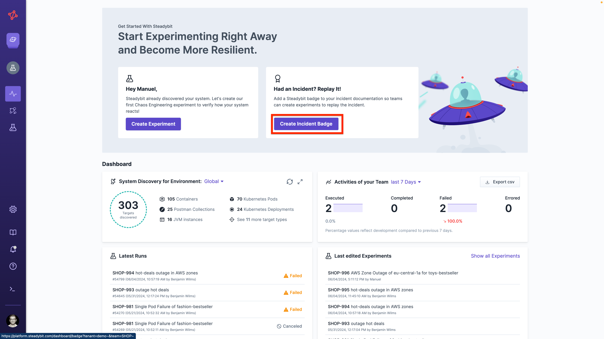
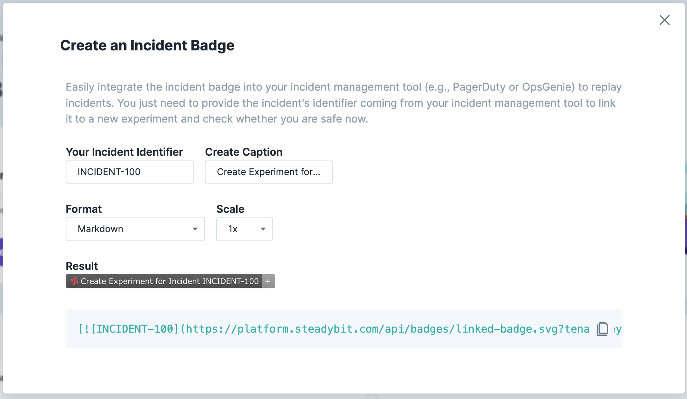

# Badges
Get a badge for your experiment to integrate the latest run state, e.g., in wikis, ticketing tools, or wherever else it is valuable for you. You can easily integrate the badge using HTML, Markdown, or just a hosted image.

We support two badges:

- an [experiment badge](#experiment-badges) that shows the latest run state of a specific experiment
- an [incident badge](#badges-linked-to-external-references) that either creates an experiment linked to an external reference or shows the latest run as soon as it is created state

## Experiment Badges

You can reference an experiment on any external web page using badges, like this one:


It’s an excellent way to get a link to your experiment and view the status without navigating and logging into the Steadybit platform.\

Simply go to an experiment that is of interest for you, and click on the experiment badge icon on the top right.


You can choose the desirable format and scale of your badge and simply copy the resulting script.


Alternatively, below are examples to copy and adjust to create your badge manually

### Example Markdown


```markdown
Template:
[](https://platform.steadybit.com/experiments/{{team-key}}/edit/{{experiment-key}}/executions/?tenant={{tenant-key}}~)

Example:
[](https://platform.steadybit.com/experiments/SHOP/edit/SHOP-61/executions/?tenant=demo~)
```


### Example HTML


```html
Template: 
<a href="https://platform.steadybit.com/experiments/{{team-key}}/edit/{{experiment-key}}/executions/?tenant={{tenant-key}}~" rel="nofollow"></a>

Example
<a href="https://platform.steadybit.com/experiments/SHOP/edit/SHOP-61/executions/?tenant=demo~" rel="nofollow"></a>
```


## Badges linked to external references

Experiment Badges always links to an existing experiment.
But what if you like to have some kind of external reference?
Let's say you have an "INCIDENT-100", you are writing a documentation about it and want to add one or more experiment badges to it.
Maybe even before you've actually created.
This is where the second kind of badges comes into play.


You can simply create the incident badge at the Steadybit dashboard by clicking 'Create Incident Badge'.



Next you need to specify your external unique identifier (e.g. `INCIDENT-100`) and can choose the desirable format and scale of your badge.




Alternatively, below are examples to copy and adjust to create your badge manually

### Markdown


```markdown
Template:
[](https://platform.steadybit.com/api/badges/link?tenantKey=demo&externalReference={{external-reference}})

Example:
[](https://platform.steadybit.com/api/badges/link?tenantKey=demo&externalReference=INCIDENT-100)
```


### HTML


```html
Template: 
<a href='https://platform.steadybit.com/api/badges/link?tenantKey=demo&externalReference={{external-reference}}' target='_blank'></a>

Example
<a href='https://platform.steadybit.com/api/badges/link?tenantKey=demo&externalReference=INCIDENT-100' target='_blank'></a>
```

