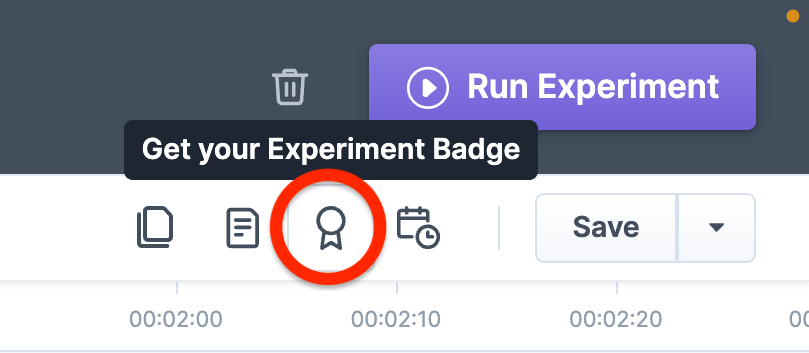
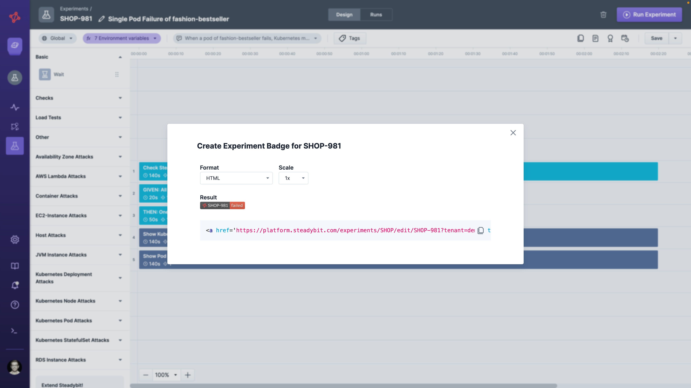
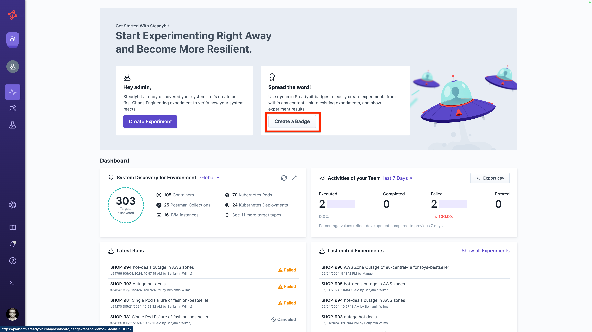
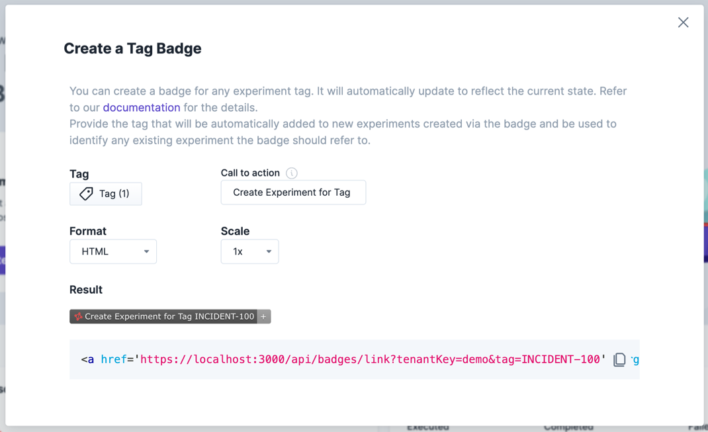

# Badges

Get a badge for your experiment to integrate the latest run state, e.g., in wikis, ticketing tools, or wherever else it is valuable for you. You can easily integrate the badge using HTML, Markdown, or just a hosted image.

We support two badges:

* an [experiment badge](./#experiment-badges) that shows the latest run state of a specific experiment
* an [incident badge](./#badges-linked-to-external-references) that either creates an experiment linked to an external reference or shows the latest run as soon as it is created state

## Experiment Badges

You can reference an experiment on any external web page using badges, like this one:


It’s an excellent way to get a link to your experiment and view the status without navigating and logging into the Steadybit platform.

Go to an experiment that interests you, and click on the experiment badge icon on the top right.



You can choose your badge's desirable format and scale and copy the resulting script.



Alternatively, below are examples to copy and adjust to create your badge manually

### Example Markdown


```markdown
Template:
[](https://platform.steadybit.com/experiments/{{team-key}}/edit/{{experiment-key}}/executions/?tenant={{tenant-key}}~)

Example:
[](https://platform.steadybit.com/experiments/SHOP/edit/SHOP-61/executions/?tenant=demo~)
```


### Example HTML


```html
Template: 
<a href="https://platform.steadybit.com/experiments/{{team-key}}/edit/{{experiment-key}}/executions/?tenant={{tenant-key}}~" rel="nofollow"></a>

Example
<a href="https://platform.steadybit.com/experiments/SHOP/edit/SHOP-61/executions/?tenant=demo~" rel="nofollow"></a>
```


## Tag Badges

Experiment badges always link to a single existing experiment. If you want to refer to experiments that have a common purpose, you can instead use tag badges. Example use cases for this are linking to experiments reproducing a past issue from within your post-mortem documentation, indicating whether a specific architecture requirement is fulfilled, or providing visual evidence of the outcome of your latest disaster recovery test. Unlike experiment badges, tag badges can be created even if no experiment with the chosen tag exists, allowing you to use them as a call to action for creating a new experiment. This is how they look like in different states:

<figure><figcaption><p>Tag badge when no experiment with the chosen tag exists</p></figcaption></figure>

<figure><figcaption><p>Tag badge when a single experiment with the chosen tag exists</p></figcaption></figure>

<figure><figcaption><p>Tag badge when multiple experiments with the chosen tag exist</p></figcaption></figure>

To create a tag badge, navigate to the Steadybit dashboard and click on 'Create a Badge'.



You then either choose an existing tag or create a new one. That tag will be automatically added to any experiment created via the badge and used to identify experiments that should be associated with it.

You can then configure the desired format and scale for your badge and provide the text that will be shown when no experiment with the chosen tag exists.



Alternatively, below are some examples that you can copy and adjust to create your tag badge manually:

### Markdown


```markdown
Template:
[](https://platform.steadybit.com/api/badges/link?tenantKey=demo&tag={{tag}})

Example:
[](https://platform.steadybit.com/api/badges/link?tenantKey=demo&tag=INCIDENT-100)
```


### HTML


```html
Template: 
<a href='https://platform.steadybit.com/api/badges/link?tenantKey=demo&tag={{tag}}' target='_blank'></a>

Example
<a href='https://platform.steadybit.com/api/badges/link?tenantKey=demo&tag=INCIDENT-100' target='_blank'></a>
```

