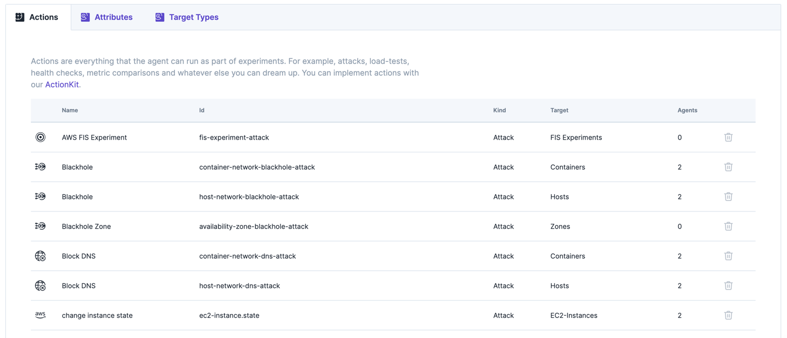

# Extension Installation

Extensions follow common installation patterns that look something like this:

1. Deploy the extension within your infrastructure.
2. Make sure the extension is reachable and known by the Steadybit agent. Please check [Install Outpost Agent -> Extension Discovery](install-and-configure/install-outpost-agent/extension-discovery.md) for details.

Most extensions will require extension-specific configuration. For example, the Kong extension needs to know how to reach and authenticate with Kong API gateways, while the AWS extensions require the configuration of IAM roles. As a result, no single set of instructions covers all extensions. However, extensions' documentation should describe the exact configuration and installation steps.

## Manage your Extensions

In the platform, you can manage your extensions via the extensions tab. You can see the extensions that are currently installed. Go to [Settings -> Extensions](https://platform.steadybit.com/settings/extensions) to see the list of installed extensions.

