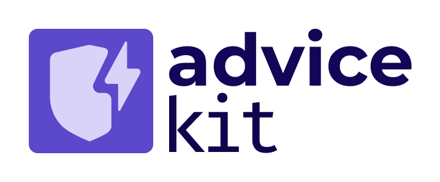

# Extension Kits

Steadybit's Extension Kits allow you to extend the Chaos Engineering capabilities by adding support for additional technologies or proprietary applications. So, you only need to know about these kits if you are considering authoring a custom extension.

Steadybit provides development kits for the following purposes:

* [ActionKit](extension-kits.md#actionkit) to create your own custom Chaos Engineering attacks, checks for integrating, e.g., into observability or load test integration
* [AdviceKit](extension-kits.md#advicekit) to implement your own [advice](../../use-steadybit/explorer/advice.md) and ease identifying experiments and tracking progress
* [DiscoveryKit](extension-kits.md#discoverykit) to support discovery of new infrastructure components
* [EventKit](extension-kits.md#eventkit) to send events about running experiments from Steadybit to other third-party applications (e.g., observability)
* [ExtensionKit](extension-kits.md#extensionkit) utility classes and best practices for extension authors using the Go programming language
* [PreflightKit](extension-kits.md#preflightkit) to implement preflight checks that can be used to prevent experiment executions

All these development kits are agnostic to the programming language and rely on HTTP interfaces. However, if you want to develop your extension using Go, we recommend our [ExtensionKit](extension-kits.md#extensionkit) to benefit from helpful utility classes and best practices.

## ActionKit

<figure><figcaption>
ActionKit logo depicting the text action kit and a crosshair icon
</figcaption></figure>

The Steadybit ActionKit enables the extension of Steadybit with new action capabilities that you can use within experiments. For example, ActionKit can be used to author open/closed source:

* attacks to attack AWS, Azure, and Google Cloud services that Steadybit cannot natively attack,
* integrate load testing tools,
* health and state checks and
* every other runnable action!

You can learn more about ActionKit through its [GitHub repository](https://github.com/steadybit/action-kit).

## AdviceKit

<figure><figcaption>
AdviceKit logo depicting the text advice kit and a shield icon
</figcaption></figure>

The Steadybit AdviceKit enables the extension of Steadybit's advice for providing guidance on reliability configuration issues and suggesting appropriate experiments.

You can learn more about AdviceKit through its [GitHub repository](https://github.com/steadybit/advice-kit).

## DiscoveryKit

<figure><figcaption>
DiscoveryKit logo depicting the text discovery kit and a radar dish icon
</figcaption></figure>

The Steadybit DiscoveryKit enables the extension of Steadybit with new discovery capabilities. For example, DiscoveryKit can be used to author open/closed source discoveries for:

* proprietary technology,
* non-natively supported open-source tech,
* hardware components and
* every other _'thing'_ you would want to see and attack with Steadybit.

You can learn more about DiscoveryKit through its [GitHub repository](https://github.com/steadybit/discovery-kit).

## EventKit

<figure><figcaption>
EventKit logo depicting the text event kit and a bell icon
</figcaption></figure>

EventKit allows extensions to consume events from the Steadybit platform to integrate with third-party systems. Extensions leveraging EventKit are similar to webhooks but do not face the typical web routing issues as Steadybit agents handle this aspect. You can use EventKit to:

* Forward audit logs to an external system.
* Add markers to monitoring systems' charts during experiment runs.
* Capture experiment run statistics.
* Report information about experiment runs to Slack, Discord etc.

You can learn more about EventKit through its [GitHub repository](https://github.com/steadybit/event-kit).

## ExtensionKit

<figure><figcaption>
ExtensionKit logo depicting the text extension kit and a wrench icon
</figcaption></figure>

Through kits like ActionKit and DiscoveryKit, Steadybit can be extended with new capabilities. ExtensionKit on the other hand contains helpful utilities and best practices for extension authors leveraging the Go programming language.

You can learn more about ExtensionKit through its [GitHub repository](https://github.com/steadybit/extension-kit).

## PreflightKit

<figure><figcaption>
PreflightKit logo depicting the text preflight kit and a preflight icon
</figcaption></figure>

PreflightKit enables the extension of Steadybit with new preflight capabilities that you can use to prevent experiment executions. 
For example, PreflightKit can be used to author open/closed source:

* preflight checks to allow or disallow experiment executions based on the experiment and its targets,
* preflight checks to prevent experiment executions based on the time of day / maintenance windows,
* or anything else you can think of!

You can learn more about PreflightKit through its [GitHub repository](https://github.com/steadybit/preflight-kit).

