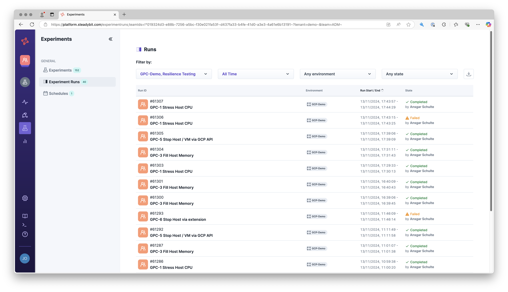

# Extension Kits

Three extension kits exist through which Steadybit's capabilities can be extended. Unless you are thinking about authoring a custom extension, you probably do not need to know about these kits.

## ActionKit

The Steadybit ActionKit enables the extension of Steadybit with new action capabilities that you can use within experiments. For example, ActionKit can be used to author open/closed source:

* attacks to attack AWS, Azure, and Google Cloud services that Steadybit cannot natively attack,
* integrate load testing tools,
* health and state checks and
* every other runnable action!

You can learn more about ActionKit through its [GitHub repository](https://github.com/steadybit/action-kit).

## DiscoveryKit

.png>)

The Steadybit DiscoveryKit enables the extension of Steadybit with new discovery capabilities. For example, DiscoveryKit can be used to author open/closed source discoveries for:

* proprietary technology,
* non-natively supported open-source tech,
* hardware components and
* every other _"thing"_ you would want to see and attack with Steadybit.

You can learn more about DiscoveryKit through its [GitHub repository](https://github.com/steadybit/discovery-kit).

## ExtensionKit

Through kits like AttackKit and DiscoveryKit, Steadybit can be extended with new capabilities. Such \*Kit usages are called extensions. ExtensionKit contains helpful utilities and best practices for extension authors leveraging the Go programming language.

You can learn more about Extension through its [GitHub repository](https://github.com/steadybit/extension-kit).
