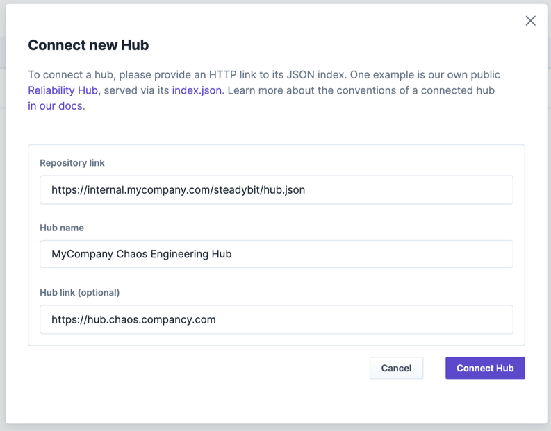
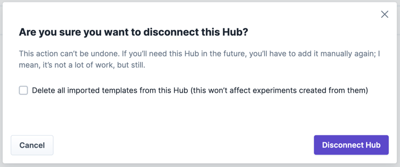

# Hubs

Steadybit's hubs are the home for the chaos engineering community! They allow everyone to browse and contribute open-source extensions and templates made for Steadybit.
Steadybit hosts its own [Reliability Hub](https://hub.steadybit.com/) and always loves to see contributions via [pull requests](https://github.com/steadybit/reliability-hub-db).

Steadybit's chaos engineering platform lets you connect to a hub to ease [importing experiment templates](../../install-and-configure/manage-experiment-templates) or integrate documentation.

## Hub Connections
Admins can manage connected hubs in the platform's settings. By default, the platform connects to our [Reliability Hub](https://hub.steadybit.com/).


On-premise platform installations connect to a bundled local copy of our Reliability hub's content. Thus, air-gapped environments are supported even when reading data from the hub connection.


### Connect New Hubs
Steadybit supports connecting your own hub to the platform. An administrator can manage hub connections via `Settings`> `Hubs`. To add a hub, you need to specify the URL to the hub's index.json (see section [hub convention](#hub-connections)).



Once you've added your hub, you can [import templates from the hub easily](../../install-and-configure/manage-experiment-templates) and view documentation of actions integrated into the experiment editor.

### Disconnect Hub
When you disconnect a connected hub, you can decide to remove imported templates. Experiments created from a template are never deleted when you disconnect a hub.



## Host Your Own Hub
You can host your own hub to share content within your organization instead of with the public community. This is especially beneficial when you have developed a proprietary extension or need to share organization-specific templates.
So far, we only support hosting a private hub's database and connecting it to the platform. We do not yet support hosting a white-labeled hub UI.

### Hub Convention
To host your own hub, you have to serve a JSON-based endpoint via HTTP that has a last modified unix timestamp (`lastChange`) and path references to templates and action documentations:

```
{
  "lastChange": 1719498293,
  "templates": [
    "/templates/aws-zone.zone-outage/template.json",
    "/templates/kubernetes-deployment.time-to-readiness/template.json"
    //...
  ],
  "actions": [
    "/actions/com.steadybit.extension_aws.lambda.latency/summary.mdx",
    "/actions/com.steadybit.extension_container.stop/summary.mdx"
    //...
  ]
}
```