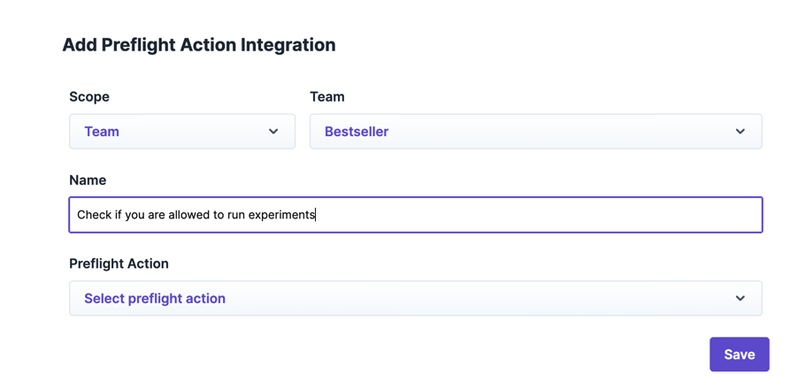
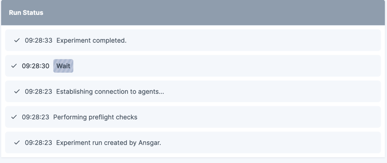
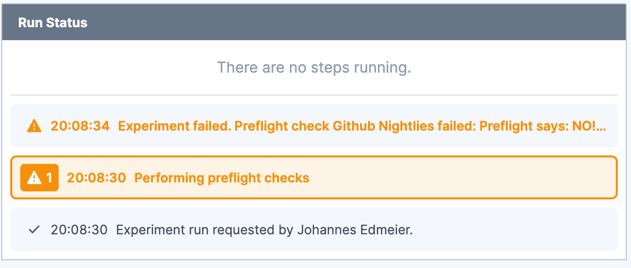

# Preflight Actions


Preflight actions are an enterprise feature. Please [reach out to us](https://steadybit.com/contact) if you want to get
access.


Preflight actions are triggered by Steadybit whenever an experiment is about to start and allow you to prevent an
experiment from running.
To decide whether that specific experiment run is allowed to start, you get a list of all expected affected targets in
the extension action call.
Please note that, due to concurrency, these affected targets may change in case one of the targets is gone when the
actual step starts or new ones are
discovered.

## Precondition

You need to write your own extension with [preflight kit](https://github.com/steadybit/preflight-kit) added to it.
Implement the preflight action at your needs.
See [docs](https://github.com/steadybit/preflight-kit/blob/main/docs/preflight-api.md).

## Configure

You can add preflight actions at `Settings` -> `Integrations` -> `Preflight Actions`.

A preflight action integration has the following parameters to be specified:

|                      |                                                                                                                                                   |
|----------------------|---------------------------------------------------------------------------------------------------------------------------------------------------|
| **Name**             | The preflight action's name, it is shown in the experiment run.                                                                                   |
| **Team**             | If no team is specified, preflight actions will be performed for all teams. If you specify a team, preflight actions are only made for this team. |
| **Preflight Action** | The Preflight Action to use from a registered extension                                                                                           |

## Experiment Runs

During the experiment run, you can see the triggered preflight actions.
If an preflight action fails, the experiment run fails, and no targets are attacked.

## Developing actions

A preflight action uses [preflight kit](https://github.com/steadybit/preflight-kit).
See our [docs](https://github.com/steadybit/preflight-kit/blob/main/README.md#getting-started) to get started.

### Lifecycle of Preflight actions

A preflight action can be in one of the following lifecycle statuses, indicated in the experiment run:

|                |                                                                                                                                                            |
|----------------|------------------------------------------------------------------------------------------------------------------------------------------------------------|
| **CREATED**    | The preflight action was created and has sent the request to the configured action in the extension. It is still waiting for the response.                 |
| **SUCCESSFUL** | The preflight action was resolved successfully. The experiment is allowed to continue (if all preflight actions are successful).                           |
| **FAILED**     | The preflight action resolved with a failure. The experiment will fail. Optionally, the response may contain a message as a reason for experiment failure. |
| **ERRORED**    | Technical error happened while requesting the preflight action, e.g., the extension URL couldn't be resolved, or the HTTP request timed out.               |


A action will timeout after 55 seconds. In that case, the preflight check is marked as `ERRORED`, and the experiment
will not start.
If the action resolves later, the actual result will be submitted to the preflight check step in the experiment.


