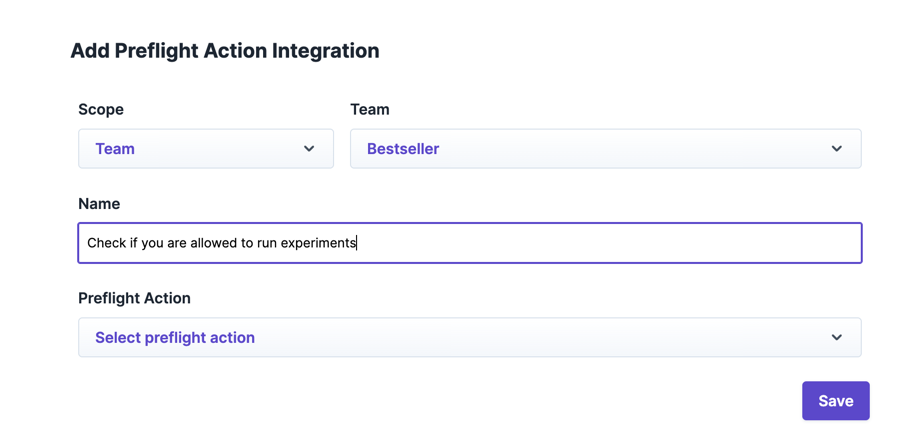

# Preflight Actions


Preflight actions are an enterprise feature. Please [reach out to us](https://steadybit.com/contact) if you want to get access.


Preflight actions are triggered by Steadybit whenever an experiment is about to start and allow you to prevent an experiment from running. To decide whether that specific experiment run is allowed to start, you get a list of all the targets expected to be affected in the extension action call. Please note that, due to concurrency, this list may change: a target may be gone by the time the actual step starts, or new ones may be discovered.

Preflight actions can additionally be used to perform checks during the experiment run, e.g., to check if a target is still healthy or if the environment is still in a state that allows the experiment to run. An interval can be configured as an additional trigger.

## Precondition

You need to write your own extension with [preflight kit](https://github.com/steadybit/preflight-kit) added to it. Implement the preflight action to suit your needs. See [docs](https://github.com/steadybit/preflight-kit/blob/main/docs/preflight-api.md).

## Configure

You can add preflight actions at `Settings` -> `Integrations` -> `Preflight Actions`.

A preflight action integration has the following parameters to be specified:

|                                      |                                                                                                                                                   |
| ------------------------------------ | ------------------------------------------------------------------------------------------------------------------------------------------------- |
| **Name**                             | The preflight action's name, as shown in the experiment run.                                                                                      |
| **Team**                             | If no team is specified, preflight actions will be performed for all teams. If you specify a team, preflight actions are only performed for that t|
| **Preflight Action**                 | The Preflight Action to use from a registered extension                                                                                           |
| **Triggers**                         | When the Preflight Action should trigger                                                                                                          |
| - _Before the experiment is started_ | default - can't be turned off                                                                                                                     |
| - _While the experiment is running_  | The interval specifies how long Steadybit waits between the end of one execution of the preflight action and the next.                            |

## Experiment Runs

During the experiment run, you can see the triggered preflight actions. If a preflight action fails, the experiment run fails, and no targets are attacked.

.png>)

.png>)

## Developing Actions

A preflight action uses [preflight kit](https://github.com/steadybit/preflight-kit). See our [docs](https://github.com/steadybit/preflight-kit/blob/main/README.md#getting-started) to get started.

### Lifecycle of Preflight Actions

A preflight action can be in one of the following lifecycle statuses, indicated in the experiment run:

|                |                                                                                                                                                            |
| -------------- | ---------------------------------------------------------------------------------------------------------------------------------------------------------- |
| **CREATED**    | The preflight action was created and has sent the request to the configured action in the extension. It is still waiting for the response.                 |
| **SUCCESSFUL** | The preflight action was resolved successfully. The experiment is allowed to continue (if all preflight actions are successful).                           |
| **FAILED**     | The preflight action resolved with a failure. The experiment will fail. Optionally, the response may contain a message as a reason for experiment failure. |
| **ERRORED**    | A technical error occurred while requesting the preflight action, e.g., the extension URL couldn't be resolved, or the HTTP request timed out.             |