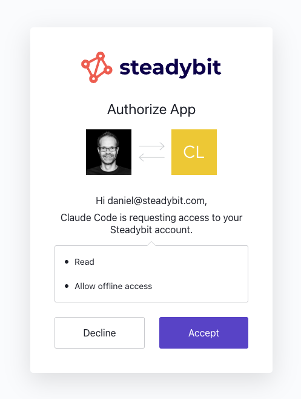

# Remote MCP Server

Steadybit ships a hosted [Model Context Protocol](https://modelcontextprotocol.io) (MCP) server, so you can connect AI agents such as Claude Code, Claude Desktop, or GitHub Copilot in VS Code directly to your Steadybit tenant. Once connected, the assistant can explore your environments, targets, actions, experiments, and execution results to help you understand your system and reason about resilience.

The MCP server is **read-only** — it exposes discovery and analysis capabilities but never creates, changes, or runs anything in your tenant.


The MCP server is a licensed feature. If the endpoints below reject your requests, ask your Steadybit administrator to confirm that MCP is enabled for your tenant.


## Authentication

There are two ways to authenticate an MCP client. Pick whichever fits your client and workflow — both connect to the same server and expose the same capabilities.

| Method | Endpoint | Best for |
| --- | --- | --- |
| **Access token** | `https://platform.steadybit.com/mcp` | Any MCP client; scripted or headless setups |
| **OAuth** | `https://platform.steadybit.com/mcp/<tenant>` | Clients with an interactive browser login |

### Method 1 — Access token

The simplest option, supported by every MCP client that can send an HTTP header. Create an [access token](api/api.md#access-tokens) in the UI under **Settings → API Access Tokens**, then pass it in the `Authorization` header when adding the server. The token already carries its tenant, so you connect to the plain `/mcp` endpoint.

For [Claude Code](https://docs.claude.com/en/docs/claude-code):

```bash
claude mcp add --transport http steadybit \
  https://platform.steadybit.com/mcp \
  --header "Authorization: Bearer <your-access-token>"
```

The same works for any other MCP client — point it at `https://platform.steadybit.com/mcp` and configure an `Authorization: Bearer <your-access-token>` header.

### Method 2 — OAuth

With OAuth, the client opens your browser, you log in to Steadybit through your identity provider, and you approve access on a consent screen — no token to copy or store. Point the client at the tenant-scoped endpoint `https://platform.steadybit.com/mcp/<tenant>`, replacing `<tenant>` with your tenant key.

For [Claude Code](https://docs.claude.com/en/docs/claude-code):

```bash
claude mcp add --transport http steadybit \
  https://platform.steadybit.com/mcp/<tenant>
```

On first use the client opens a browser window where you sign in and confirm the connection:

<figure><figcaption></figcaption></figure>

Access is granted based on your existing Steadybit membership: the assistant acts as you, within the same tenant and permissions you already have.

#### Supported clients

The OAuth path works with MCP clients that Steadybit has registered with its identity provider:

* **Claude Code**
* **Claude Desktop / Web**
* **VS Code** — including **GitHub Copilot** chat and agent mode, which connect through VS Code's built-in MCP client

Other clients that require Dynamic Client Registration (for example Cursor, Windsurf, the Codex CLI, and the GitHub Copilot CLI) are not supported on the OAuth path today. Use the [access token](#method-1-access-token) method with those clients instead.
