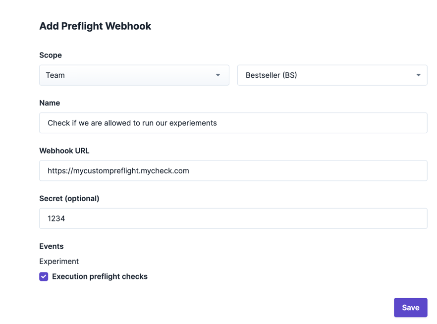
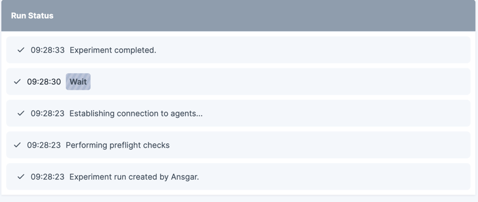

# Preflight Webhooks


Preflight webhooks are an enterprise feature. Please [reach out to us](https://steadybit.com/contact) if you want to get access.


Preflight webhooks are triggered by Steadybit whenever an experiment is about to start and allow you to prevent an experiment from running. To decide whether that specific experiment run is allowed to start, you get a list of all expected affected targets in the webhook call. Please note that, due to concurrency, these affected targets may change in case one of the targets is gone when the actual step starts or new ones are discovered.

## Configure

You can add preflight webhooks at `Settings` -> `Integrations` -> `Preflight webhook`.



A webhook has the following parameters to be specified:

|            |                                                                                                                                                     |
| ---------- | --------------------------------------------------------------------------------------------------------------------------------------------------- |
| **Name**   | The preflight webhook's name, it is shown in the experiment run.                                                                                    |
| **URL**    | The URL, which will receive an HTTP Post request with the HTTP request body                                                                         |
| **Secret** | **optional**You may specify a secret which is used to sign the body to [verify the webhook request](preflight-webhooks.md#verify-webhook-requests). |
| **Team**   | If no team is specified, preflight checks will be performed for all teams. If you specify a team, preflight checks are only made for this team.     |
| **Events** | Right now, there is only one event here: `Execution preflight checks`, which is triggered before starting an experiment run.                        |

## Experiment Runs

During the experiment run, you can see the triggered preflight webhooks. If a webhook fails, the experiment run fails, and no targets are attacked.




## Developing Webhooks

A webhook uses an HTTP POST request at an endpoint reachable from the Steadybit platform. The HTTP request sends a body with the content-type `application/json`. Our [OpenAPI specification](https://platform.steadybit.com/api/spec) describes the exact body in `WebhookPayload`.

The webhook must return an HTTP status 2xx to allow an experiment to run. The experiment will not run if the webhook returns an HTTP status code other than 2xx.

Optionally, you can return a `message` in the HTTP response to show why the experiment isn't allowed to start. The response body can be found in the [OpenAPI specification](https://platform.steadybit.com/api/spec) as `PreflightWebhookResponseAO`.

### Lifecycle of Preflight Webhooks

A preflight webhook can be in one of the following lifecycle statuses, indicated in the experiment run:

|                |                                                                                                                                                                              |
| -------------- | ---------------------------------------------------------------------------------------------------------------------------------------------------------------------------- |
| **CREATED**    | The preflight webhook was created and has sent the request to the configured webhook. It is still waiting for the response.                                                  |
| **SUCCESSFUL** | The preflight webhook was resolved successfully with an HTTP status code 2xx. The experiment is allowed to continue (if all preflight webhooks are successful).              |
| **FAILED**     | The preflight webhook resolved with a non-2xx HTTP status code. The experiment will fail. Optionally, the response may contain a message as a reason for experiment failure. |
| **ERRORED**    | Technical error happened while requesting the HTTP endpoint, e.g., the URL couldn't be resolved, or the HTTP request timed out.                                              |


A webhook will timeout after 55 seconds. In that case, the preflight check is marked as `ERRORED`, and the experiment will not start. If the webhook resolves later, the actual result will be submitted to the preflight check step in the experiment.


### Examples

This section covers some example requests to ease the development of the preflight webhook endpoint. The request body sent to your endpoint depends on the experiment that is tried to be executed.

#### Request

The below curl command can be used to mock a preflight request from Steadybit to your endpoint.

Please note, that some of the metadata (i.e., step's `parameters`, and `targetExecutions`' `attributes`) have been omitted.

```bash
curl --request POST \
--url https://<your-preflight-webhook-endpoint> \
--header 'accept: */*' \
--header 'accept-encoding: gzip' \
--header 'content-type: application/json' \
--data '{
  "event": "experiment.execution.preflight",
  "time": "2024-11-05T10:51:31.586222005Z",
  "execution": {
    "id": 60963,
    "experimentKey": "GITHUB-42",
    "teamKey": "GITHUB",
    "environment": "de75d3d2-6e23-4b9a-b5b5-0df898bd039e",
    "name": "Copy of AWS Zone Outage of eu-central-1a for toys-bestseller",
    "hypothesis": "When AWS Availability Zone eu-central-1a is down for toys-bestseller, Kubernetes manages this accordingly by routing the traffic within expected failure rates so that the offered features still work. As soon as the zone is available again, the pod is ready within 60s.",
    "created": "2024-11-05T10:51:31.316731Z",
    "createdVia": "UI",
    "experimentVersion": 1,
    "state": "CREATED",
    "steps": [
      {
        "id": "a8f99390-b906-43b5-b456-becacd295304",
        "state": "CREATED",
        "ignoreFailure": false,
        "parameters": {
          "url": "https://demo.steadybit.io/products",
          "method": "GET",
          "duration": "140s",
        },
        "customLabel": "HTTP Endpoint works all the time",
        "actionId": "com.steadybit.extension_http.check.periodically",
        "actionKind": "CHECK",
        "radius": {},
        "targetExecutions": [
          {
            "type": "agent",
            "name": "prod-demo/steadybit-agent/steadybit-agent-0",
            "attributes": [
              {
                "key": "agent.hostname",
                "value": "prod-demo/steadybit-agent/steadybit-agent-0"
              }
            ]
          }
        ],
        "totalTargetCount": 1
      }
      {
        "id": "0192fbf3-7c7c-701b-af5a-8bbc567b7b9f",
        "state": "PREPARED",
        "ignoreFailure": false,
        "parameters": {
          "duration": "20s"
        },
        "customLabel": "Wait for AWS Zone outage"
      },
      {
        "id": "0192fbf3-7c7c-701b-af5a-8bbc567b7ba0",
        "predecessorId": "0192fbf3-7c7c-701b-af5a-8bbc567b7b9f",
        "state": "CREATED",
        "ignoreFailure": false,
        "parameters": {
          "ip": [],
          "port": [],
          "duration": "60s",
          "hostname": [],
          "failOnHostNetwork": true
        },
        "customLabel": "WHEN: Zone outage of eu-central-1a for toys-bestseller",
        "actionId": "com.steadybit.extension_container.network_blackhole",
        "actionKind": "ATTACK",
        "radius": {
          "targetType": "com.steadybit.extension_container.container",
          "percentage": 50,
          "predicate": {
            "operator": "AND",
            "predicates": [
              {
                "operator": "AND",
                "predicates": [
                  {
                    "key": "aws.zone",
                    "operator": "EQUALS",
                    "values": [
                      "eu-central-1a"
                    ]
                  }
                ]
              }
            ]
          }
        },
        "targetExecutions": [
          {
            "type": "com.steadybit.extension_container.container",
            "name": "411f01843ca1fbe53a7d30367acf25f0a79242659ffc36b56516b880d2731847",
            "attributes": [
              {
                "key": "aws.account",
                "value": "111111111111"
              },
              {
                "key": "k8s.label.service-tier",
                "value": "2"
              },
              {
                "key": "aws.zone",
                "value": "eu-central-1a"
              }
            ]
          }
        ],
        "totalTargetCount": 1
      }
    ]
  }
}'
```

#### Response: Allow Run

The webhook must return an HTTP status 2xx to allow an experiment to run.

Optionally, you can return a `message` in the HTTP response to show details on why the experiment is allowed to start. For example:

```json
{"message":  "Jane Doe authorized this experiment because it runs in a permitted execution window."}
```

#### Response: Disallow Run

To disallow an experiment to run, the webhook must return an HTTP status code other than 2xx.

Optionally, you can return a `message` in the HTTP response to show why the experiment isn't allowed to start.

```json
{"message":  "Jane Doe rejected this experiment run because it needs to run in a permitted execution window."}
```

#### Response: Property Modifications

Preflight Webhooks can also modify properties of the experiment execution by returning `modifications` in the response body. Examples:
```json
{"modifications": [
  {
    "type": "set_property_value",
    "propertyKey": "approvedBy",
    "value": "Daniel"
  },
  {
    "type": "add_value_to_list_property",
    "propertyKey": "observations",
    "value": "This looks interesting!"
  }
]}
```

Currently, two modification types are supported:
- `set_property_value`: Sets the value of a property identified by `propertyKey` to the provided `value`. If the property does not exist, it will be added.
- `add_value_to_list_property`: Adds the provided `value` to a list property identified by `propertyKey`. If the property does not exist, it will be added. If it exists but is not a list, the execution will fail.

Properties needs to be `editableInExecution` if inherited from the experiment design. You can learn more about properties [here](../../install-and-configure/manage-properties/README.md).

### Verify Webhook Requests

You can verify that the call to the preflight webhook is legitimate by verifying the signature. as soon as the webhook's optional secret is configured. To do that, you need to configure the optional webhook's secret. The body's signature is computed using `HMAC SHA-256` and sent as an `X-SB-Signature` HTTP header.

You can use this header to verify the message. Here is an example of doing this in Java:

```java
private static boolean validateSignature(byte[]body,String secret,String header)throws Exception{
    //calculate the signature using the secret
    Mac mac=Mac.getInstance("HmacSHA256");
    mac.init(new SecretKeySpec(secret.getBytes(StandardCharsets.UTF_8),"HmacSHA256"));
    byte[]signature=mac.doFinal(body);

    //remove the algorithm prefix and decode the hex to bytes[]
    byte[]receivedSignature=Hex.decode(header.replaceFirst("^hmac-sha256 ",""));

    //compare using time-constant algorithm
    return MessageDigest.isEqual(signature,receivedSignature);
}
```
