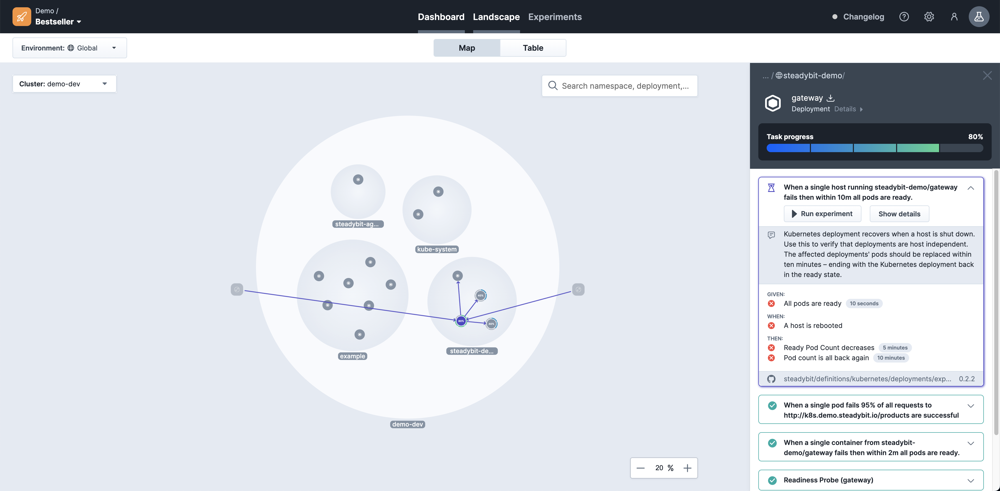

# Define Resilience Policies

Resilience policies are a cornerstone of Steadybit's capabilities, and in this guide, you will learn what they are and how to use them.

You can think about resilience policies like linting or security rules (ESLint, SonarQube, dependency auditing and more) for your systems' resilience.
Resilience policies help you identify issues and (non-) compliance with the desired expectations.
For example, Steadybit can outline that a particular Kubernetes configuration best practice isn't followed or that an HTTP request is missing timeouts or retries.
Resilience policies are declarative by nature.
This means that resilience policies are easy to get started with.
No need for a resilience or chaos engineering expert!

You can get started with resilience policies via our CLI or the UI.
This guide will help you get started with our CLI, which has greater flexibility and ensures that you can apply configuration as code best practices.

### Prerequisite

* You have already signed up for an account [on our website](https://www.steadybit.com/get-started/)
* You are able to login into the [Steadybit SaaS platform](https://platform.steadybit.io/)
* You have already [installed the agents](set-up-agents.md)

### Step 1 - CLI Installation

The CLI requires at least Node.js version 14 to execute.
We recommend installing Node.js via [Node Version Manager](https://github.com/nvm-sh/nvm#intro).
Once Node.js is installed, you can use NPM to install our [CLI package](https://www.npmjs.com/package/steadybit).

```bash
npm install -g steadybit
```

### Step 2 - Authentication

Once the CLI is installed, you will find that a new global executable named `steadybit` is available.
Before you can start using policies, you need to authenticate with your Steadybit account via an [API access token](../integrate-with-steadybit/api.md#tokens).
Authentication profiles are the most comfortable way to do so:

```bash
steadybit config profile add
```

### Step 3 - Defining a Resilience Expectation

Resilience policies are used via so-called service definitions.
When using the CLI, you will be interacting with service definition YAML files (`.steadybit.yml`).
To create such a file, you can use the following command:

```bash
steadybit service init
```

### Step 4 - Uploading the Resilience Expectation

You can use the following command to upload the service definition file to your Steadybit platform.
Don't worry; this won't execute any attacks or experiments.

```bash
steadybit service apply
```

### Step 5 - Checking Resilience Expectation State

Now that the Steadybit platform knows about your service definition and it's expectations via a linked policy, it is time to check how many of the selected tasks are fulfilled!

```bash
steadybit service verify
```

### Step 6 - Inspect State in the UI and Execute Experiments

Depend on your selection in step 3, you may find that not all tasks are fulfilled! To learn more about each tasks' state you can open the Steadybit UI to learn more and to execute experiments!

```bash
steadybit service open
```



### Step 7 - Execute Experiments and check Weak Spots via CLI

You can also execute the linked policies of your service definition from the CLI via:

```bash
steadybit service  exec
```

This will execute all experiments and weak spots and checks whether your system is compliant to it.

Within your CI/CD the `--yes`-parameter comes in hand to skip the confirmation dialog.

### Conclusions

This guide has shown how to use the CLI to declare a service's desired resilience.
Approaching resilience in a declarative way makes it easier to get started.
On top of this, we leveraged a configuration as code approach which helps us evolve, version and update our policies together with the described service.
There was no need to know Kubernetes best practices or chaos engineering specifics.
Resilience policies enable everyone to rely on reusable (pre-defined) policies and tasks to observe and improve service resilience!

### Next Steps

* [Learn about policies and tasks referenced through service definition files.](../use-steadybit/resilience-policies/README.md)
* [Run your own experiments with the Steadybit UI](run-experiment.md)
