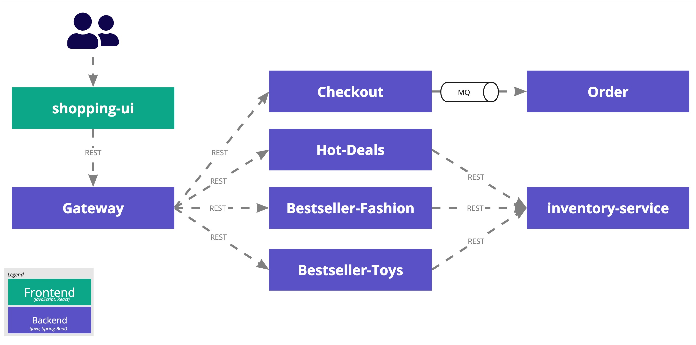

# Deploy Example Application

When trying out Steadybit you may want to start easy instead of directly using your fully fledged system. Therefore, we have a small example application called [Shopping Demo](https://github.com/steadybit/shopping-demo) which you can easily deploy on a local minikube or AWS EKS using this guide.

Simply follow these two steps:

* [Step 1 - Check out example application](#step-1-have-a-look-a-the-example-application)
* [Step 2 - Deploy the example application](#step-2-deploy-the-example-application)
  * [a) on Minikube](#step-2a-deploy-on-minikube)
  * [b) on AWS EKS](#step-2b-deploy-on-aws-eks)

## Prerequisites

* You have already signed up for an account [on our website](https://signup.steadybit.com/)
* You are able to log in to the [Steadybit SaaS platform](https://platform.steadybit.com/)
* You have [Kubernetes kubectl](https://kubernetes.io/docs/tasks/tools/install-kubectl/) installed
* You have [Helm - The package manager for Kubernetes](https://helm.sh/) installed

## Step 1 - Have a look a the example application

In order to give you a quick and easy start, we have developed a small demo application. Our shopping demo is a small product catalog provided by seven distributed backend services and a simple UI.



If you want to learn more about our demo, please take a look at our GitHub repository: [https://github.com/steadybit/shopping-demo](https://github.com/steadybit/shopping-demo)

## Step 2 - Deploy the example application

The example application is already pre-configured to be deployed into a Kubernetes cluster. You can choose whether to deploy it into [a) local minikube installation](#step-2a-deploy-on-minikube) or [b) AWS EKS](#step-2b-deploy-on-aws-eks).

> [Kubernetes](https://kubernetes.io/), also known as k8s, is an open source system for automating the deployment, scaling, and management of containerized applications. You can use [minikube](https://minikube.sigs.k8s.io/docs/) to set up a local Kubernetes cluster on macOS, Linux or Windows. As an alternative choose [AWS EKS](https://docs.aws.amazon.com/eks/latest/userguide/what-is-eks.html) to set up a Kubernetes cluster in the cloud.

Make sure to [install the agents](../set-up-agents/README.md) afterwards into the same environment.

### Step 2a) Deploy on Minikube

**Prerequisite**

* You have a running [minikube](https://minikube.sigs.k8s.io/docs/start/) installation

**Start your minikube cluster**

From a terminal, run:

```bash
minikube start
```

You can access your cluster with:

```bash
kubectl get po -A
```

**Deploy the example application**

Now we use helm to deploy the demo by running the following command:

```bash
helm repo add steadybit-shopping-demo https://steadybit.github.io/shopping-demo
helm repo update
helm upgrade steadybit-shopping-demo \
    --install \
    --wait \
    --timeout 5m0s \
    --create-namespace \
    --namespace steadybit-shopping-demo \
    --set gateway.service.type=ClusterIP \
    steadybit-shopping-demo/steadybit-shopping-demo
```

Verify that all Shopping Demo pods are running:

```bash
kubectl get pods --namespace steadybit-shopping-demo
```

You will see the following result, all pods are ready if you can see the status `Running`:

```bash
NAME                                  READY   STATUS    RESTARTS   AGE
fashion-bestseller-79b9698f88-557vt   1/1     Running   0          11s
gateway-7fc74f7f9b-tshzg              1/1     Running   0          11s
hot-deals-75cb898ff7-wrnxc            1/1     Running   0          10s
postgres-68f9db56cc-wxxth             1/1     Running   0          10s
toys-bestseller-6df5bd864f-kzrt9      1/1     Running   0          11s
orders-dcf644b8-g277b                 1/1     Pending   0          10s
inventory-7895d47cb7-sfdqb            1/1     Pending   0          10s
activemq-6dd55b4b7-wqmk6              1/1     Running   0          11s
```

You can do a local port forward to your minikube to open the `gateway` service via your browser:

```bash
kubectl port-forward deployment/gateway 8080:8080 --namespace steadybit-shopping-demo
```

Visit `http://127.0.01:8080/products` in your browser to retrieve the aggregated list of all products or just use `curl`:

```bash
curl http://127.0.01:8080/products
```

The result is an aggregated list of all products of the services `toys`, `hot-deals` and `fashion`:

```bash
{
  "fashionResponse": {
    "responseType": "REMOTE_SERVICE",
    "products": [
      {
        "id": "e9f0bec4-989c-4b9f-8bf9-334622e915ad",
        "name": "Bob Mailor Slim Jeans",
        "category": "FASHION"
      },
      {
        "id": "b110185b-d808-4104-b605-08a90b1248ce",
        "name": "Lewi's Jeanshose 511 Slim Fit",
        "category": "FASHION"
      },
      {
        "id": "222d7084-3cc7-43c3-890f-4598aa44eb2f",
        "name": "Urban Classics Shirt Shaped Long Tee",
        "category": "FASHION"
      }
    ]
  },
  "toysResponse": {
    "responseType": "REMOTE_SERVICE",
    "products": [
      ...
    ]
  },
  "hotDealsResponse": {
    "responseType": "REMOTE_SERVICE",
    "products": [
      ...
    ]
  },
  "duration": 112,
  "statusFashion": "REMOTE_SERVICE",
  "statusToys": "REMOTE_SERVICE",
  "statusHotDeals": "REMOTE_SERVICE"
}
```

### Step 2b) Deploy on AWS EKS

**Prerequisites**

* [AWS account](https://aws.amazon.com/de/account/)
* [AWS Command Line Interface](https://docs.aws.amazon.com/cli/latest/userguide/cli-chap-install.html)
* [AWS eksctl](https://docs.aws.amazon.com/eks/latest/userguide/getting-started-eksctl.html)

**Create your AWS Elastic Kubernetes Service (AWS EKS) cluster and nodes**

Verfiy your AWS CLI configuration by running:

```bash
aws --version
```

Your output should be similiar to:

```bash
aws-cli/2.0.44 Python/3.8.5 Darwin/19.6.0 source/x86_64
```

Create your Amazon EKS cluster and containing 2 nodes by running the following command. More details are available at [AWS documentation](https://docs.aws.amazon.com/eks/latest/userguide/getting-started-eksctl.html)

From a terminal, run:

```bash
eksctl create cluster \
--name steadybit-demo-cluster \
--region us-west-2
```

You can access your cluster with:

```bash
kubectl get nodes
```

Your output should be look like:

```bash
NAME                                           STATUS   ROLES    AGE    VERSION
ip-192-168-53-195.us-west-2.compute.internal   Ready    <none>   113s   v1.17.12-eks-7684af
ip-192-168-68-23.us-west-2.compute.internal    Ready    <none>   118s   v1.17.12-eks-7684af
```

**Deploy the Shopping Demo**

Now we use kubectl to deploy the demo by running the following command:

```bash
helm repo add steadybit-shopping-demo https://steadybit.github.io/shopping-demo
helm repo update
helm upgrade steadybit-shopping-demo \
    --install \
    --wait \
    --timeout 5m0s \
    --create-namespace \
    --namespace steadybit-shopping-demo \
    -f <path-to-your-optional-values.yaml> \
    steadybit-shopping-demo/steadybit-shopping-demo
```

Maybe you need to edit some ingress hosts names in your own `values.yaml` file.

Verify that all Shopping Demo pods are running:

```bash
kubectl get pods --namespace steadybit-shopping-demo
```

You will see the following result, all pods are ready if you can see the status `Running`:

```bash
NAME                                  READY   STATUS    RESTARTS   AGE
fashion-bestseller-79b9698f88-557vt   1/1     Running   0          11s
gateway-7fc74f7f9b-tshzg              1/1     Running   0          11s
hot-deals-75cb898ff7-wrnxc            1/1     Running   0          10s
postgres-68f9db56cc-wxxth             1/1     Running   0          10s
toys-bestseller-6df5bd864f-kzrt9      1/1     Running   0          11s
orders-dcf644b8-g277b                 1/1     Pending   0          10s
inventory-7895d47cb7-sfdqb            1/1     Pending   0          10s
activemq-6dd55b4b7-wqmk6              1/1     Running   0          11s
```

With the following command you can now determine the external IP and port to access the `gateway` service:

```bash
kubectl get svc -n steadybit-shopping-demo
```

Example response:

```bash
NAME                 TYPE           CLUSTER-IP       EXTERNAL-IP   PORT(S)          AGE
fashion-bestseller   NodePort       -------------    <none>        ----:-----/---   ---
gateway              LoadBalancer   10.98.173.27     127.0.0.1     80:30131/TCP     3h15m
hot-deals            NodePort       -------------    <none>        ----:-----/---   ---
product-db           NodePort       -------------    <none>        ----:-----/---   ---
toys-bestseller      NodePort       -------------    <none>        ----:-----/---   ---
orders               NodePort       -------------    <none>        ----:-----/---   ---
inventory            NodePort       -------------    <none>        ----:-----/---   ---
activemq             NodePort       -------------    <none>        ----:-----/---   ---
```

Visit `http://{EXTERNAL-IP}:{PORT}/products` in your browser to retrieve the aggregated list of all products or just use `curl`:

```bash
curl http://{EXTERNAL-IP}:{PORT}/products
```

The result is an aggregated list of all products of the services `toys`, `hot-deals` and `fashion`:

```bash
{
  "fashionResponse": {
    "responseType": "REMOTE_SERVICE",
    "products": [
      {
        "id": "e9f0bec4-989c-4b9f-8bf9-334622e915ad",
        "name": "Bob Mailor Slim Jeans",
        "category": "FASHION"
      },
      {
        "id": "b110185b-d808-4104-b605-08a90b1248ce",
        "name": "Lewi's Jeanshose 511 Slim Fit",
        "category": "FASHION"
      },
      {
        "id": "222d7084-3cc7-43c3-890f-4598aa44eb2f",
        "name": "Urban Classics Shirt Shaped Long Tee",
        "category": "FASHION"
      }
    ]
  },
  "toysResponse": {
    "responseType": "REMOTE_SERVICE",
    "products": [
      ...
    ]
  },
  "hotDealsResponse": {
    "responseType": "REMOTE_SERVICE",
    "products": [
      ...
    ]
  },
  "duration": 112,
  "statusFashion": "REMOTE_SERVICE",
  "statusToys": "REMOTE_SERVICE",
  "statusHotDeals": "REMOTE_SERVICE"
}
```

## Next Steps

Now, make sure to [install the agents](../set-up-agents/README.md) into the same environment (minikube or AWS EKS).
