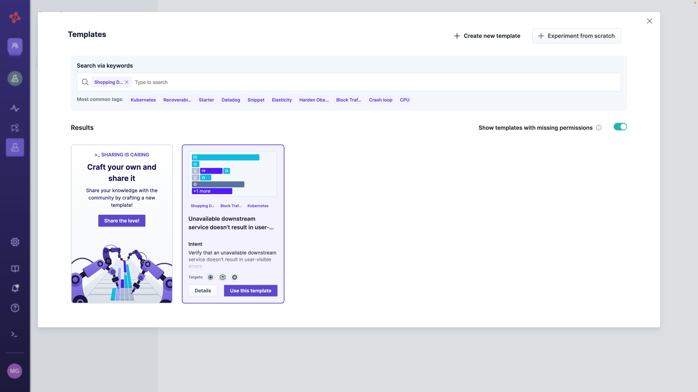
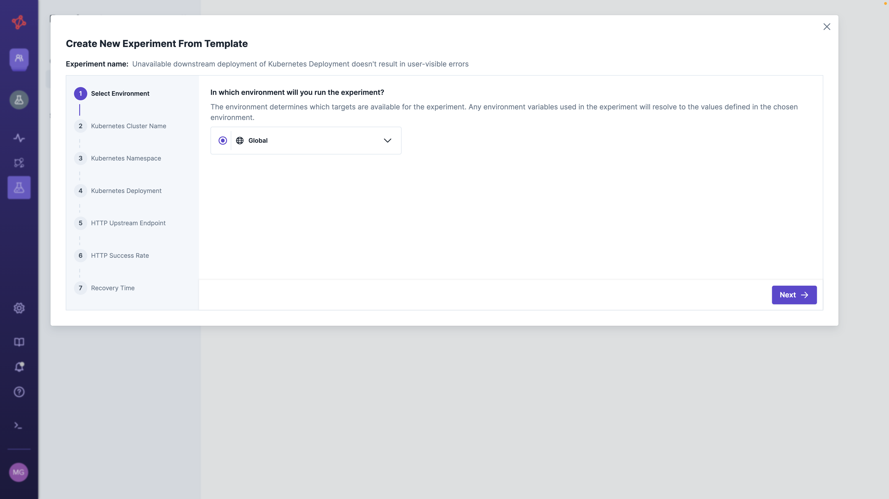
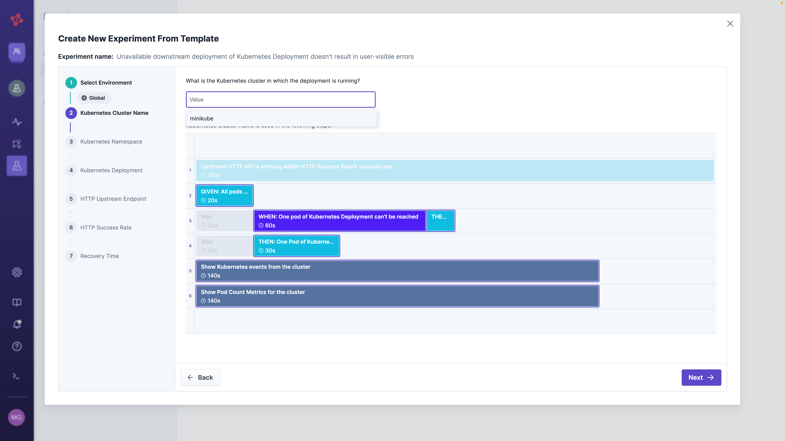
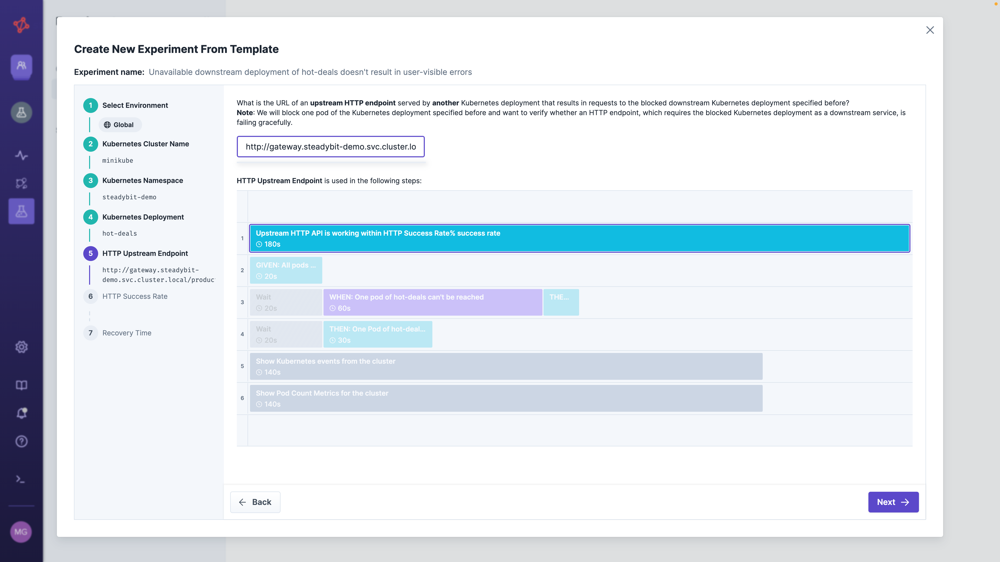
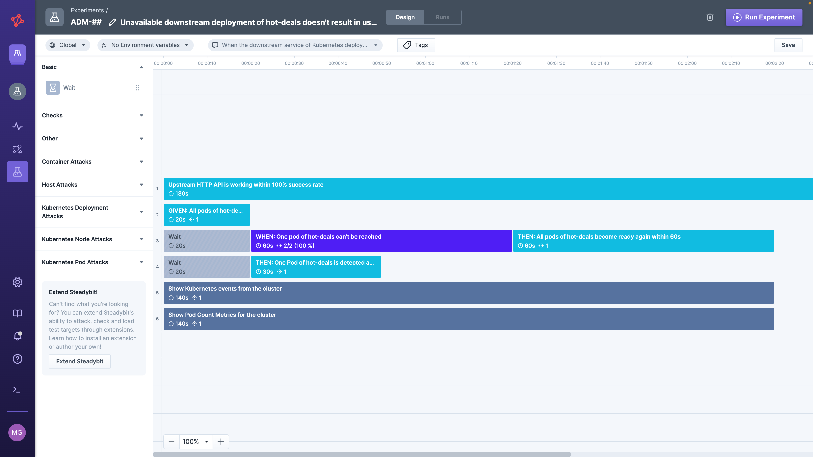
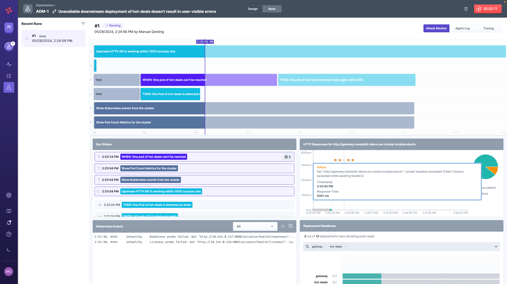
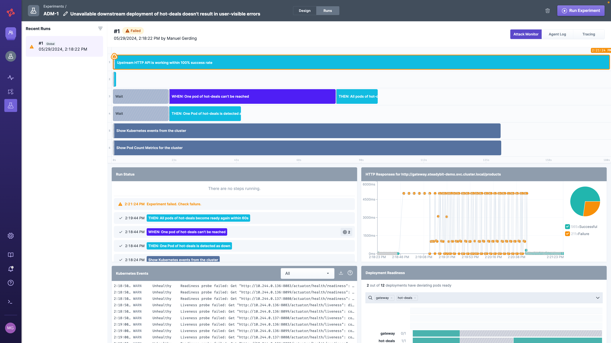

# Run an Experiment

We will now use Steadybit to design and run our first experiment.
This guide focuses on our example shopping demo application, which you have [optionally deployed following these steps here](deploy-example-application.md).
However, you can also apply the steps to your application.

## Prerequisite

* You have already signed up for an account [on our website](https://signup.steadybit.com)
* You can log in to the [Steadybit SaaS platform](https://platform.steadybit.com)
* You have already [installed an agent and extensions (](set-up-agents.md)

## Step 1 - Define your Scenario

The first step is to think about the scenario you want to test.
Good inspiration for scenarios is, e.g., a past incident, dependencies of your architecture, or common pitfalls.
In our case, we want to identify how our shopping demo behaves when one of the product backend services is unavailable.
In the best case, the shop's landing page is still available, and we just get a reduced set of products.
To validate this, we simulate the unavailability of containers in all pods of the Kubernetes deployment `hot-deals` by isolating them on the network level (attack [Block Traffic](https://hub.steadybit.com/action/com.steadybit.extension_container.network_blackhole)).
Isolating containers on the network level is usually less invasive than stopping them.

To do that, we can simply use one of the existing templates to create the experiment step-by-step.
In the Steadybit platform, choose experiments -> `New Experiment` -> `From Template` and search for a template with the tag `Shopping Demo Quick Start`.

You can see the overall experiment structure in the template details or continue this tutorial by choosing `use template`.

> If you miss this experiment template in your Steadybit platform, you can [download the template here](TODO) and import it via `Settings` -> `Templates` -> `Create Template`.
> In the future, it will be available out-of-the-box.

## Step 2 - Define experiment

Now, you need to define step-by-step template-specific experiment details to validate the scenario.

### (1) Environment
The first option is always to select the environment where you want to run the experiment.
The environment limits the set of attackable targets and thus prevents you from accidentally attacking the wrong stage or interfering with other teams.
Check out [Manage Environments](install-and-configure/manage-environments) later.
If you haven't set up environments yet, you can continue with the `Global` environment, which contains everything Steadybit discovered.

### (2) Kubernetes Cluster Name, (3) Namespace, and (4) Deployment
Based on the selected template, the experiment needs to know the name of your Kubernetes cluster (`minikube`), the Kubernetes namespace (`steadybit-demo`), and the deployment (`hot-deals`).
Just choose the values from the drop-down.

#### (5) HTTP Upstream Endpoint, and (6) HTTP Success Rate
The next step is to define the HTTP endpoint dependent on our downstream deployment `hot deals`.
This would be the `/products` endpoint of `gateway`, which crawls all products from `hot-deals`, `toys-bestseller`, and `fashion-bestseller`.
The resulting products are shown on our shop's landing page.
Because the experiment performs the HTTP check within the Kubernetes cluster, we can also use Kubernetes-internal URLs, like `http://gateway.steadybit-demo.svc.cluster.local/products`.

Afterward, we specify the expected HTTP success rate.
Since the shop's landing page uses this endpoint, we aim for `100%` successful responses.

#### (7) Recovery Time
The last step is to define the recovery time.
How long do we expect it to take until all pods of `hot deals' start up again and are ready to serve traffic? In our example, we expect 60 seconds to be sufficient.

Finalize the template's wizard by clicking `Create Experiment`.

## Step 3 - Experiment Design
Woohoo!
There is our first experiment design! 🎉 You're now in the timeline-based experiment editor that you can always use to design an experiment from scratch via drag-and-drop.

Our experiment was already designed by using the template, so we can save and run it immediately to learn whether the shop survives an outage of the downstream deployment `hot-deals`.

## Step 7 - Run experiment
When hitting the 'run experiment'-button you see the Steadybit run view.
As soon as agent and extensions have established a connection, the experiment starts to validate the HTTP endpoint `/products`, and validates the amount of ready pods for the deployment `hot-deals`.
When isolating the deployment's containers, we start noticing faults in the HTTP responses as `hot-deals`' products can't be reached anymore.
This is undesirable as there are other products which could have been browsed by the customers of the online shop.
You can improve this behavior by adding appropriate fallbacks or scaling the services.

Continuing to run the experiment, we see that eventually, Kubernetes restarts the deployment's pods, resulting in missing pods.
Even so, after the attack, all pods become ready within the expected 60 seconds.
However, the overall experiment run failed, as the HTTP success rate of `100%`was not achieved.

## Conclusion

You have now successfully run an experiment with Steadybit in a Kubernetes environment.
You have discovered the impact of an unavailable downstream service on the upstream service.

### What are the next steps?
Continue to explore more experiments using the [Explorer Landscape](use-steadybit/explorer/landscape) and get [Advice](use-steadybit/explorer/advice) to learn how to improve your system's reliability.
Before rolling it out to more users, make sure to [set up proper environments](install-and-configure/manage-environments) and [create teams](install-and-configure/manage-teams-and-users) to benefit from Steadybit's safety in Chaos Engineering rollouts.