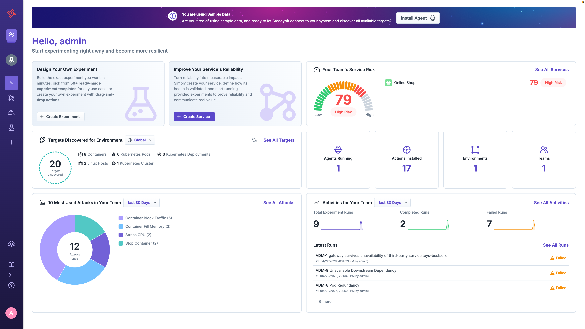
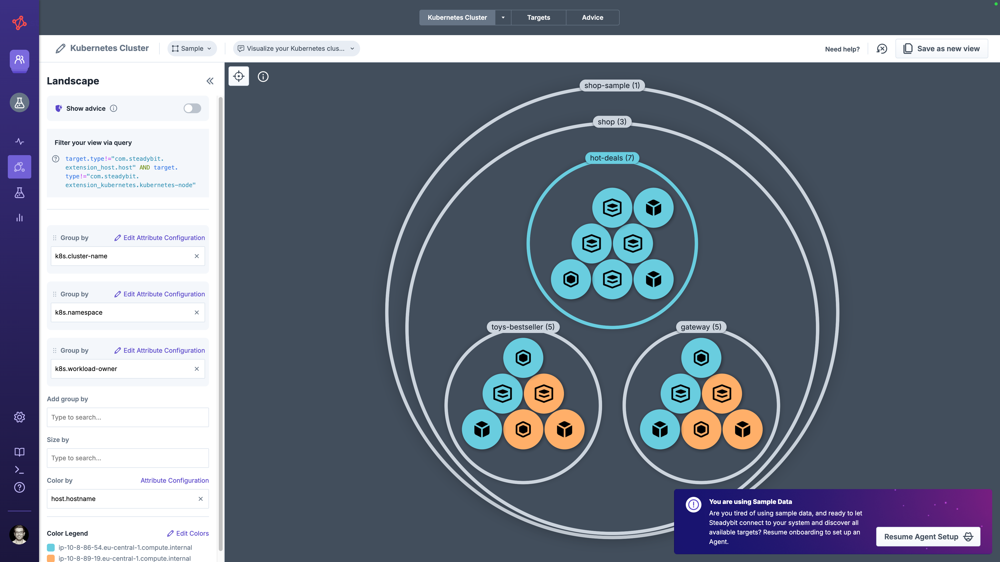
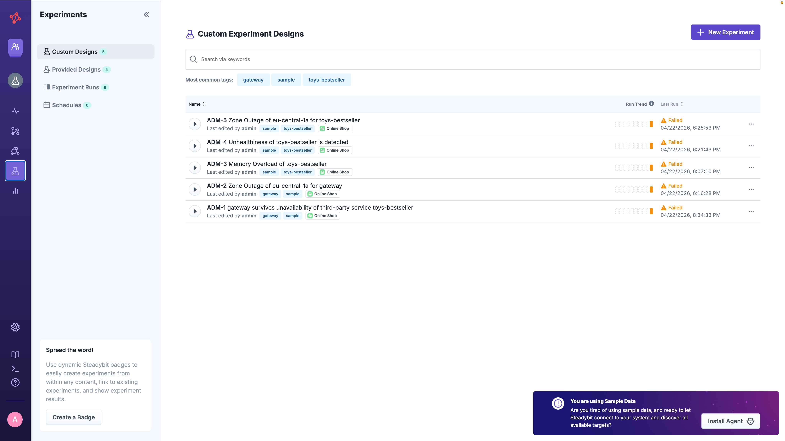
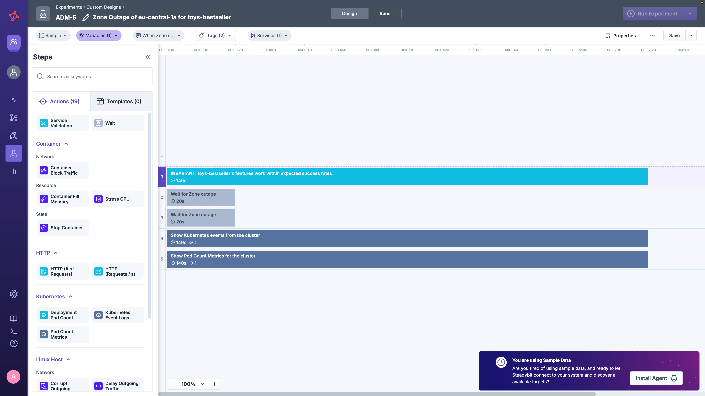
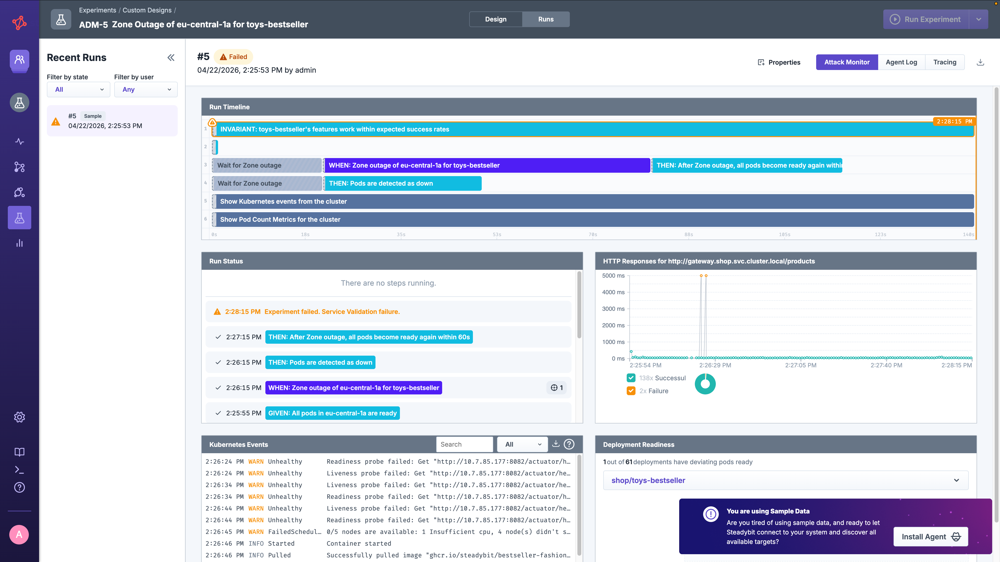
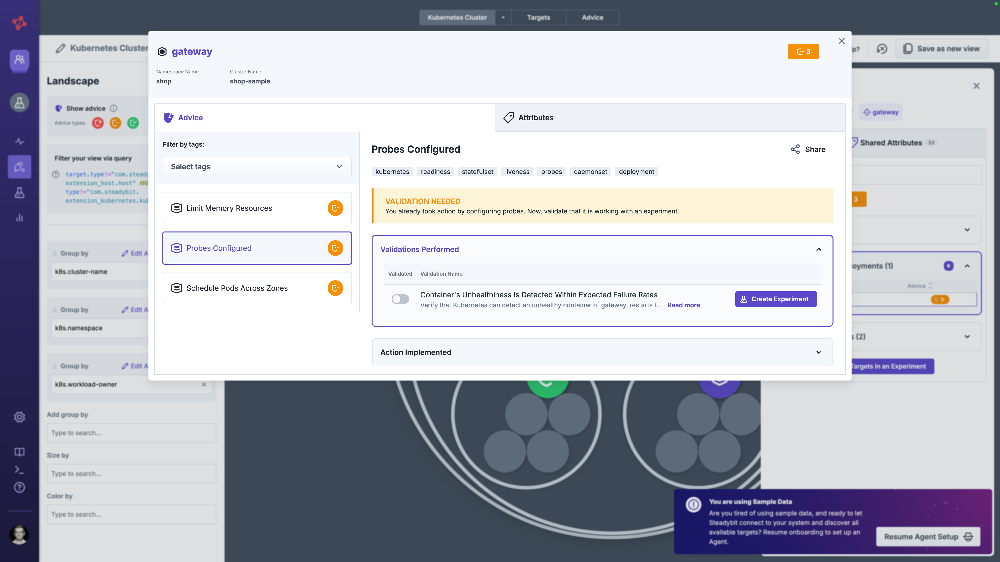

# Explore with Sample Data

Want to explore Steadybit without installing agents or extensions into your environment?
You can use sample data to get a hands-on experience with Steadybit's features.

## What is Sample Data?

Sample data is a pre-configured dataset that simulates a realistic Kubernetes-based microservice application.
It allows you to:

- Explore the Steadybit UI and understand its capabilities
- Review [experiment designs](../../use-steadybit/experiments/design.md) and see how chaos experiments are structured
- Analyze [past experiment runs](../../use-steadybit/experiments/run.md) and their results
- Explore targets and environments in the [landscape](../../use-steadybit/explorer/landscape.md) 
- Learn about [reliability advice](../../use-steadybit/explorer/advice.md) without deploying anything

All sample data is automatically assigned to a **Sample** [environment](../../install-and-configure/manage-environments/README.md) in your Steadybit tenant.


Sample data is designed for exploration and learning.
The experiments cannot be executed since they target simulated infrastructure.
To run real chaos experiments, you'll need to install agents and extensions in your environment.


## Sample Data Contents

### Targets

The sample data includes a simulated Kubernetes environment representing an e-commerce "shop" application running on the `shop-sample` cluster in the `shop` namespace.

The targets include:

- **Containers**: Application containers running services like `gateway` and `toys-bestseller`
- **Kubernetes Deployments**: Workload definitions with pod specifications
- **Kubernetes Pods**: Running instances of the deployments
- **Kubernetes Cluster**: The overall cluster target

Each target comes with rich attributes including:
- Kubernetes labels (topology zones, service tiers, managed-by tags)
- Container metadata (image tags, engine versions)
- Host information (hostname, domain)
- Datadog and Steadybit-specific tags

Once you install an agent and the extension, they will [automatically discover targets](../../concepts/discovery/README.md) like these.

### Experiment Designs

The sample data includes five pre-built experiment designs that demonstrate common chaos engineering scenarios.
Most of these experiments are generated from [reliability advice](../../use-steadybit/explorer/advice.md), which automatically creates validation experiments based on your infrastructure configuration.

#### Experiments from Advice

The following experiments were generated from advice provided by the [Kubernetes extension](https://hub.steadybit.com/extension/com.steadybit.extension_kubernetes):
Advice-based experiments are suggested automatically and easy to create.

| Experiment                                       | Related Advice                                                                                                        | Description                                                                                                                                                              |
|--------------------------------------------------|-----------------------------------------------------------------------------------------------------------------------|--------------------------------------------------------------------------------------------------------------------------------------------------------------------------|
| **Zone Outage for gateway**                      | [Schedule Pods Across Zones](https://hub.steadybit.com/advice/com.steadybit.extension_kubernetes.advice.single-zone)  | Simulates an availability zone outage (`eu-central-1a`) to verify that traffic is properly routed to healthy pods in other zones and that pods recover within 60 seconds |
| **Zone Outage for toys-bestseller**              | [Schedule Pods Across Zones](https://hub.steadybit.com/advice/com.steadybit.extension_kubernetes.advice.single-zone)  | Same zone outage scenario targeting the `toys-bestseller` service to verify zone redundancy                                                                              |
| **Memory Overload of toys-bestseller**           | [Limit Memory Resources](https://hub.steadybit.com/advice/com.steadybit.extension_kubernetes.advice.k8s-memory-limit) | Fills container memory to 80% capacity to verify the application handles memory pressure gracefully, including proper OOM handling and recovery                          |
| **Unhealthiness of toys-bestseller is detected** | [Probes Configured](https://hub.steadybit.com/advice/com.steadybit.extension_kubernetes.advice.k8s-probes)            | Verifies that Kubernetes detects unhealthy containers via health probes, restarts them, and routes traffic appropriately during recovery                                 |

#### Custom Experiments

Sample data includes also custom created experiments to test specific resilience patterns:

| Experiment                                                 | Experiment Template                                                                                                                                                                     | Description                                                                                                                                                               |
|------------------------------------------------------------|-----------------------------------------------------------------------------------------------------------------------------------------------------------------------------------------|---------------------------------------------------------------------------------------------------------------------------------------------------------------------------|
| **Gateway survives unavailability of third-party service** | [Third-Party Service Is Unavailable for a Kubernetes Deployment](https://hub.steadybit.com/template/kubernetes-deployment.third-party-service-unavailable?freeText=third-party+service) | Tests whether the gateway deployment continues to function when a dependent service (`toys-bestseller`) becomes unavailable by using a container network block traffic attack |

#### Experiment Structure

Each experiment follows the **Given-When-Then** pattern:

- **GIVEN**: Preconditions are verified (e.g., all pods are ready)
- **WHEN**: The chaos attack is executed (e.g., network block traffic, memory fill)
- **THEN**: Expected behavior is validated (e.g., pods recover, HTTP requests succeed)

However, this structure is optional and you don't have to apply this to your experiments.

### Experiment Runs

The sample data includes a history of experiment runs showing:

- **Completed runs**: Experiments that passed all validations, demonstrating successful resilience (e.g. **Zone Outage for toys-bestseller**)
- **Failed runs**: Experiments that detected issues (e.g., "Check failure"), showing how Steadybit identifies reliability problems (e.g. **Gateway survives unavailability of third-party service**)

Each run includes timestamps to correlate data with external systems like observability tools..
This allows you to understand what is going on in your system and analyze turbulent conditions.

### Advice

Sample data includes advice definitions that help identify reliability improvements for your Kubernetes workloads.
Each advice provides actionable guidance and can generate validation experiments:

| Advice | Description |
|--------|-------------|
| [**Limit Memory Resources**](https://hub.steadybit.com/advice/com.steadybit.extension_kubernetes.advice.k8s-memory-limit) | Identifies containers without memory limits configured, which could affect other pods on the same node|
| [**Probes Configured**](https://hub.steadybit.com/advice/com.steadybit.extension_kubernetes.advice.k8s-probes) | Checks whether readiness and liveness probes are properly configured to enable Kubernetes health management|
| [**Schedule Pods Across Zones**](https://hub.steadybit.com/advice/com.steadybit.extension_kubernetes.advice.single-zone) | Identifies workloads running in a single availability zone that could be affected by zone outages|

Browse all available advice in the [Steadybit Reliability Hub](https://hub.steadybit.com/advice).

## Working with Sample Data

When opening up Steadybit, you're welcomed by the dashboard showing you a summary of the most-important activities in your tenant.

### Exploring Targets

1. Navigate to **Explorer** > **Targets**
2. Filter by the **Sample** environment
3. Browse the simulated Kubernetes resources and their attributes

 
### Exploring Experiment Designs

1. Navigate to **Experiments** in the Steadybit UI
2. Filter by the **Sample** environment or look for experiments tagged with `sample`
3. Open any experiment to explore its design, including:
    - The hypothesis being tested
    - The attack steps and their configuration
    - Target selection using the query UI or query language
    - Validation checks that determine success or failure

### Viewing Experiment Runs

1. Open a sample experiment
2. Click on the **Run** tab
3. Review past runs, including:
    - Run status (completed/failed)
    - Timeline of each step
    - Logs and metrics captured during the run

### Reviewing Advice

1. Navigate to **Explorer** and activate **Show Advice** in the landscape or go to the **Advice**-tab
2. Filter by the **Sample** environment
3. Review the reliability recommendations for sample workloads

## Transitioning to Real Data

Once you're ready to start chaos engineering with your own infrastructure:

1. [Install the Steadybit agent and extensions](../set-up-agents/README.md) in your environment
2. The sample data targets will automatically be removed once you have real agents connected
3. Sample experiment designs and run history remain available and can be manually deleted when no longer needed