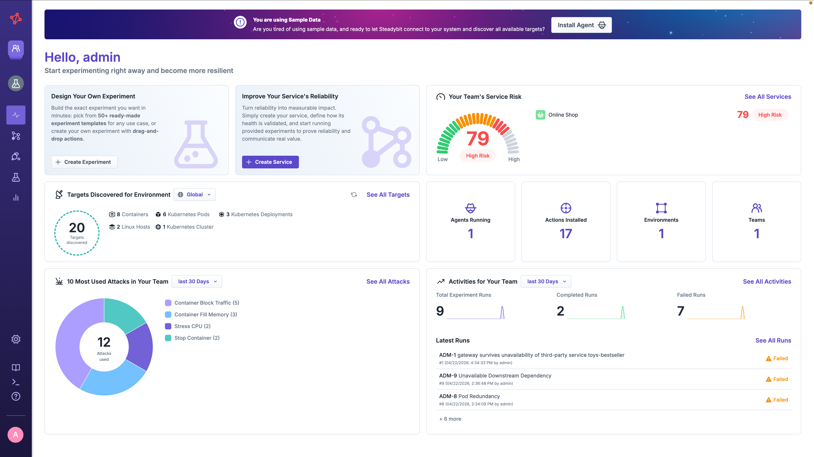
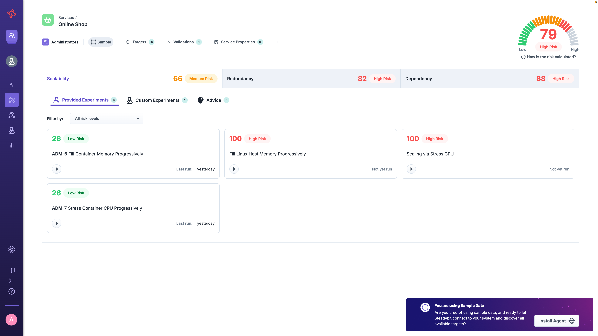
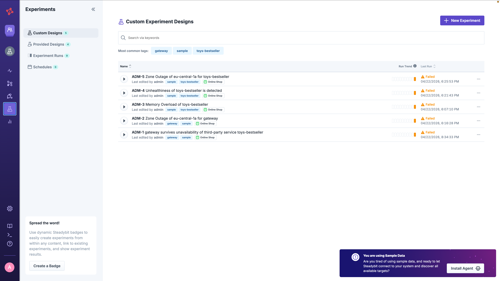
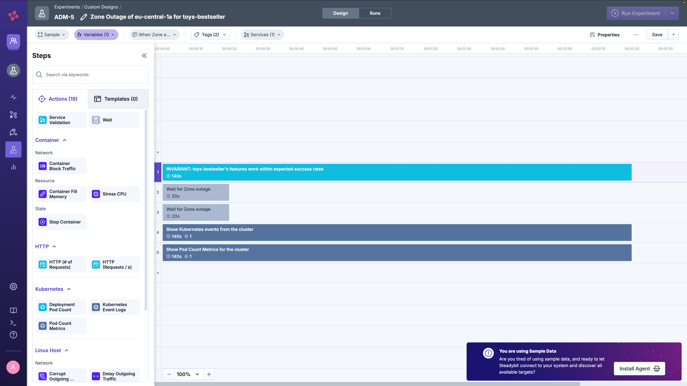
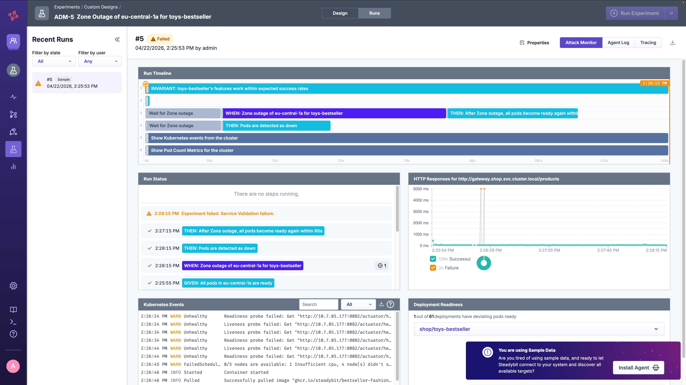
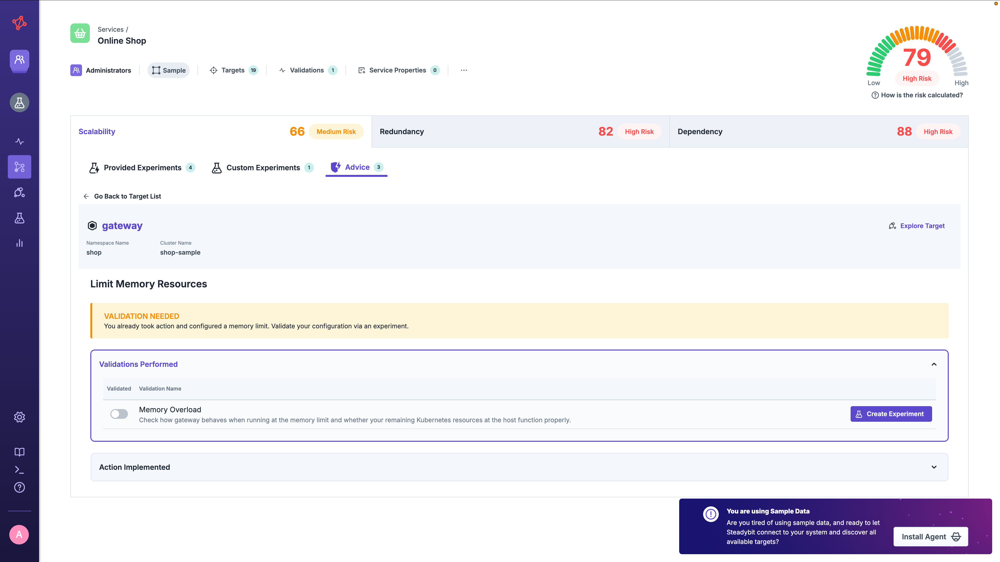
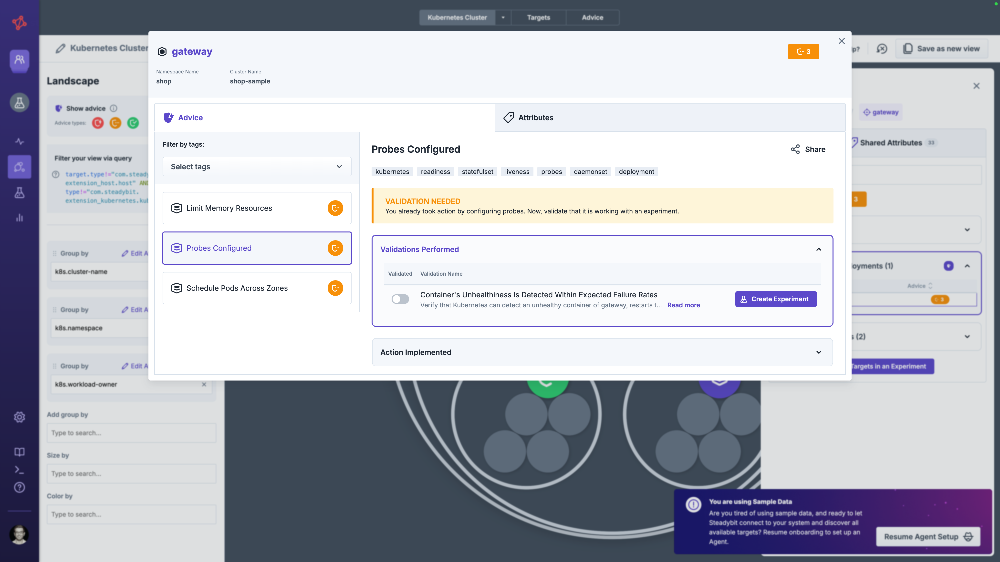
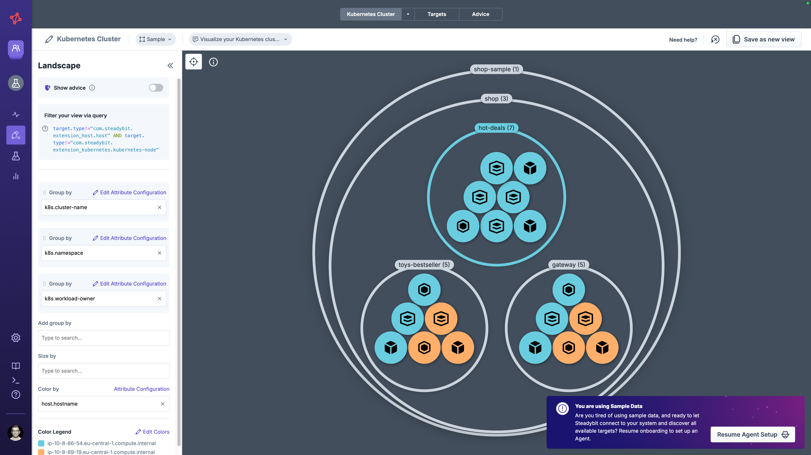

# Explore with Sample Data

Want to explore Steadybit without installing agents or extensions into your environment?
You can use sample data to get a hands-on experience with Steadybit's features.

## What is Sample Data?

Sample data is a pre-configured dataset that simulates a realistic Kubernetes-based microservice application.
It allows you to:

- Explore a pre-configured [service](../../use-steadybit/services/README.md) and explore Steadybit's service-centric view of your reliability work and risk calculation
- Review [experiment designs](../../use-steadybit/experiments/design.md) and see how chaos experiments are structured
- Analyze [past experiment runs](../../use-steadybit/experiments/run.md) and their results
- Explore targets and environments in the [landscape](../../use-steadybit/explorer/landscape.md)
- Learn about [reliability advice](../../use-steadybit/explorer/advice.md) without deploying anything

All sample data is automatically assigned to a **Sample** [environment](../../install-and-configure/manage-environments/README.md) in your Steadybit tenant.


Sample data is designed for exploration and learning.
The experiments cannot be executed since they target simulated infrastructure.
To run real chaos experiments, you'll need to install agents and extensions in your environment.


## Sample Data Content

### Service: Online Shop

The central piece of the sample data is a pre-configured [service](../../use-steadybit/services/README.md) named **Online Shop**.
The service allows a single view into your reliability work, bundling your service's targets, defines healthiness of your service, and all experiments validating different reliability scenarios.

The **Online Shop** service is configured with:

- **[Target Scope](../../use-steadybit/services/README.md#target-scope)** — Kubernetes resources of the services `gateway`, `hot-deals`, and `toys-bestseller` in the Sample environment, resolved via the query `k8s.service.name IN ("gateway", "hot-deals", "toys-bestseller")`. See [targets below](#targets)
- **[Validations](../../use-steadybit/services/README.md#validations)** — a periodic HTTP check that verifies the shop's endpoint returns `2xx` while experiments run, defining what 'healthy' means for the **Online Shop** service
- **[Provided Experiments](../../use-steadybit/services/README.md#provided-experiments)** — ready-to-run [provided experiments](../../use-steadybit/services/README.md#provided-experiments) automatically generated from the linked [service profile](../../install-and-configure/manage-service-profiles/README.md), covering Redundancy, Dependency, and Scalability categories
- **[Custom Experiments](../../use-steadybit/services/README.md#custom-experiments)** — linked [custom experiments](../../use-steadybit/services/README.md#custom-experiments) demonstrating advice-based and manually-designed reliability scenarios
- **[Advice](../../use-steadybit/services/README.md#advice)** — reliability recommendations surfaced for the targets within the service's scope

Based on this information, Steadybit calculates the associated reliability [risk](../../use-steadybit/services/README.md#risk) to help you prioritize and communicate your reliability work.

#### Provided Experiments

Provided experiments are automatically generated from the service profile and scoped to Online Shop's targets and validations:

| Experiment                                  | Category    | Description                                                                                           |
|---------------------------------------------|-------------|-------------------------------------------------------------------------------------------------------|
| **Pod Redundancy**                          | Redundancy  | Gradually reduces the redundancy of the service to verify it still provides its services             |
| **Unavailable Downstream Dependency**       | Dependency  | Blocks a downstream dependency of the service's container to verify graceful degradation             |
| **Fill Container Memory Progressively**     | Scalability | Gradually fills the memory of the service's containers to verify graceful handling                    |
| **Stress Container CPU Progressively**      | Scalability | Gradually stresses the CPU of the service's containers to verify graceful handling                    |

#### Custom Experiments

Custom experiments are linked to the service to keep all relevant reliability work in one place.
Most of these are generated from [reliability advice](../../use-steadybit/explorer/advice.md), which automatically creates validation experiments based on your infrastructure configuration.

| Experiment                                                 | Category   | Related Advice / Template                                                                                                                                                                | Description                                                                                                                                                              |
|------------------------------------------------------------|------------|------------------------------------------------------------------------------------------------------------------------------------------------------------------------------------------|--------------------------------------------------------------------------------------------------------------------------------------------------------------------------|
| **Gateway survives unavailability of third-party service** | Dependency | [Third-Party Service Is Unavailable for a Kubernetes Deployment](https://hub.steadybit.com/template/kubernetes-deployment.third-party-service-unavailable?freeText=third-party+service)  | Tests whether the gateway deployment continues to function when a dependent service (`toys-bestseller`) becomes unavailable by blocking container network traffic         |
| **Zone Outage of eu-central-1a for gateway**               | Redundancy | [Schedule Pods Across Zones](https://hub.steadybit.com/advice/com.steadybit.extension_kubernetes.advice.single-zone)                                                                     | Simulates an availability zone outage to verify that traffic is properly routed to healthy pods in other zones and pods recover within 60 seconds                         |
| **Zone Outage of eu-central-1a for toys-bestseller**       | Redundancy | [Schedule Pods Across Zones](https://hub.steadybit.com/advice/com.steadybit.extension_kubernetes.advice.single-zone)                                                                     | Same zone outage scenario targeting the `toys-bestseller` service to verify zone redundancy                                                                               |
| **Memory Overload of toys-bestseller**                     | Scalability | [Limit Memory Resources](https://hub.steadybit.com/advice/com.steadybit.extension_kubernetes.advice.k8s-memory-limit)                                                                    | Fills container memory to 80% capacity to verify the application handles memory pressure gracefully, including proper OOM handling and recovery                           |
| **Unhealthiness of toys-bestseller is detected**           | Redundancy | [Probes Configured](https://hub.steadybit.com/advice/com.steadybit.extension_kubernetes.advice.k8s-probes)                                                                               | Verifies that Kubernetes detects unhealthy containers via health probes, restarts them, and routes traffic appropriately during recovery                                  |

### Experiment Runs

The sample data includes a history of experiment runs showing:

- **Completed runs**: Experiments that passed all validations, demonstrating reliability (e.g. **Zone Outage of eu-central-1a for toys-bestseller**)
- **Failed runs**: Experiments that detected issues (e.g., "Check failure"), showing how Steadybit identifies reliability problems (e.g. **Gateway survives unavailability of third-party service**)

This allows you to understand what is going on in your system and analyze turbulent conditions.

### Advice

Sample data includes advice definitions that help identify reliability improvements for your Kubernetes workloads.
Each advice provides actionable guidance and can generate validation experiments:

| Advice                                                                                                                    | Description                                                                                                 |
|---------------------------------------------------------------------------------------------------------------------------|-------------------------------------------------------------------------------------------------------------|
| [**Limit Memory Resources**](https://hub.steadybit.com/advice/com.steadybit.extension_kubernetes.advice.k8s-memory-limit) | Identifies containers without memory limits configured, which could affect other pods on the same node      |
| [**Probes Configured**](https://hub.steadybit.com/advice/com.steadybit.extension_kubernetes.advice.k8s-probes)            | Checks whether readiness and liveness probes are properly configured to enable Kubernetes health management |
| [**Schedule Pods Across Zones**](https://hub.steadybit.com/advice/com.steadybit.extension_kubernetes.advice.single-zone)  | Identifies workloads running in a single availability zone that could be affected by zone outages           |

Browse all available advice in the [Steadybit Reliability Hub](https://hub.steadybit.com/advice).

### Targets

Underpinning the Online Shop service, the sample data includes a simulated Kubernetes environment representing an e-commerce "shop" application running on the `shop-sample` cluster in the `shop` namespace.

The targets include:

- **Containers**: Application containers running services like `gateway` and `toys-bestseller`
- **Kubernetes Deployments**: Workload definitions with pod specifications
- **Kubernetes Pods**: Running instances of the deployments
- **Kubernetes Cluster**: The overall cluster target

Each target comes with rich attributes including:
- Kubernetes labels (topology zones, service tiers, managed-by tags)
- Container metadata (image tags, engine versions)
- Host information (hostname, domain)
- Datadog and Steadybit-specific tags

Once you install an agent and the extension, they will [automatically discover targets](../../concepts/discovery/README.md) like these.

## Working with Sample Data

When opening up Steadybit, you're welcomed by the dashboard showing you a summary of the most-important activities in your tenant.

### Reviewing Service and Service's Risk

You can explore the **Online Shop** service by jumping from the dashboard's service widget to the **Online Shop** service.
Review its target scope, validations, and properties in the header bar and browse the **Provided Experiments**, **Custom Experiments**, and **Advice** tabs to understand how reliability work is bundled for this application.

[Learn more about services](../../use-steadybit/services/README.md).

### Checking Experiment Designs

Check out the 
* linked provided and custom experiment designs in the service **Online Shop** or
* navigate to **Experiments** in the Steadybit UI.

Open any experiment to explore its design, including:

- The hypothesis being tested
- The attack steps and their configuration
- Target selection using the query UI or query language
- Validation checks that determine success or failure

### Viewing Experiment Runs

1. Open a sample experiment
2. Click on the **Run** tab
3. Review past runs, including:
   - Run status (completed/failed)
   - Timeline of each step
   - Logs and metrics captured during the run

### Reviewing Advice

Review advice 

* linked in the service **Online Shop** or
* navigate to **Explorer** and activate **Show Advice** in the landscape or
* go to the **Advice**-tab

* Review the reliability recommendations for sample workloads

### Exploring Targets

Navigate via

* **Services** > **Explore Services** to the **Explorer** to drill-down your targets or
* check out the **Explorer**'s **Kubernetes Cluster** view to browse the simulated Kubernetes resources and their attributes

 

## Integrating with Your Environment

Once you're ready to start chaos engineering with your own infrastructure, simply [install the Steadybit agent and extensions](../set-up-agents/README.md) in your environment.

The sample data targets will automatically be removed once you have real agents connected.
Sample experiment designs and run history remain available and can be manually deleted when no longer needed