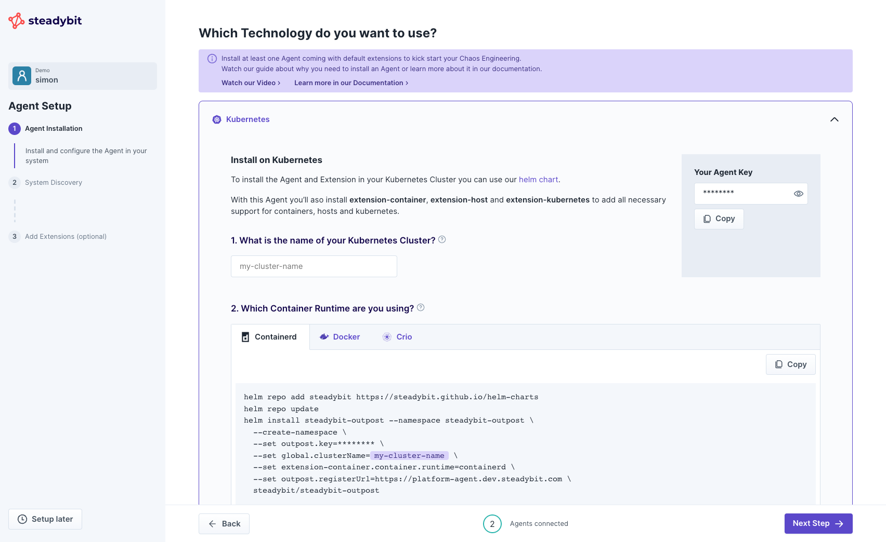
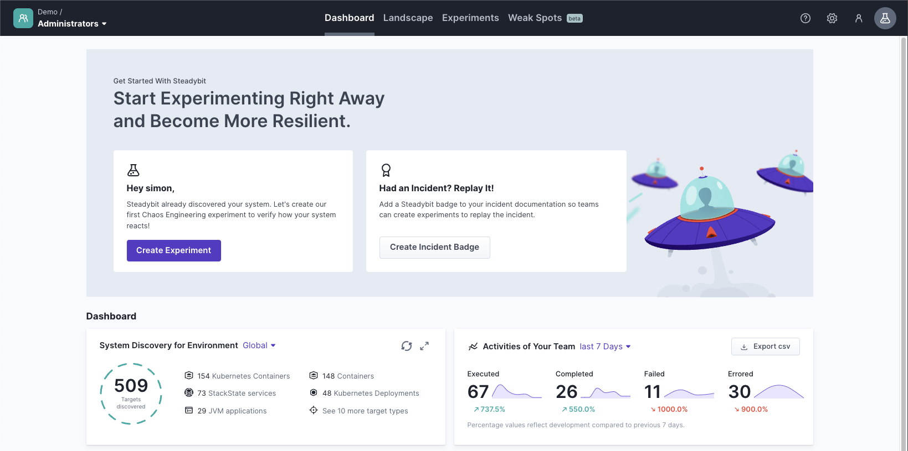

# Install Agents

This guide helps you with the initial setup of Steadybit by installing an agent and useful extensions.

In case something is not working out for you, [let us help you](https://www.steadybit.com/contact)!

### Prerequisite

- You have already signed up for an account [on our website](https://www.steadybit.com/get-started/)
- You are able to log in to the [Steadybit SaaS platform](https://platform.steadybit.com/)

### Step 1 - Install Agent

Our agent is the communication channel into your environment.
The agent is connected to various extensions that continuously discover and deliver target data to the platform and help you create targeted experiments based on data that is always up-to-date.
Therefore, it is necessary that you deploy the agents and extensions to the locations in which you want to perform Chaos Engineering experiments.


Without agents, there is no connection to your environment. And without extensions, there is no discovery data and thus no experiments are possible.


We offer our agents and extensions for different platforms and have made the installation as easy as possible for you.
You can find the different installation scripts directly in our platform after logging in.

Simply copy the script matching your technology and execute it next to your system.

> If you need a demo application to play around, you can [deploy our Shopping Demo into a Minikube or AWS EKS cluster](deploy-example-application.md).

Once an agent is rolled out, it connects to the platform and appears at the bottom of the page.
This may take a few minutes.
Afterwards, you are able to continue to the next step.

### Step 2 - Let Steadybit discover your system

Now, the agent and extensions are busy discovering your system to give you an overview what has been found.

### Step 3 - Install More Extensions (Optional)

You miss support for further technologies?
That's why Steadybit supports extensions!
Extensions enable you to make Steadybit your own – either by using an official or open source extension or by writing your own!
Learn more about extensions in our [dedicated documentation](../integrate-with-steadybit/extensions/).

### Step 4 - Start using Steadybit!

That's it!
You are welcomed by our Dashboard, and you are ready to take off by [designing and running your first Chaos Engineering experiment](run-experiment.md).

