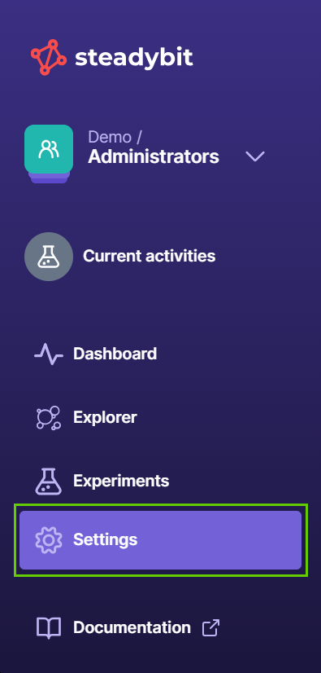
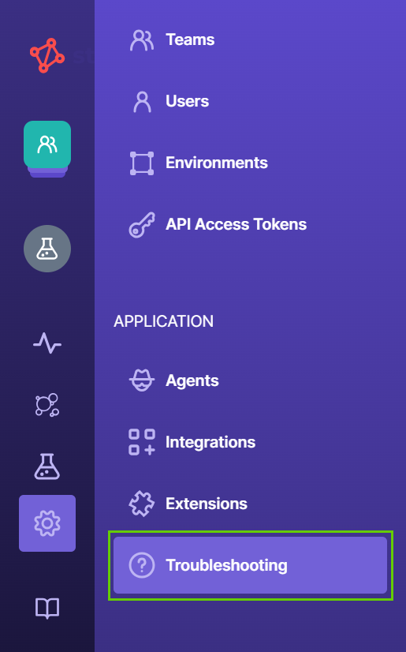
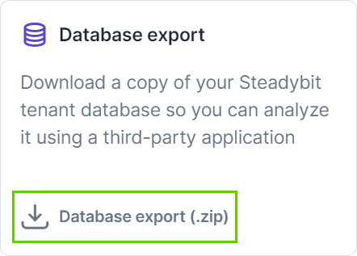
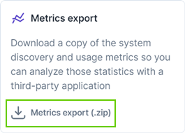

# How to troubleshoot

If you need help finding and resolving problems within Steadybit, you can look into your tenant database and metrics or enable our technical support team to assist you.

## Database export

By downloading a copy of your Steadybit tenant database, you'll be able to analyze it using a third-party application.

1. On Steadybit.com, go to "Settings."

<figure><figcaption></figcaption></figure>

2. Navigate to the "Troubleshooting" menu.

<figure><figcaption></figcaption></figure>

3. On the "Database export" section, choose "Database export (.zip)."

<figure><figcaption></figcaption></figure>

You'll find a ZIP file in your local downloads folder with a copy of your tenant database.

## Metrics export

Another option to troubleshoot your tenant is to download a copy of the system discovery and usage metrics and analyze those statistics with an external tool.

1. On Steadybit.com, go to "Settings."
2. Navigate to the "Troubleshooting" menu.
3. On the "Metrics export" section, choose "Metrics export (.zip)."

<figure><figcaption></figcaption></figure>

You'll find a ZIP file in your local downloads folder with a copy of your system discovery and usage metrics.

## Technical support by Steadybit

Steadybit's technical support team can log in to your tenant account to investigate and fix problems you might experience within the platform. But they can only do that if you allow it.


We can only view your data and never change it or run an experiment through your tenant. And the audit log records any login and logout activity of our team in your account. Besides, you can withdraw the authorization at any time. 


1. On Steadybit.com, go to "Settings."
2. Navigate to the "Troubleshooting" menu.
3. Click the "Let Steadybit troubleshoot your tenant" button.

<figure><figcaption></figcaption></figure>

## Further help

If you still need help resolving a problem within Steadybit, take a look at the common fixes linked below:

* [Extensions](common-fixes/extensions.md)
* [Agents](common-fixes/agents.md)
* [On-prem platform](common-fixes/on-prem-platform.md)
* [Migrating from the outpost agent](common-fixes/migrating-from-the-outpost-agent.md)

For more help, [contact us](https://www.steadybit.com/contact).
