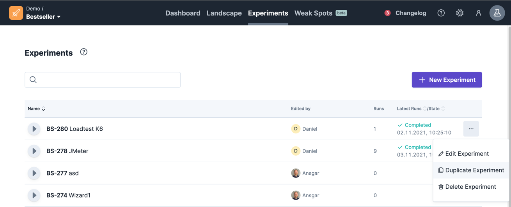

# Duplicate experiments

to duplicate an experiment, you can do it in two ways:
- by duplicate the experiment via experiment list
- or by duplicate the experiment via the experiment designer

## Duplicate via experiment list

If you are on the experiments overview page, you will find a button with 3 dots next to each experiment.
In this button you will find the option `Duplicate Experiment`.

## Duplicate via experiment designer

If you are on the experiment designer page, you will find a button  to duplicate the experiment.

