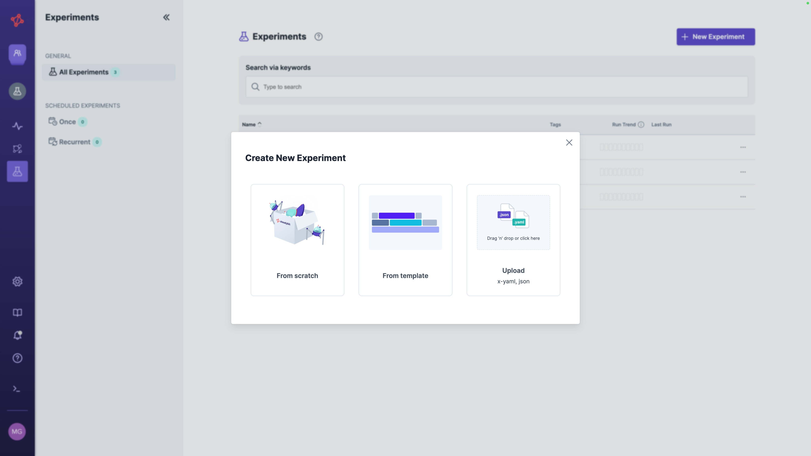
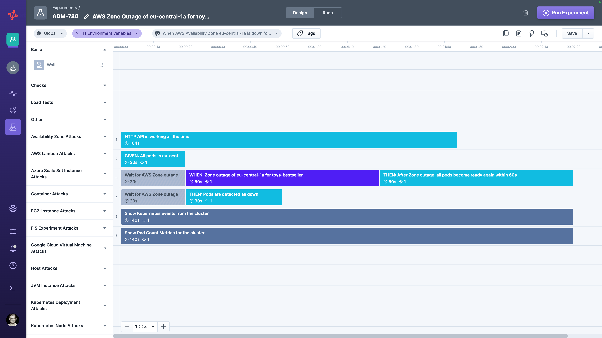
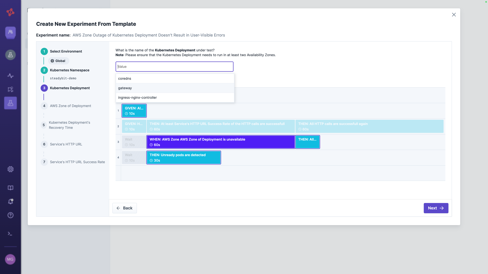
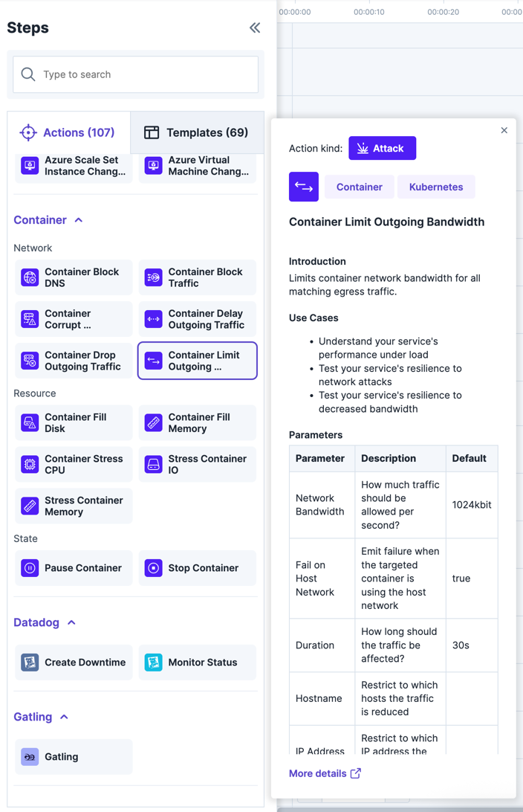

# Design

To start and eventually run a Chaos Engineering experiment, you first need to design it. That includes defining, e.g., where to run it (environment), what actions to perform (attacks, checks, load tests), and what should be attacked (targets).

## Basic Elements

An experiment generally consists of the following elements:

* **Name**: Giving your experiment a meaningful name makes it easier to find it again. You can change it at any time.
* **Team**: Each experiment is associated with a team. If you are a member of multiple teams, you can see and change your current team in the left-hand navigation sidebar. Once created, you can't change the experiment's team.
* **Environment**: An experiment always runs in one specific environment of your system landscape. This environment spans a set of targets you want to address in an experiment, such as containers and JVM applications in a Development stage. How the [environments are configured and assigned to your team](../../install-and-configure/manage-environments/) is up to your admin.
* **Variables**: A variable allows you to reference a value in your experiment's configuration to have a single source of truth. Steadybit supports different scopes (e.g., experiment variables or environment variables). Learn more in the [variables section](variables.md).
* **Hypothesis**: The hypothesis should answer the question of the expected outcome. In addition, you can describe the steady state, the turbulent condition, and the expected behavior. See this example of a hypothesis: 'When requests to the recommendation service exceed 1000ms, the catalog responds using an empty recommendation list.'
* **Tags**: Besides the hypothesis, tags can be applied to an experiment as useful metadata. Tags are not only listed in the experiments overview, but also you can use them to search for specific experiments. In the experiment list, the top 10 used tags are listed right below the searchbar (where you find the full list of used tags), so you have a quick access.
* **Actions**: Performed when running the experiment, sequentially or in parallel. An action can be either
  * an **attack** to inject a fault into your system
  * a **check** to validate your expectation in your system or observability tooling
  * a **load test** to inject load into your system and validate functionality.

The team influences the experiment in the following aspects:

1. **Short Handle:** Each experiment gets a unique key with a team prefix (e.g., `SRE-23`), which is used, e.g., to trigger an experiment via the [API](../../integrate-with-steadybit/api/api.md).
2. **Run/Edit Permissions:** Only team members are allowed to edit or run an experiment.
3. **Environment and Action Permissions:** A team's permission determines which environments (a set of targets or infrastructure components you can attack) and actions are eligible for an experiment.

## Create New Experiment

In general, you have three possibilities to get started:

* **From scratch**: in case you have already an experiment in mind
* **From template**: benefit from existing templates and apply them easily in a wizard-style to your context
* **Upload** a YAML- or JSON-based file containing an exported experiment

### From Scratch

When creating an experiment from scratch, you land directly into our timeline-based experiment editor. If your team can access only one environment, it is selected automatically. Otherwise, you have to define which environment you want to experiment in. In addition, you can specify the experiment's name and hypothesis at any point you like.

After that, you can add all actions (attacks, checks, and load tests) to your experiment by dragging and dropping. When you place actions in the same horizontal lane, they will be performed sequentially, putting them below each other results in a parallel run. Choose actions with the desired effect to perform your overall experiment.

Once you've dropped the action or selected it later, you can define its configuration on the right-hand side.

#### Revealing Step's Intention

When designing and running experiments as a team, it is a best practice to reveal every step's intention by renaming it. Click on a step's label in the sidebar to rename and help others understand it easily.

#### Target Selection

You can now select your desired targets of your environment via a target query referencing [discovered attributes](../../concepts/discovery/). Since these attribute values are always discovered live, some can change from one moment to the next. So, it is wise to choose stable attributes. Good examples are labels, namespaces, or symbolic names - whereas a unique identifier of targets (like the container id) is usually a bad idea. When you run the experiment, these attributes are resolved into a concrete set of targets under attack. You can preview matching targets using the 'show targets' button next to the query.

#### Limiting Targets via Blast Radius

Furthermore, you can limit your targets randomly to only attack a subset of your target selection and avoid attacking all at once. You can choose between the basic blast radius, a simple randomizer across all target selections, and the advanced blast radius, allowing you to group your targets on a given attribute hierarchically.

**Basic Blast Radius**

The basic blast radius simply randomizes all selected targets and limits the subset by a percentage or a fixed number. The total number of attacked targets is shown at the top of the sidebar.

**Advanced Blast Radius**

The advanced blast radius allows you to hierarchically group your targets on a given attribute and attack only a subset of the groups. This is perfect whenever you need to add context to the randomization to express a more realistic blast radius.

Some common examples for this are

* attacking a random Kubernetes deployment in a cluster
* attacking a random Kubernetes pod of a specific deployment
* attacking one random service's components, but all in a random availability zone

The screenshot below shows an example where we group containers first on the label `k8s.label.domain`, and afterwards - within each group - on the available zone. We will select 50% of the service-groups and one availability zone.

So, in this example, we may attack all containers in, e.g.,

1. `k8s.label.domain` = `shop-inventory`, `shop-gateway`, `shop-products` and `aws.zone` = `eu-central-1a` _or_
2. `k8s.label.domain` = `shop-inventory`, `shop-gateway`, `shop-products` and `aws.zone` = `us-east-1a` _or_
3. `k8s.label.domain` = `shop-checkout`, `shop-orders`, `shop-products` and `aws.zone` = `eu-central-1b` _or_
4. ...

This allows to simulate an unavailability of a random zone across random services (i.e. case 1, `eu-central-1a`), but results in some container's domain unaffected (i.e. case 1, `k8s.label.domain` = `shop-inventory`, as no containers are running in `eu-central-1a`). The actual picked values are shown in the [run modal](run.md#advanced-blast-radius).


A percentage limit can easily result in no targets while running the experiment. This can happen when specifying a low percentage or having a low number of targets in a group.

Steadybit rounds mathematically, so, for example, `20% of 2 targets` results in `0 targets`, and the experiment run to stop. This is not validated when designing the experiment in case of the advanced blast radius.


In case you use a variable, template placeholder, or the API, you need to define the unit of the radius limit, like `50%` for percentage and `1#` for an absolute number.

#### Action and Attack Settings

Depending on the action chosen, you can configure different settings for the step. For instance, an attack to 'fill memory' allows to configure the amount of memory to be filled, an attack to 'stop container' allows to configure whether it is a graceful termination, and an 'HTTP check' allows to configure the expected success rate.

**Continue on Any Failures / Errors**

By default, a failed/errored step causes the entire experiment run to fail/error immediately. All steps have a configuration to continue an experiment run even when a failure or error occurred in the step's execution. Once activated, the step is still marked as a failure/error, but the experiment continues running and may still eventually end in `COMPLETED`. This is further described in the [experiment run state documentation](run.md#state-propagation).

Continue with these steps until you've designed your experiment. A reasonable experiment could easily look like the one below. Once you have saved it, you are ready to [run it](./#run) to learn how your system behaves.

### From Template

A second option for creating a new experiment is using an existing template. This approach is best when you want to learn from others' experiences and apply them to your context via a step-by-step wizard. You can simply browse all available templates or use our search feature to find one using the template's **tags**, **targets** or **actions** used in the experiment, or free text search.

Once you've decided to use an experiment template, you are guided step-by-step through applying it to your context. The first step asks you to select the environment where you eventually want to run your experiment. If the experiment template references any environment variable, they are also listed. You only need to specify a value for new environment variables.

The subsequent steps depend on the selected experiment template and will guide you step-by-step to a ready-to-be-executed experiment. Each step consists of a specific question for a value (i.e., a Kubernetes deployment) to adapt the template's experiment to your context.

Eventually, you end up in the experiment editor, where you can adjust the experiment or [run it](./#run) to learn how your system behaves.

### Via File Upload

The third option for creating a new experiment is to upload a YAML- or JSON-based experiment file. Once you've uploaded the file, the experiment is created in the defined team. Please note that when the experiment file references an explicit team and environment (e.g., `team: "ADM"` or `environment: "Online shop"`), they have to exist. If you want to be flexible, you can use the variable `{{teamKey}}` to apply it to the current team and `{{environmentName}}` to apply it to the team's first environment.

## Action and Template Documentation

Within the experiment editor you can read up the full documentation of an action or a template by clicking on the individual step. This helps to understand the exact details, read up use cases and a full documentation of the parameters.

The documentation of a template is coming from the [experiment template's description](../../install-and-configure/manage-experiment-templates/#template-description). The documentation of an action is provided via the [Hub Connection](../../integrate-with-steadybit/hubs/), and can also be achieved for your own custom actions.

## Supported Actions

Check out our [Reliability Hub](https://hub.steadybit.com/actions) to learn about actions you can leverage with Steadybit or learn more about the [concept of an action](../../concepts/actions/).
