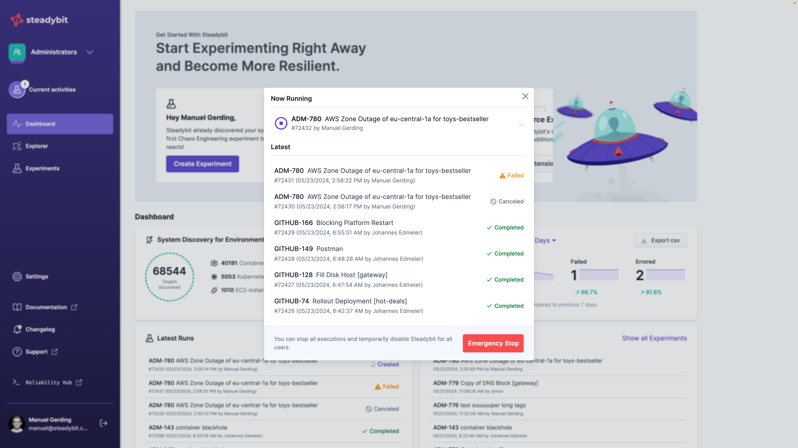

# Emergency Stop

In case a running experiment causes unforeseen severe failures, every authenticated user can stop any running experiment by clicking the emergency stop button. You can find it under 'Current Activities' on the left.

After that, all running experiments are stopped and, in addition, starting new experiments is prevented (via the UI as well as the API).
