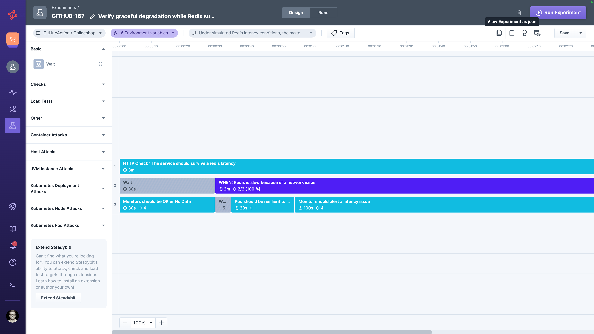
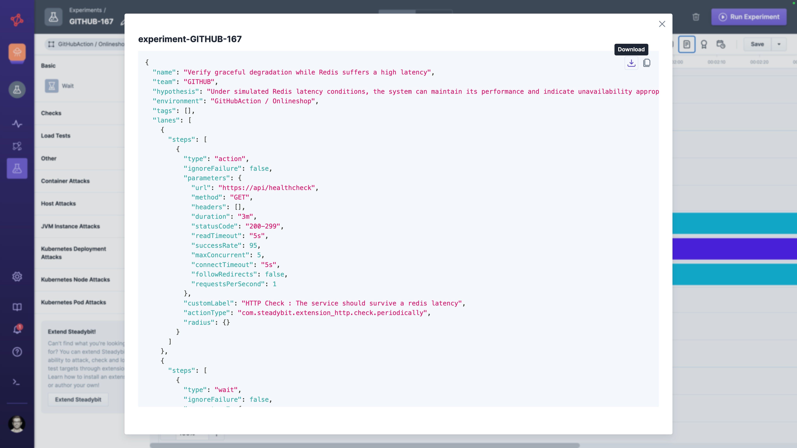
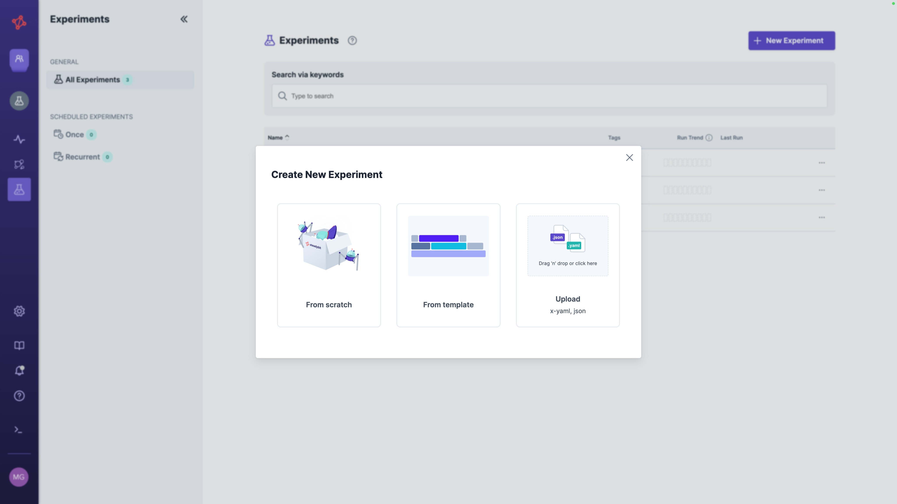

# Share Experiment as File

## Export Experiment

When you edit your experiment in the designer, you can export it to a JSON file.
To do that, please click on the button  `View Experiment as json`.

Then you see a popup with a download button and you can copy it to your clipboard.

So, you can edit your experiment using the JSON editor of your choice.

## Import Experiment

When you want to import an experiment, you can do it via the `New Experiment` button in the experiment list.

Then, you can drag and drop the JSON file onto the upload area or click on it to select a file.
The file is parsed, imported, and the resulting experiment is opened.

## Flexible Team and Environment Assignment
The current team and environment are saved in the experiment's file when exporting an experiment.
So, whenever you import the experiment, it will also use that particular team and environment.
If the team or environment doesn't exist or the user doesn't have access to it, the experiment can't be created.
To improve sharing and make experiments easily adaptable, you can use the variable `{{teamKey}}` to apply it to the current team and `{{environmentName}}` to apply it to the team's first environment.