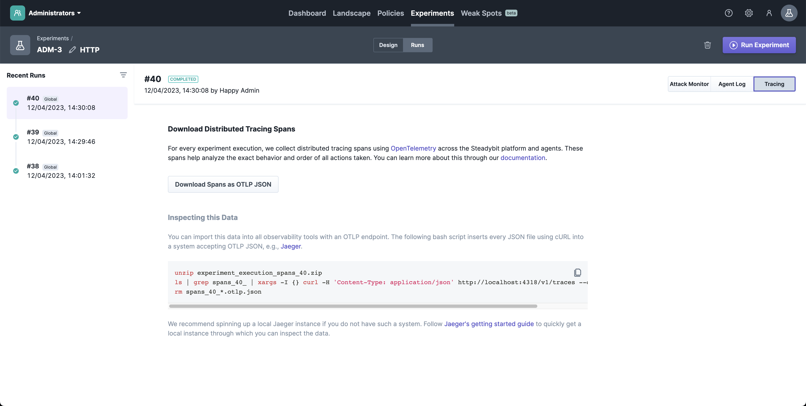

# OpenTelemetry Integration

For every experiment run, Steadybit collects distributed tracing spans using [OpenTelemetry](https://opentelemetry.io/) across the Steadybit platform and agents. Access to this data benefits users, extension authors and Steadybit maintainers alike. Here are some scenarios as part of which you might access this data:

* Steadybit interests your organization, and you are in the process of building trust in the solution. As part of this, you want to understand what is happening as part of experiments – including the nitty-gritty details.
* You are developing an extension, and something went wrong. You want to know precisely how your extension was called, the parameters, and how it responded.
* To correlate experiment runs with other monitoring and observability data, e.g., in your Jaeger or Zipkin installations.
* Something went wrong, and you need help from Steadybit's support staff to resolve the situation. Attach the distributed tracing data to give them context.

As the following sections show, Steadybit enables the collection of this data automatically for simple use cases. However, you can instruct the Steadybit agents to report this data to your observability pipeline. This document explains both approaches.


## Download through the Experiment Run View

Steadybit collects and persists distributed tracing data across its platform and agents without further configuration for every experiment run. This is the simplest way to get started – and the option relevant to most customers.

You can download the distributed tracing data as multiple [OTLP JSON files](https://opentelemetry.io/docs/reference/specification/protocol/). The UI explains importing and inspecting this data within the open-source tool [Jaeger](https://www.jaegertracing.io/).

Distributed tracing data for experiments is retained for 28 days within the Steadybit platform.



## Exporting OpenTelemetry Data

_**Note: OpenTelemetry data export is currently an experimental capability.**_

It can be helpful to have Steadybit observability data within your systems. Steadybit agents can be instructed to export distributed tracing data to OpenTelemetry-compatible systems.

This section explains how to configure the Steadybit agents to achieve this. To validate the configuration, the section contains optional guidance on how to set up a local Jaeger instance, Zipkin instance and an OpenTelemetry collector.

### Agent Configuration

The Steadybit agent internally leverages the OpenTelemetry SDK auto-configuration module. Consequently, all of the [module's configuration parameters](https://github.com/open-telemetry/opentelemetry-java/blob/v1.24.0/sdk-extensions/autoconfigure/README.md#sampler) are supported! This section only shows the most basic configuration to achieve data export.

The configuration parameters are set through environment variables, as the following `shell` snippet shows. You may also pass these environment variables when deploying the agent through any other mechanism, e.g., Helm charts.

```bash
# enable the auto-configuration mechanism
export JAVA_OPTS="-Dotel.java.global-autoconfigure.enabled=true"
# Name the service. You most likely wanna keep it as 'steadybit-agent'
export OTEL_SERVICE_NAME="steadybit-agent"
# Define where to export the data to.
export OTEL_EXPORTER_OTLP_ENDPOINT="http://localhost:4317"
# The Steadybit agent does not currently expose any metrics through OpenTelemetry.
export OTEL_METRICS_EXPORTER="none"
```

### Sample Jaeger and OpenTelemetry Collector Setup

The following sections explain how to spin up a local Jaeger instance, a Zipkin instance and an OpenTelemetry collector. These steps are optional for a successful configuration of the export mechanism. We list these here for your convenience if you want to check the setup locally.

#### OpenTelemetry Collector Configuration

We start with a configuration for an OpenTelemetry collector. The collector will accept the telemetry data from Steadybit agents, batch it and then forward it to both Jaeger and Zipkin.

Store this in a file called `otel-config.yml` within your current working directory.

```yaml
receivers:
  otlp:
    protocols:
      grpc:
      http:

processors:
  batch:

exporters:
  otlp:
    endpoint: jaeger-service:4317
    tls:
      insecure: true
  zipkin:
    endpoint: http://zipkin-service:9411/api/v2/spans
    tls:
      insecure: true

service:
  pipelines:
    traces:
      receivers: [ otlp ]
      processors: [ batch ]
      exporters: [ otlp, zipkin ]
```

#### Docker Compose Configuration

Next, we start all the systems locally using [Docker compose](https://docs.docker.com/compose/). Note the comments about UI endpoints within the snippet.

Store this in a file called `docker-compose.yml` within your current working directory. Then run `docker-compose up` to start everything.

Once the startup completes, you can use the following URLs to interact with the systems:

* Jaeger UI: http://localhost:16686/
* Zipkin UI: http://127.0.0.1:9411/
* OpenTelemetry collector OTLP gRPC endpoint: http://127.0.0.1:4317

```yaml
version: "4.0"

services:
  zipkin-service:
    image: openzipkin/zipkin:latest
    ports:
      # UI and ingestion endpoint
      - "9411:9411"

  jaeger-service:
    image: jaegertracing/all-in-one:latest
    ports:
      # UI endpoint
      - "16686:16686"
      # OTLP gRPC endpoint
      - "4317"
      # OTLP HTTP endpoint
      - "4318:4318"
    environment:
      - COLLECTOR_OTLP_ENABLED=true

  collector:
    image: otel/opentelemetry-collector:latest
    command: [ "--config=/etc/otel-collector-config.yml" ]
    volumes:
      - ./otel-config.yml:/etc/otel-collector-config.yml
    ports:
      # OTLP gRPC endpoint the agent will be interacting with
      - "4317:4317"
    depends_on:
      - jaeger-service
      - zipkin-service
```
