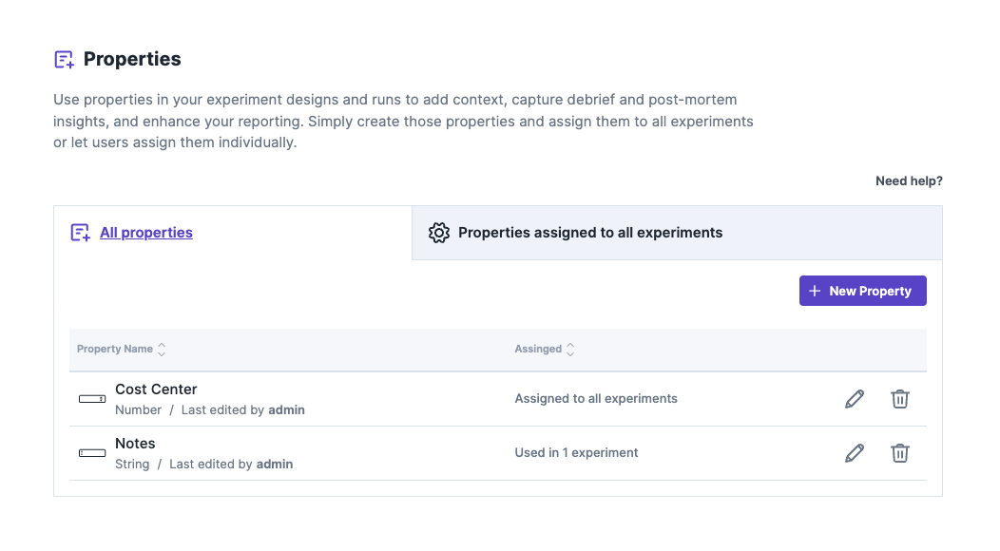
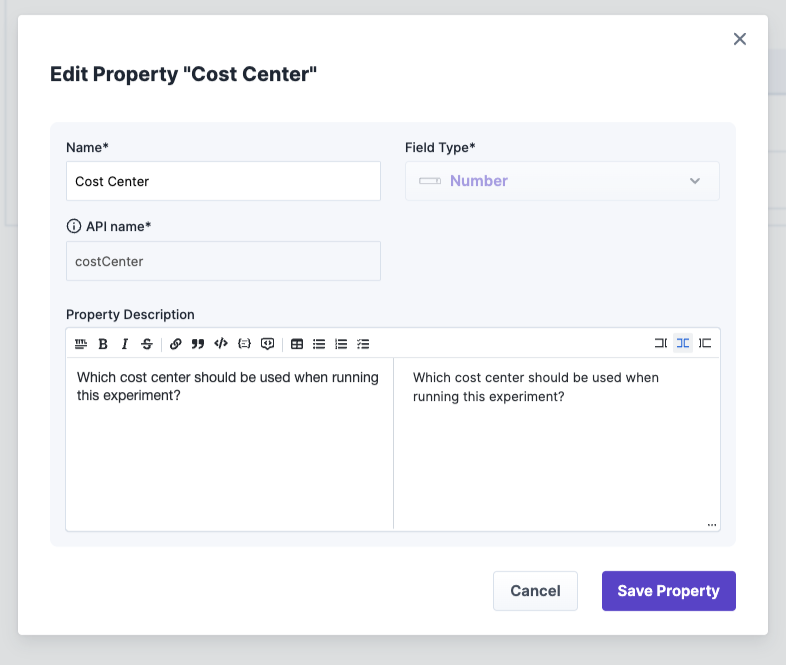
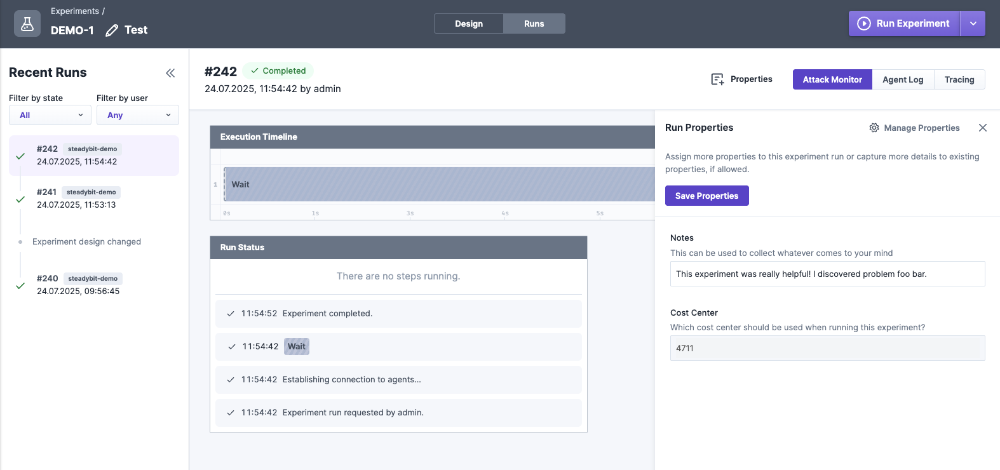

# Properties

Properties are key-value pairs that can be used to add additional information to your experiments and executions. They can be used to store metadata about the
experiment, such as the experiment's purpose, the team responsible for it, the outcome or just a note of a specific execution or any other relevant information.

Properties consist of three concepts:

- Property definitions: The administrator can define, which properties are available in the Steadybit platform. These definitions can be assigned to experiments
  and executions.
- Property associations: Associations define the relationship between a property definition and an experiment. They define where the property is visible and
  editable.
    - Administrators can assign properties to each experiment in your Steadybit tenant and even mark it as a required property.
    - Users can assign properties to a single experiments or a single execution they are allowed to edit. This allows users to add additional information to the
      experiment.
- Property values: The actual values of the properties that are saved as part of an experiment design and copied to each experiment execution. These values can
  be updated after the experiment has been run if the association allows so.

## Examples

- Adding a note to a single experiment execution
    - Your administrator defines a property definition called `note` with the datatype `string`.
    - You can add the property `note` to a single experiment execution you are allowed to edit and fill in a value like "This experiment was great!".
- Adding a mandatory cost center field to each experiment
    - Your administrator defines a property definition called `costCenter` with the datatype `integer`.
    - Your administrator assigns the property definition `costCenter` to all experiment design and marks it as required.
    - You need to fill in the cost center for each experiment you want to run.

## Property Definitions

Property definitions are the basis for properties in Steadybit.

A property definition consists of the following fields:

- **Name**: The name of the property definition. This is the name that will be shown in the UI.
- **API name**: The key of the property that will be used in the API. This is a unique identifier for the property definition.
- **Field Type**: The data type of the property definition. This can be one of the following:
    - `String`: A text field that can contain any string value.
    - `List of Strings`: A list of text fields that can contain multiple string values.
    - `Rich Text`: A string field that can contain Markdown formatted text.
    - `Boolean`: A checkbox that can be either true or false.
    - `Date`: A date field that can contain a date value.
    - `Number`: A number field that can contain an integer value.
    - `List of Numbers`: A list of number fields that can contain multiple integer values.
    - `Enumeration`: A dropdown field that can contain a predefined list of values. The values can be defined in the property definition.
    - `List of Enumerations`: A list of dropdown fields that can contain multiple predefined values. The values can be defined in the property definition.
    - `Link`: A field that can contain a URL. This can be used to link to external resources.
    - `List of Links`: A list of URL fields that can contain multiple links.
- **Property Description**: A description of the property definition. This is optional but recommended to provide additional context for the property.

Property definitions can be created and managed in the settings of the Steadybit platform. Administrators can create new property definitions, edit existing
ones, and delete them. If an administrator deletes a property definition, all associations and values of this property definition will be removed from all
experiments. Values in existing executions will not be deleted.

## Property Associations

An administrator can assign property definitions to each experiment design in your Steadybit tenant. He can also mark a property as required, which means that
the property must be filled in before the experiment can be run. This allows administrators to enforce certain properties for all experiments in the tenant.
The association also defines, whether the property is editable after the execution has been started or if it should be read-only. This can be done in the
settings section of the Steadybit platform.

Users can also assign properties to a single experiment design or execution they are allowed to edit. This allows users to add additional information to their
experiments. This can be done in the experiment editor or in the execution details page. Properties added to an execution after the execution has been started
can always be edited and can also be removed later. Properties that have been present in the experiment design and copied to the execution can only be
edited if the association allows it. If the association read-only, the property can only be viewed and not edited.

A property association consists of the following fields:

- **Property Definition Key**: The property definition that is associated with the experiment design or execution.
- **Mandatory**: A checkbox that indicates whether the property is required or not. If checked, the property must be filled in before the experiment can be run.
- **Allow edits after the experiment has started**: A checkbox that indicates whether the property can be edited after the experiment has started. If checked,
  the property can be edited in the execution details page.

## Property Values

Property values are the actual values of the properties that are saved as part of an experiment design and copied to each experiment
execution. [Variables](../variables.md) are fully supported for the input fields of all properties. (including overrides for single executions or via schedules).

## Properties via API

Properties can also be managed and used by the following API endpoints.
Check out [Integrate with Steadybit / API](../../../integrate-with-steadybit/api/api.md) how to access the API.

- [Manage property definitions and associations](https://platform.dev.steadybit.com/api/swagger/swagger-ui/index.html?configUrl=/api/spec/swagger-config#/Properties)
- [Update the properties of a experiment design](https://platform.dev.steadybit.com/api/swagger/swagger-ui/index.html?configUrl=/api/spec/swagger-config#/Experiment%20Designs/createOrUpdateExperiment)
- [Get the properties of a experiment execution](https://platform.dev.steadybit.com/api/swagger/swagger-ui/index.html?configUrl=/api/spec/swagger-config#/Experiment%20Executions/getExperimentExecution)
- [Update properties of a experiment execution after it has completed](https://platform.dev.steadybit.com/api/swagger/swagger-ui/index.html?configUrl=/api/spec/swagger-config#/Experiment%20Executions/updateExecutionProperties)

