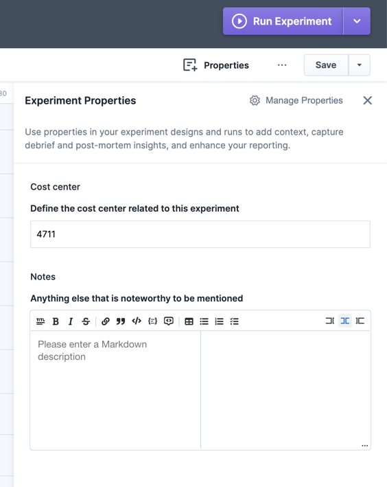
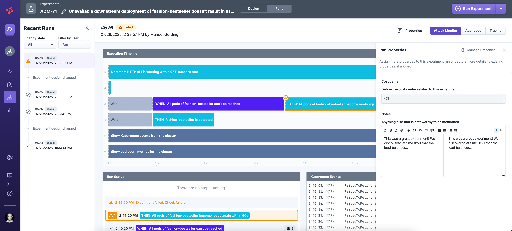

# Properties

Properties are key-value pairs that can be used to add additional information to your services, experiments and runs.
They can be used to store metadata about the service or experiment, such as the service owner, experiment's purpose, the team responsible for it, the outcome, or just a note of a specific run or any other relevant information.

In general, a user can only assign properties and capture values that have been [defined by an administrator](../../../install-and-configure/manage-properties/#manage-property-definitions).
Once you - or your administrator - has defined the property, you can assign and capture values per experiment design or experiment run.

## Examples

* Defining a service's business criticality
  * Your administrator has defined a property definition called `serviceCritcality` with the datatype `enumeration (select one)`.
  * Your administrator has assigned the property definition `serviceCritcality` to all services and marks it as required.
  * Whenever an administrator or team owner adds or edits a service, he can capture the value of the property (e.g. `Tier 0 - Mission Critical`)
* Adding a mandatory cost center field to each experiment
  * Your administrator has defined a property definition called `costCenter` with the datatype `integer`.
  * Your administrator has assigned the property definition `costCenter` to all experiment designs and marks it as required.
  * You need to fill out the cost center for each experiment you want to run.
* Adding a note to a single experiment run
  * Your administrator has defined a property definition called `note` with the datatype `rich text`.
  * You can add the property `note` to a single experiment run, you are allowed to edit, and fill out a Markdown value like "This experiment was _really_ great!".

## Assign Properties

Properties that are defined by your administrator, can be assigned to a single service by administrator or team owners and to experiment design or run by any team member.
This way, everyone can add additional context to your experiment designs or for a specific run.
Properties assigned to an experiment design or an experiment run can be removed later on.
Properties copied from the experiment design to a run cannot be removed later.

.png>)

A property assignment configuration consists of the following fields:

* **Property Definition Key**: The referenced property definition assigned to the experiment design or run.
* **Mandatory**: A checkbox indicating whether a value is required or not. If checked, the property must be filled in before the experiment can be run.
* **Allow editing the value in the experiment run**: A checkbox indicating whether the property can be edited at run-level. If checked, the property can be edited in the run details page.

.png>)

### API

Properties can also be assigned using the following API endpoints. Check out [Integrate with Steadybit / API](../../../integrate-with-steadybit/api/api.md) how to access the API.

* [Assign properties to a service](https://platform.steadybit.com/api/swagger/swagger-ui/index.html?configUrl=/api/spec/swagger-config#/Services/upsertService)
* [Assign properties to an experiment design](https://platform.steadybit.com/api/swagger/swagger-ui/index.html?configUrl=/api/spec/swagger-config#/Experiment%20Designs/createOrUpdateExperiment)
* [Assign properties to an experiment run](https://platform.steadybit.com/api/swagger/swagger-ui/index.html?configUrl=/api/spec/swagger-config#/Experiment%20Executions/updateExecutionProperties)

## Property Values

Property values are the actual values of the properties that are saved as part of an experiment design and copied to each experiment run.
[Variables](../variables.md) are fully supported for the input fields of all properties (including overrides for single runs or via schedules).

 

### API

Properties' values can also be read and edited using the following API endpoints.
Check out [Integrate with Steadybit / API](../../../integrate-with-steadybit/api/api.md) how to access the API.

* [Update the properties of a service](https://platform.steadybit.com/api/swagger/swagger-ui/index.html?configUrl=/api/spec/swagger-config#/Services/upsertService)
* [Update the properties of an experiment design](https://platform.steadybit.com/api/swagger/swagger-ui/index.html?configUrl=/api/spec/swagger-config#/Experiment%20Designs/createOrUpdateExperiment)
* [Get the properties of an experiment run](https://platform.steadybit.com/api/swagger/swagger-ui/index.html?configUrl=/api/spec/swagger-config#/Experiment%20Executions/getExperimentExecution)
* [Update properties of an experiment run after it has completed](https://platform.steadybit.com/api/swagger/swagger-ui/index.html?configUrl=/api/spec/swagger-config#/Experiment%20Executions/updateExecutionProperties)
