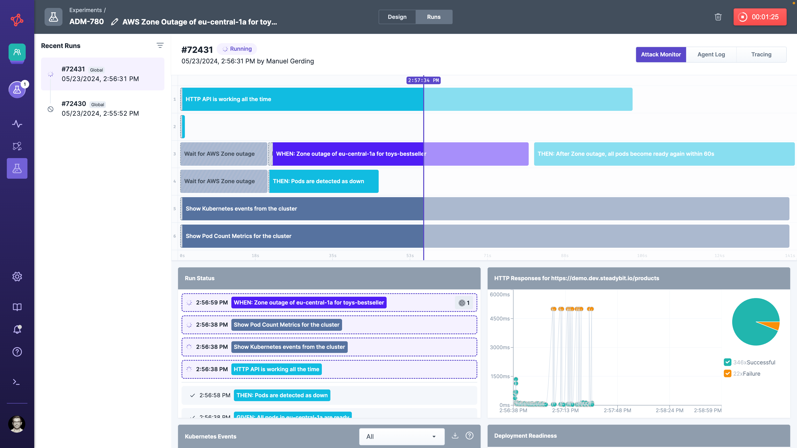
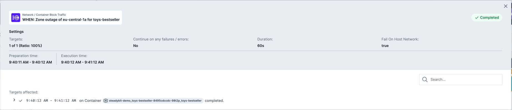
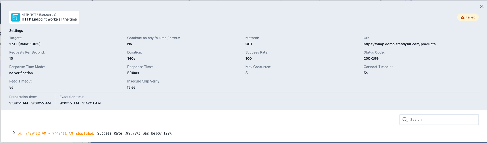
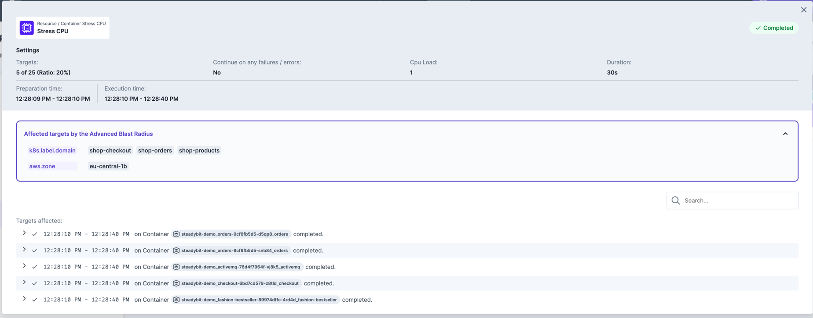

# Run

After having your [experiment fully designed](./) you can simply use the `Run`-button to execute it.
This action can be performed if all the following conditions are met:

1. No validation errors
2. Every attack resolves at that moment to at least one target.
3. You are member of the same team as the experiment
4. [Emergency stop](./#Emergency-Stop) has not been triggered.

Otherwise, you'll get an error message and the experiment is not started.

## Run View
As soon as the experiment starts, the platform automatically switches over to the run view.
The first step of the platform is to establish the connection to the matching agents.
In addition, the running experiment is indicated at the top right run icon.

Every experiment run has a unique identifier (e.g. **#33131**), which you can use to identify older experiment runs (visible on the left side).

The run view itself consists of the following elements.

* **Run Timeline**: At the top you see the sequence defined previously in the [design](./#design). While the experiment is running a special marker indicates the current point of time. Some attacks need a little bit of extra time before being started which is indicated by a light green colouring in the front. The extra time is added to the timing of the attack and is currently caused by technical reasons .You can click on each step to get more details in the [run modal](#run-modal).
* **Run Status**: The run log lists the currently active or already performed experiment's steps. You can click on each step to get more details in the [run modal](#run-modal).
* **Deployment Replica Count**: When using an experiment in a Kubernetes context we will automatically monitor how many PODs are ready in your cluster and indicate whenever there is a discrepancy.
* **Kubernetes Event Log**: When using an experiment in a Kubernetes context we provide you access to the Kubernetes Events so that you can identify what exactly happens in the Kubernetes cluster.
* **HTTP Call**: If your experiment contains a `HTTP Call`-action you can see the response time as well as HTTP response status as a separate widget in the run window.
* **Monitoring Events**: In case your admin has installed a monitoring extension to Steadybit (see [monitoring extensions in Reliability Hub](https://hub.steadybit.com/extensions?tags=Monitoring)) you can see occurring events and alerts of your setup directly in the run view.

### Run Modal
You can click on each experiment step in the 'run timeline'- or 'run status'-widgets to get more details.
The modal allow you to see the actions' configuration, the exact timing and affected targets (e.g., containers attacked by the blackhole-attack).
It also details more information whenever a step/experiment has errored or failed.

#### Advanced Blast Radius
Whenever you have used the [advanced blast radius](./design.md#advanced-blast-radius), you can see the picked values at the top of the run modal.

## States
Experiment runs can have the following states:

| State     | Description                                                                                                                                                                                                                                          |
| --------- | ---------------------------------------------------------------------------------------------------------------------------------------------------------------------------------------------------------------------------------------------------- |
| REQUESTED | The experiment was requested by a user, api call or a schedule.                                                                                                                                                                                      |
| CREATED   | The experiment was created and all targets were resolved.                                                                                                                                                                                            |
| PREPARED  | The experiment was prepared and all agents are ready to execute the needed actions.                                                                                                                                                                  |
| RUNNING   | The experiment is currently running.                                                                                                                                                                                                                 |
| COMPLETED | Entire experiment (all attacks, actions and checks) were successfully executed - so no failure reported by any check.                                                                                                                                |
| CANCELED  | The experiment was canceled by user interaction and all attacks were rolled back.                                                                                                                                                                    |
| FAILED    | The run failed due to some failing checks, for example a _HTTP Check_ not reaching the required success rate.                                                                                                                                        |
| ERRORED   | The run failed due to some technical reasons like _Failed attack execution_ or _Agent disconnected unexpectedly_. This shouldn't happen frequently, in case it does, let us know. We are constantly improving the platform to reduce failure states. |

In case an agent looses the connection to the platform during an experiment, it will immediately stop and rollback running attacks. There are some attacks (like `Stop Container`) which can't be rolled back due to it's nature.
