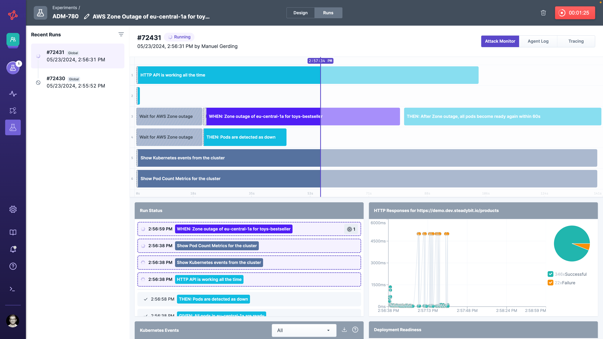
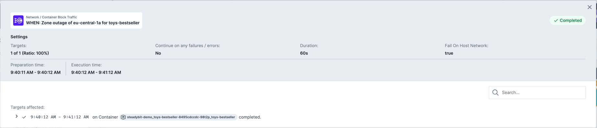
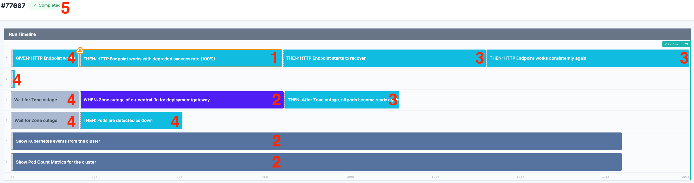

# Run

After having your [experiment fully designed](./) you can simply use the `Run`-button to execute it. This action can be performed if all the following conditions are met:

1. No validation errors
2. Every attack resolves at that moment to at least one target.
3. You are member of the same team as the experiment
4. [Emergency stop](./#Emergency-Stop) has not been triggered.

Otherwise, you'll get an error message and the experiment is not started.

## Run View

As soon as the experiment starts, the platform automatically switches over to the run view. The first step of the platform is to establish the connection to the matching agents. In addition, the running experiment is indicated at the top right run icon.

Every experiment run has a unique identifier (e.g. **#33131**), which you can use to identify older experiment runs (visible on the left side).

The run view itself consists of the following elements.

* **Run Timeline**: At the top you see the sequence defined previously in the [design](./#design). While the experiment is running a special marker indicates the current point of time. Some attacks need a little bit of extra time before being started which is indicated by a light green colouring in the front. The extra time is added to the timing of the attack and is currently caused by technical reasons .You can click on each step to get more details in the [run modal](run.md#run-modal).
* **Run Status**: The run log lists the currently active or already performed experiment's steps. You can click on each step to get more details in the [run modal](run.md#run-modal).
* **Deployment Replica Count**: When using an experiment in a Kubernetes context we will automatically monitor how many PODs are ready in your cluster and indicate whenever there is a discrepancy.
* **Kubernetes Event Log**: When using an experiment in a Kubernetes context we provide you access to the Kubernetes Events so that you can identify what exactly happens in the Kubernetes cluster.
* **HTTP Call**: If your experiment contains a `HTTP Call`-action you can see the response time as well as HTTP response status as a separate widget in the run window.
* **Monitoring Events**: In case your admin has installed a monitoring extension to Steadybit ( see [monitoring extensions in Reliability Hub](https://hub.steadybit.com/extensions?tags=Monitoring)) you can see occurring events and alerts of your setup directly in the run view.

### Run Modal

You can click on each experiment step in the 'run timeline'- or 'run status'-widgets to get more details. The modal allow you to see the actions' configuration, the exact timing and affected targets (e.g., containers attacked by the blackhole-attack).

The run modal also details more information whenever a step - and thus the experiment - has errored or failed.

#### Advanced Blast Radius

Whenever you have used the [advanced blast radius](design.md#limiting-targets-via-blast-radius), you can see the picked values at the top of the run modal.

## States

An experiment run supports different level of states:

* [**Experiment run**](run.md#experiment-run) indicating an overall state of the run _(highest level)_
* [**Step**](run.md#step) each individual step performed in an experiment run
* [**Target execution**](run.md#target-execution) each individual target affected in a step _(lowest level)_

The state from a lower level is propagated to the upper level, as described [below](run.md#state-propagation).

### Experiment Run

Experiment runs is in one of the following states:

| State     | Description                                                                                                                                                                                                                                                               |
| --------- | ------------------------------------------------------------------------------------------------------------------------------------------------------------------------------------------------------------------------------------------------------------------------- |
| REQUESTED | The experiment was requested by a user, api call or a schedule.                                                                                                                                                                                                           |
| CREATED   | The experiment was created and all targets were resolved.                                                                                                                                                                                                                 |
| PREPARED  | The experiment is prepared, all preflight checks were successful, and agents are ready to execute the needed actions.                                                                                                                                                     |
| RUNNING   | The experiment is currently running and performing actions (e.g. attacks).                                                                                                                                                                                                |
| COMPLETED | Entire experiment including all actions were successfully executed - no failure or error reported by any step.                                                                                                                                                            |
| CANCELED  | The experiment was canceled by user interaction or system (in case of a failed validation in `REQUESTED` or `CREATED`) and all attacks were rolled back.                                                                                                                  |
| FAILED    | The run failed due to some failing checks, for example a _HTTP Check_ not reaching the required success rate.                                                                                                                                                             |
| ERRORED   | The run errored due to some technical reasons like `I/O error on POST request: Connection refused` or `Agent disconnected unexpectedly`. This shouldn't happen frequently, in case it does, let us know. We are constantly improving the platform to reduce error states. |

In case an agent looses the connection to the platform during an experiment, it will immediately stop and rollback running attacks. There are some attacks (like `Stop Container`) which can't be rolled back due to it's nature.

### Step

Every step that is executed as part of an experiment run is in one of the following states:

| State     | Description                                                                                                                                                                                                    |
| --------- | -------------------------------------------------------------------------------------------------------------------------------------------------------------------------------------------------------------- |
| CREATED   | All targets of the step have been resolved.                                                                                                                                                                    |
| PREPARED  | Agents for all resolved targets are connected and ready to execute the step's action as soon as it's the step's turn in the designed experiment timeline.                                                      |
| RUNNING   | The step's action is currently executed on all targets.                                                                                                                                                        |
| COMPLETED | The step's action was successfully executed on all targets - no failure or error.                                                                                                                              |
| CANCELED  | The step was running before and has now been canceled, either by a user canceling the entire experiment run or by the system (e.g. when another step running in parallel caused the experiment to stop early). |
| SKIPPED   | The step was never executed, because the experiment was stopped before.                                                                                                                                        |
| FAILED    | The step's action noticed a failed check, such as an _HTTP Check_ that did not reach the required success rate.                                                                                                |
| ERRORED   | The step's action errored due to some technical reasons, such as `I/O error on POST request: Connection refused` or `Agent disconnected unexpectedly`.                                                         |

### Target Execution

For every step, there are single or multiple target executions. The actual number depends on the number of targets selected in the experiment design and the nature of the step. The target executions are listed as 'selected targets' in the [run modal](run.md#run-modal).

Each target execution is in one of the following states:

| State     | Description                                                                                                                                                                                                                                                                           |
| --------- | ------------------------------------------------------------------------------------------------------------------------------------------------------------------------------------------------------------------------------------------------------------------------------------- |
| CREATED   | The target was selected to be attacked in an experiment run's step.                                                                                                                                                                                                                   |
| PREPARED  | The agent, that discovered the selected target, is connected.                                                                                                                                                                                                                         |
| RUNNING   | The action is currently executed on the selected target.                                                                                                                                                                                                                              |
| COMPLETED | The action was successfully executed on the selected target - no failure or error.                                                                                                                                                                                                    |
| CANCELED  | The action was executed before and has now been canceled on the selected target, either by a user canceling the entire experiment run or by the system (e.g. when another target execution of the same step or another step running in parallel caused the experiment to stop early). |
| SKIPPED   | The action was never executed on the selected target, because the experiment's step was stopped before.                                                                                                                                                                               |
| FAILED    | The action performed on the selected target noticed a deviation in the check, such as an _HTTP Check_ that did not reach the required success rate.                                                                                                                                   |
| ERRORED   | The action performed on the selected target errored due to some technical reasons, such as `I/O error on POST request: Connection refused` or `Agent disconnected unexpectedly`.                                                                                                      |

### State Propagation

The different levels of states (**experiment run**, **step**, **target execution**) can be propagated to higher levels (e.g., state `FAILED` at target execution level is propagated to step being `FAILED` and experiment run being `FAILED`). But also change the states of adjacent instances of the same level (i.e., a `FAILED` step causes subsequent steps to be `SKIPPED`) and level below (i.e., for a `SKIPPED` step all target executions are in the `SKIPPED` state as well).

#### Example: State Propagation

The following example shows the state propagation in action:

1. Within step **(1)**, one target execution fails because the HTTP success rate wasn't achieved (target execution's state `FAILED`).
2. Other target executions of the step **(1)** are canceled by the system (target execution's state `CANCELED`).
3. Due to the failed target execution, step **(1)** is also ending as `FAILED`.
4. Steps running in parallel **(2)** are canceled (step's state `CANCELED`, thus all its target execution states are `CANCELED`).
5. Subsequent steps **(3)** are not performed anymore and are indicated as `SKIPPED`.
6. Steps already performed **(4)** beforehand don't change their state (i.e., `COMPLETED`).
7. The experiment will stop immediately in the state `FAILED` **(5)**.

#### Example: Continue on Any Failures / Errors

In some cases, state propagation is not desirable. Especially when running an experiment that attacks a large number of targets, single targets becoming unavailable may be expected and shouldn't cause the experiment to stop immediately. For these cases, you can configure a step to [continue on any failures or errors](design.md#continue-on-any-failures--errors) in the experiment design.

Once activated, the above example looks different:

1. Within step **(1)**, one target execution fails because the HTTP success rate wasn't achieved (target execution's state `FAILED`).
2. Other target executions of the step **(1)** continue to run (target execution's state `COMPLETED`).
3. Due to the failed target execution, step **(1)** is still indicated as `FAILED`.
4. Steps running in parallel **(2)** continue to run (step's and target execution's state `COMPLETED`).
5. Subsequent steps **(3)** are performed as usual; if no additional failure or error occurs, the steps' and target executions' states are `COMPLETED`.
6. Steps already performed **(4)** beforehand don't change their state (i.e., `COMPLETED`).
7. The experiment run ended in the state `COMPLETED` **(5)** because the step **(1)** failing was ignored, and all other steps `COMPLETED`.
