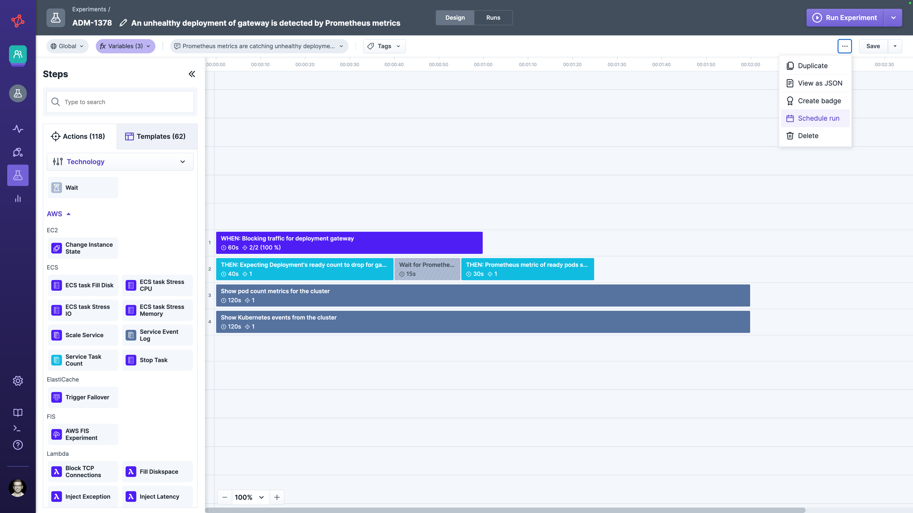

# Schedule

Experiments can be run on the fly using the UI, API, or CLI or scheduled to run automatically in the future. Scheduling an experiment can be done via [UI](README.md#scheduling-via-ui) or [API](README.md#scheduling-via-api).


To schedule an experiment, one must have permission to edit it. This means one has to be a member of the team.

Please note that an experiment schedule always starts the experiment. In case of validation errors, these are documented as canceled experiment runs to check them out asynchronously.


## Scheduling via UI

You can open the scheduling configuration dialog in the platform either in the experiment experiment editor or the experiment list's context menu.

When the configuration dialog opens, you can manage multiple experiment schedules. Each schedule can run the experiment just once or repeatedly in the future.

### Once Schedule

The configuration is straightforward if you decide to run it once. Just select a date and time in the future and save the schedule. Please keep the "Activate Schedule" toggle enabled. Otherwise, the schedule will be ignored and not run.


The date and time selections are done in the user’s configured timezone. 

### Recurrent Schedule

Experiments can be scheduled to run repeatedly (like every hour or every Friday morning). To do so, you have to configure a cron-like expression.


**Just so you know**, we are using the [Quartz cron trigger syntax](http://www.quartz-scheduler.org/documentation/quartz-2.3.0/tutorials/crontrigger.html). The Quartz cron expression is evaluated in the user’s configured timezone. The currently configured timezone will also be shown for the next experiment run.


### Schedules Overview

In the experiment list section on the left-hand side, you can find a quick overview of all configured schedules. Here, you can easily see when the schedules will be triggered next, enable/disable or even delete the schedule.

### Experiment variable overrides

If the experiment is making use of an [environment or experiment variable](../variables.md), you can override them is the schedule. As in the experiment editor, the exeriment is validated when you enter non supported values (e.g. entering "name" into a duration variable). Schedule variables will override environment or experiment variable values for each run, triggered by this schedule.

## Scheduling via API

Schedules can also be configured using the following API endpoints.
Check out [Integrate with Steadybit / API](../../../integrate-with-steadybit/api/api.md) how to access the API.

- [Create or update an experiment schedule](https://platform.steadybit.com/api/swagger/swagger-ui/index.html#/Experiment%20Schedule/upsertSchedule)
- [Get an experiment schedule](https://platform.steadybit.com/api/swagger/swagger-ui/index.html#/Experiment%20Schedule/getSchedules)
- [Remove an experiment schedule](https://platform.steadybit.com/api/swagger/swagger-ui/index.html#/Experiment%20Schedule/removeExperimentScheduleById)
- [List all schedules currently configured](https://platform.steadybit.com/api/swagger/swagger-ui/index.html#/Experiment%20Schedule/getAllSchedulesV2)

Each experiment schedule can be identified via a UUID (`id`) which can be used to update or delete a specific schedule.
