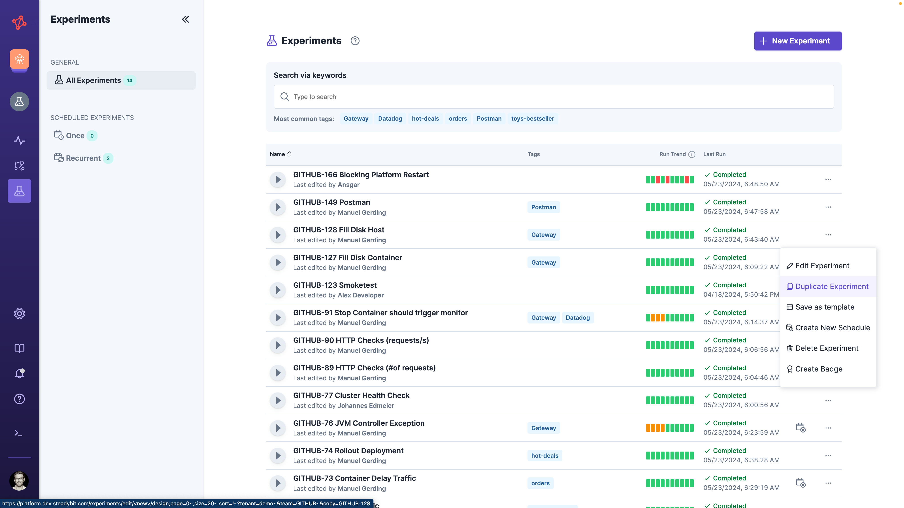
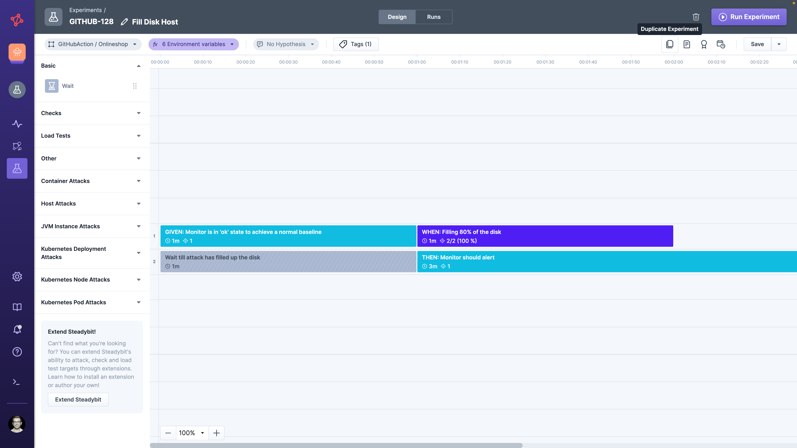
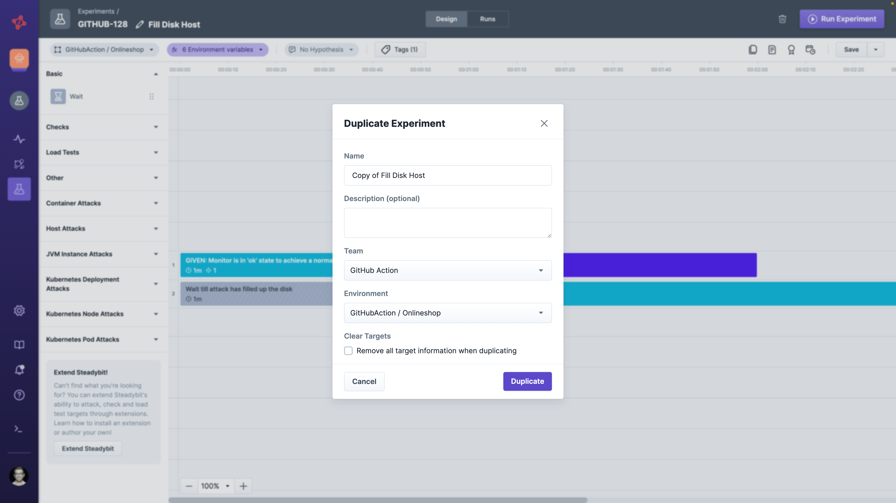
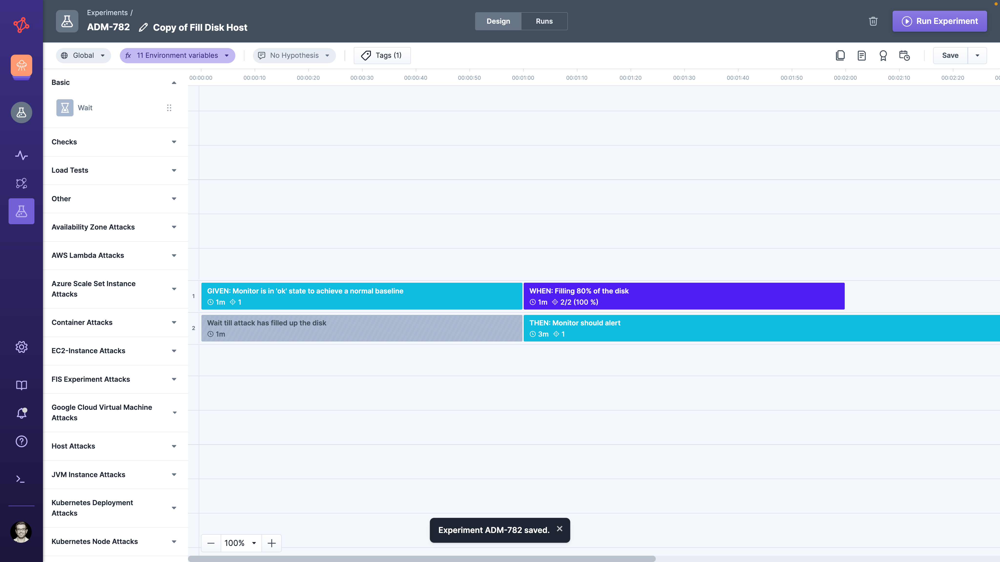

# Duplicate Experiment

Duplicating an experiment creates a fully editable copy — even across teams and environments within the same Steadybit tenant.

Use this when another team wants to use your experiment as a **starting point** and adapt it freely, with no expectation that future changes to the original will reach the copy.
Once you expect increased reusing across teams, consider using the [experiment template](../templates/README.md) approach.

## How Sharing Works

Two artifacts are involved:

* **Original Experiment** — the source of the duplicate. After duplication, it continues to live and evolve independently.
* **Duplicated Experiment** — a new, independent experiment placed into a team and environment of your choice. Once created, it has no link back to the original.

Because the duplicate is a detached copy, design changes do not propagate in either direction.

## Single Source of Truth

| Aspect              | Source of truth                                    |
|---------------------|----------------------------------------------------|
| Experiment instance | Per duplicate — each duplicate is a new experiment |
| Experiment design   | Detached copy at the time of duplication           |
| Experiment runs     | Per duplicate                                      |

For sharing where design changes should propagate, use [Service Provided Experiments](../service-provided/README.md) or [Share Experiment](../share-experiment/README.md) instead.

## Duplicate via Experiment List

On the experiments overview page, every experiment row has a 3-dot menu. Choose **Duplicate Experiment**.

## Duplicate via Experiment Designer

In the experiment designer, the  duplicate button creates a copy of the currently opened experiment.

## Choose Name, Team and Environment

After duplicating, you are prompted for the new experiment's name, description, team and environment.

Confirm the dialog to save the new experiment and open it in the experiment designer.

## When to Use This Approach

Duplicating an experiment is the right choice when:

* Another team should start from a copy of your experiment and freely adapt it
* The original and the copy should evolve independently going forward
* You want to keep the duplicate in a different team or environment within the same tenant

For other sharing needs, see the [overview of sharing options](../README.md).
